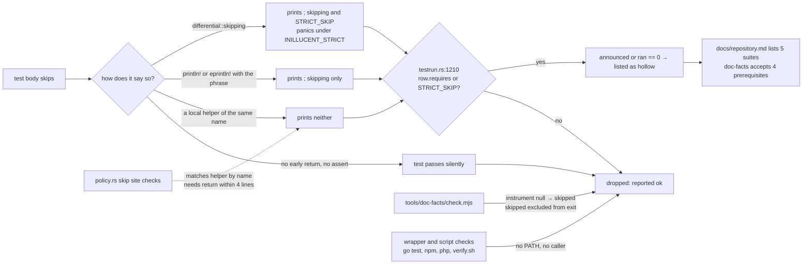
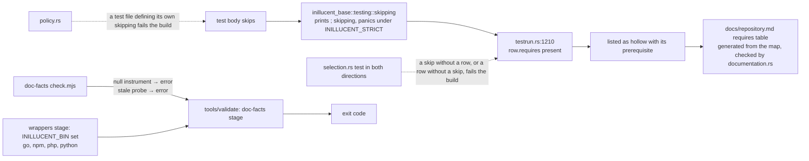

# task-1969 - inillucent code review, part six: the tests that can pass having checked nothing, end to end coverage, and what task-1962 left open

Reviewed at commit `ef4b630091ef559ad7f3c9cd4209940ff75bf479`, the tip of `origin/main` when this review
started. Every file and line cited below is at that revision. The review was read from a detached
worktree of that commit, not from the working checkout, because two other tickets were committing to
the checkout while this one ran. No cargo command was run for this review; every count names the
command that produced it, and every count is reproducible with `grep`, `wc` and `git` against
`ef4b630`.

## Introduction

This is the sixth review of the repository and the fourth that produced a design document. The three
earlier design rounds were task-1920 (41 findings, 12 high), task-1946 (round two) and task-1961
(part four: architecture, tests, documentation, agent instructions, roadmap), implemented by
task-1932, task-1953 and task-1962. task-1962 closed with `crates/inillucent-engine/src/lib.rs` at
1,279 lines from 7,307 and `crates/inillucent-exec/src/physical.rs` at 297 from 5,708, coverage
measured at 77.2% of regions, and 2,939 tests across 181 targets reported by a strict run.

This round asks the ticket's five questions (code quality, complete feature implementation, full test
coverage including end to end, separation of concerns, comments that express intent), and weights
one of them above the others. This sprint produced five cases where a green result meant nothing:

| ticket | what reported green | what it was hiding |
|---|---|---|
| task-1944 | two tests that called `differential::skipping` when `_agent_output/fixtures/medium.db` was absent | a `CREATE INDEX` that threw away 129 uncommitted pages during eviction |
| task-1952 | a test behind `#[cfg(feature = "embed")]` that no build turned on | a refusal message that never reached the caller |
| task-1925 | `tools/doc-facts/check.mjs` discarding the child exit code of the test run it judged | a run that never happened reading as "every fact agrees" |
| task-1951 | `packaging/sign-sums.ps1`'s wrong key guard inside `if (Test-Path packaging/inillucent.pub)`, a file that never existed | signing `SHA256SUMS` with any key and printing `signed` |
| task-1962 | three `gates_fail_closed.rs` cases resolving `CARGO_BIN_EXE_inillucent-testrun` to a stale binary another command had left in `target/` | a test passing on an artifact rather than a build |

So the central question of this round is: **how many places in this repository can still report
success without having checked anything, and does `docs/repository.md`, which task-1913 reconciled
against the suites that do not run, describe them?** Section 4 answers it with a census. The answer
is 61, and the page names 5.

Five read only lanes ran against the pinned tree and their reports are under
`_agent_output/task-1969-code-review-part-6/` (`board-history-summary.md`, `test-coverage.md`,
`architecture.md`, `feature-completeness.md`, `comments-and-clarity.md`). Every finding below was
checked at the cited lines before it was written down.

### The short version

What task-1962 built is real. All 20 of task-1961's acceptance criteria were re-verified against
`ef4b630` (section 6): 15 are met in full, 4 are partly met (7, 8, 9, 16 in part), 1 is not met
(16's second clause). The split moved code without rewriting it, every new module states its
invariant, 28 of 29 crates deny the four lints with two documented exceptions, and the module and
function ratchets in `policy.rs` name the ticket and the extraction behind every number.

What needs changing:

- **61 places can report success having checked nothing, and the page that is supposed to list
  them lists 5.** 53 are cargo test targets and 8 are checks outside cargo. One is undeclared in
  every sense: `crates/inillucent-compat/tests/differential.rs`, the namesake of the differential
  tier, defines its own `announce_skip` that neither prints `; skipping` nor fails a strict run, and
  `policy.rs` waves it through because it matches the helper by name. Nine of the file's ten tests
  pass on a fresh clone having compared nothing to SQLite.
- **`gates_fail_closed.rs`, written this sprint so a gate cannot pass having measured nothing, can
  pass with 7 of its 15 cases skipped**, and the strict runner cannot see it because the skips are
  `println!` and its row declares no `requires`.
- **`tools/doc-facts/check.mjs` skips 10 of its 16 facts and exits 0** when the binaries are not
  built. The task-1925 fix was applied to one instrument of eleven. Nothing in `tools/validate` runs
  the program at all.
- **End to end coverage stops at the process boundary.** 18 of the 30 command line verbs are never
  passed to a spawned binary. `--output json` is parsed from a spawned binary for 2 of 30 commands.
  Nothing asserts that a built binary exits with code 3. `inillucent-migrate` is never run as a
  process. No crash test kills a process and reopens the file; every campaign runs in the simulator.
  The Node and PHP wrappers have no test that calls the wrapper. The Go wrapper's five engine tests
  skip in CI because CI never puts the binary where the harness looks.
- **The published numbers disagree with each other and nothing checks them.** The coverage table
  says 40.6% and 48.4% and the prose eleven lines below says 40.9% and 47.9%. The page claims 100%
  branch coverage sixteen lines above the sentence saying branch coverage cannot be measured on the
  pinned toolchain. Three documents give three target counts (169, 170, 181).
- **From task-1961, still open:** A15 (an `Identifier` type; `bind.rs` is 5,122 lines and
  unsplit), half of A6 (the engine still exports `OwnedDatum` under the name `Value`), one of the six
  A8 doc comments (`build_upper`), and eight functions over 300 lines that the ratchet froze rather
  than shrank.
- **`inillucent-bench` denies none of the four lints**, and the reason `docs/repository.md` gives
  ("no library to put the attributes in") does not hold: `main.rs` is a crate root.
- **`embed` is registered without `direct_only`** while its own doc comment says "It stays
  `direct_only`", so with a trusted schema the 275 MB model load is callable from a `CHECK`
  constraint or an index expression.

## Goals and Non-Goals

### Goals

1. Every test, suite, gate or check that can skip does so through a mechanism the strict runner
   counts, its `tests/selection.toml` row declares the prerequisite, and `docs/repository.md`
   describes the prerequisites as a table generated from the map rather than one machine's run.
   Measured: the census in section 4 goes from 5 declared of 61 to 61 of 61, and a test enforces
   both directions between a row's `requires` and the suite's skip sites.
2. `tools/doc-facts/check.mjs` fails when an instrument cannot answer, checks the freshness of every
   `_agent_output/` input it reads, and runs inside `tools/validate` on both platforms.
3. Every one of the 30 command line verbs has a test that spawns the built binary with populated
   arguments and asserts on a parsed `--output json` field or a specific exit code; a spawned binary
   is driven to exit code 3; `inillucent-mcp` completes an `initialize` to `tools/call` round trip
   over real pipes; `inillucent-migrate` runs as a process; one durability test kills a real writer
   process and reopens its file.
4. The Node and PHP wrappers each have a test that calls the wrapper against a built binary; the Go
   wrapper's engine tests fail rather than skip when the binary the gate built is absent; the Python
   conformance runner and the RAG example's verification scripts have targets in the map.
5. The coverage table, the target counts and the per tier table are generated or checked, and the
   two published prose percentages are gone.
6. The task-1961 leftovers in section 6 are closed or, for A15, filed as their own ticket with the
   re-scoping task-1962 asked for.
7. `inillucent-bench` denies the four lints and `missing_docs`; `embed` is registered `direct_only`
   and a test proves a schema cannot name it.

### Non-goals

- The `bind.rs` split and the `Identifier` type (A15). task-1962 measured that only 11 of the 114
  byte or string identifier signatures are in `bind.rs`, so the reason A15 waited on the split does
  not hold; A15 is its own ticket, designed in section 6.4, not part of the implementation ticket
  this document produces.
- A Rust loopback TLS acceptor for the remainder of task-1961 T4. `inillucent-remote` speaks TLS
  through the operating system (`tls/windows.rs`, `tls/unix.rs`) and the dependency policy allows
  no TLS library, so a server side acceptor would be a TLS implementation. The right answer is the
  one section 4.14 gives: the row declares what the suite needs.
- The planner's range costing (task-1913 measured that a range that does not cover never beats a
  scan) and any other performance change. Each has its own gate.
- Publishing the 0.1.3 GitHub release, which is a draft waiting on the Linux archives. Section 10.
- Anything under `.github/`. task-1968 is removing the workflows while this review runs, so every
  fix here is phrased against `tools/validate.sh` and `tools/validate.ps1`, which is what the
  workflows called and what remains when they are gone.

## Problem statement

The repository has a strict runner, a testing standard with a `; skipping` convention, a documentation
facts checker and a page that says which suites do not run. Each was built in response to a green
result that meant nothing, and each catches the case it was built for. They do not compose into one
guarantee, because each reads a different signal:

- `policy.rs:1164 every_skip_site_carries_the_one_marker` reads an `eprintln!` only when a `return;`
  follows within four lines at one of four indents, and `policy.rs:1261
  every_early_return_in_a_test_says_why` accepts a call site by the **name** of the helper it calls.
- `testrun.rs:1210` counts a target only when its row declares `requires` **or** its output carries
  the `STRICT_SKIP` sentinel that only `inillucent_compat::differential::skipping` writes. A
  `println!` or `eprintln!` of the phrase alone drops the target before it is examined.
- `tools/doc-facts/check.mjs:690` marks a fact whose instrument returned `null` as `skipped` and
  `:789` excludes `skipped` from the exit code.
- `docs/repository.md:110-117` lists the five suites one strict run on one machine named, and
  presents them as the complete list.

A suite falls through when it satisfies one reader and not the others. The census in section 4 is
the list of everything that does. The cost is the one the five tickets in the introduction paid: a
fresh clone, a machine without the oracle, or a release cut on Linux reports green, and the defect
that would have been caught ships.

The end to end gap is the same shape one layer out. The engine is tested in process at depth
(2,959 `#[test]` functions), and the command table is checked in both directions against MCP. What
is not tested is the layer a user touches: argument parsing, stdout rendering, the process exit code,
the wrapper a Node or PHP application calls, and recovery after the operating system ends the writer.
AGENTS.md puts exit code 3 second among "the four things that will save you a wrong turn", and no
test observes it from outside the process.

## Architectural overview

How a skipped suite reaches a green verdict today, and where each of the 61 cases passes through.



The fix is one rule applied in every reader: **a skip is a `requires` on the row and a call to the
one panicking helper, and a reader that cannot see both refuses.** Section 11 lists the components.

## 4. The silently not-run census

### 4.1 Method and totals

A place counts when a run of it can print success while the thing it exists to check was not
checked. Each is classified against three readers: does the message say `; skipping`; does
`inillucent-testrun --strict` count the target; does `docs/repository.md` name it. **(a)** all
three, **(b)** one or two, **(c)** none.

| class | count | what is in it |
|---|---:|---|
| (a) declared | 5 | `inillucent-remote::live_postgres`, `inillucent-remote::live_mysql`, `inillucent-remote::lib`, `inillucent-core::lib`, `inillucent-bench::inillucent-bench` |
| (b) partially declared | 47 | 43 that say `; skipping`, are counted by `--strict` and are not on the page (26 `requires = ["oracle"]`, 6 `requires = ["shell"]`, `transport`, `conformance`, and 9 with no `requires` whose helper panics: `budgets`, `cli_arguments`, `cli_batch`, `confinement`, `harness`, `mcp_cancel`, `setup_embeddings`, `btree_model`, `new_engine_log_lead`); 4 that say `; skipping` and are **not** counted by `--strict` (`gates_fail_closed`, `inillucent-driver::import`, `inillucent-cli::lib`, `inillucent-tree::lib`) |
| (c) undeclared | 9 | `inillucent-compat::differential`; and eight checks outside cargo: the Go wrapper's engine tests, `tools/doc-facts/check.mjs`, `drivers/bindings/python/run_conformance.py`, `examples/rag-agent/scripts/verify.sh`, `verify-indexed.sh`, `packaging/release.sh`'s C ABI smoke, and the npm and PHP wrapper suites, which never call the wrapper |
| **total** | **61** | 53 cargo targets, 8 outside cargo |

Three patterns the census looked for are absent, each because a committed check makes it absent, and
they are recorded so nobody hunts them again: `#[ignore]` (zero occurrences), a test that returns
early without saying why (`policy.rs:1261` reads every early return), and a test behind a feature no
build turns on (`selection.rs:316 every_feature_is_either_built_or_written_off`; five features are
written off with a reason and two are built).

Inventory, for the record: 2,959 `#[test]` attributes (1,836 under `crates/*/src`, 1,057 under
`crates/*/tests`, 66 under `drivers/`), `tests/selection.toml` has 181 `[[target]]` rows (149 `test`,
28 `lib`, 4 `bin`), 44 fenced blocks in doc comments of which 8 run, 2 are `no_run`, 2 `ignore`, 32
untagged as code.

### 4.2 `crates/inillucent-compat/tests/differential.rs` defines its own `announce_skip`, and nine of its ten tests pass on a machine with no oracle

`crates/inillucent-compat/tests/differential.rs:61-63`:

```rust
fn announce_skip() {
    eprintln!("the pinned SQLite oracle is not built; run tools/sqlite-reference.{{ps1,sh}}");
}
```

The library helper it shadows, `crates/inillucent-compat/src/differential.rs:56`, calls
`skipping(...)`, which prints `; skipping` and panics with the `STRICT_SKIP` sentinel when
`INILLUCENT_STRICT` is set (`src/differential.rs:82-83`). The local copy does neither. It is called
at nine sites (lines 178, 257, 302, 353, 425, 479, 563, 636, 710), always as `let Some(mut oracle) =
start_oracle() else { announce_skip(); return; };`.

Neither guard sees it. `policy.rs:1164` examines an `eprintln!` only when a `return;` follows within
four lines; here the `eprintln!` is a helper body followed by `}`. `policy.rs:1263-1567` accepts every
call site because `announces_by_saying_so` contains `|| code.contains("announce_skip")`, a match on
the name written for the library helper. At `testrun.rs:1210` the row's `requires = ["oracle"]` lets
the target through, but at `:1238` `silent || announced` is false on both halves: the output has no
`; skipping`, and `ran` is not zero because the tests that returned still count as run. `--strict`
prints `ok`.

This is the file the differential tier is named after. It is the defect `tests/inillucent-testing-tdd.md`
section 9 was written to close and the one task-1932 rewrote `--strict` to see.

**Fix.** Delete the local helper; call `inillucent_compat::differential::announce_skip()` at the nine
sites. In `policy.rs:1563` replace the name match with `code.contains("differential::announce_skip")`
and add a check that any function named `skipping` or `announce_skip` defined inside a `tests/*.rs`
file or a `#[cfg(test)]` module is a defect by itself.

### 4.3 `gates_fail_closed.rs` can pass with 7 of its 15 cases skipped, invisibly

Nine skip sites (`crates/inillucent-compat/tests/gates_fail_closed.rs:128, 228, 253, 275, 279, 327,
331, 379, 383`) are `println!("...; skipping"); return;`. The row at `tests/selection.toml:1394-1398`
declares no `requires`. At `testrun.rs:1210` both halves are empty and the target is dropped. The
seven cases that skip when `.sqlite-ref/3.53.4/sqlite-bench` and `_agent_output/fixtures/small.db`
are absent, or when `inillucent-testrun` is not built (which is every plain `cargo test`, because the
binary is behind `required-features = ["testrun"]`, as the file's own header at lines 102-118 says):
`readgate_refuses_a_fixture_that_is_not_there`, `readgate_refuses_a_family_that_selects_no_workload`,
`readgate_measures_the_small_fixture`, `writegate_measures_the_small_fixture`,
`fullgate_measures_the_small_fixture`, `testrun_refuses_a_tier_that_does_not_exist`,
`testrun_selects_targets_for_the_smoke_tier`.

`tools/validate` builds the fixture and the oracle before the `tests` stage, so a full run exercises
these. A bare strict run on a fresh clone does not and says nothing. The suite is the only test any
gate program has, and its invariant line reads "a gate that checked nothing exits non-zero and says
what was missing".

Also: `walperf` has one case and no measuring twin; `scorecard` has two cases and both are refusals
(`gates_fail_closed.rs:441, 472, 492`), so two of the seven gates lack the second case task-1961 T1
asked for. 38 of the 45 programs under `crates/inillucent-compat/src/bin/` (22,023 lines) have no
test; two of the 38 decide pass or fail: `foldgate.rs` (847 lines, the roadmap's M8 measurement) and
`release.rs` (734 lines, `ExitCode::FAILURE` at 90 and 95).

**Fix.** Replace the nine `println!` with `inillucent_compat::differential::skipping(...)`; add
`requires = ["fixtures", "sqlite-bench", "testrun"]` to the row; add
`walperf_measures_the_small_fixture` and `scorecard_measures_a_lever_it_knows`; extend the file to
`foldgate` and `release` with a refusal case and a measuring case each; add both to
`every_gate_under_test_is_a_binary_that_exists` (`gates_fail_closed.rs:573`).

### 4.4 `tools/doc-facts/check.mjs` skips ten of sixteen facts and exits 0, and nothing runs it

`tools/doc-facts/check.mjs:690` returns `{ skipped: true }` for a fact whose instrument answered
`null`; `:789` builds `failed` from checks that are not `skipped`. `binary()` (`:48`) returns `null`
when neither `target/release` nor `target/debug` holds the program. On a checkout with nothing built
and no `_agent_output/feature-probe/results.json` (gitignored, so every fresh clone), ten of the
sixteen entries in `checks[]` are `null`: command line verbs, MCP tools, shell dot commands, shell
options, driver capabilities (need a built binary), probe cases twice (read the gitignored result),
tests and targets (need `--run-tests`), book chapters (need `--site`). The program prints `skip` ten
times and exits 0 with "Every fact a document states is the fact the engine reports."

The task-1925 fix applied to one instrument: `judgeTestRun` (`:524`) returns an error when the runner
is absent or prints no summary, and `instrumentErrors` (`:757`) feeds the exit code. The other ten
instruments were not given that treatment. `probe()` (`:180`) and `registers()` (`:209`) read
`_agent_output/` with no freshness check of any kind, so a probe result from a month ago passes as
today's. And the program's only caller is `packaging/release.ps1:283`, on Windows, without
`--run-tests`; `packaging/release.sh`, `tools/validate.sh` and `tools/validate.ps1` never call it.

Every published count (30 verbs, 63 dot commands, 416 probe cases, 2,819 tests, 170 targets) is
checked by this program and by nothing else.

**Fix.** An instrument that cannot answer is an `instrumentError`, not a `skip`, unless the caller
passed a flag that puts it out of scope (`--site` is the one legitimate case; give `--run-tests` the
same shape, so a run without it fails the two test facts rather than skipping them, and `validate`
passes it). When `tools/feature-probe` writes `results.json` it records the commit sha and the
timestamp, and `probe()` fails when the recorded commit is not `git rev-parse HEAD`. Add
`node tools/doc-facts/check.mjs --run-tests` as a stage of both validate scripts after `tests`, and
call it from `packaging/release.sh` beside the `release.ps1:283` call.

### 4.5 The Go wrapper's five engine tests skip wherever the gate runs them

`packages/go/inillucent_test.go:18-28` `skipWithoutBinary` looks at `INILLUCENT_BIN`, then
`exec.LookPath("inillucent")`, then `t.Skip(...)`. All five engine tests (`TestRoundTrip`,
`TestBindingIsNotInterpolation`, `TestStatusIsClassified`, `TestDescribeCarriesItsExtraFields`,
`TestReadOnlyRefusesAWrite`) call it first. The gate that runs them builds
`target/release/inillucent` and sets neither variable nor `PATH`, so all five skip, `go test` exits
0, and what runs is the five tests in `cmd/inillucent-install/main_test.go` that check a platform
string table. The comment that justified the wrappers job says it exists because "a wrapper could be
broken for a whole release with nothing to say so"; for Go that is still true of everything but the
download table.

**Fix.** A `wrappers` stage in both validate scripts (the workflows are being removed by task-1968,
so validate is where this lives) that exports `INILLUCENT_BIN=<repo>/target/release/inillucent` and
runs the Go, npm, PHP and Python suites. In `skipWithoutBinary`, when `INILLUCENT_BIN` is set and the
file is absent, `t.Fatalf` rather than `t.Skip`, the shape
`drivers/inillucent-driver-capi/tests/conformance.rs:334` already uses for `INILLUCENT_CAPI_ASAN`.

### 4.6 Four suites say `; skipping` and the strict runner does not count them

| target | skip site | mechanism | row |
|---|---|---|---|
| `inillucent-driver::import` | `drivers/inillucent-driver/tests/import.rs:143, 190, 237, 289` | `eprintln!` | `selection.toml:1287-1291`, no `requires` |
| `inillucent-cli::lib` | `crates/inillucent-cli/src/command/mod.rs:861` | `eprintln!` | `:233-235`, no `requires` |
| `inillucent-tree::lib` | `crates/inillucent-tree/src/mutate.rs:1294` | `eprintln!` | `:319-321`, no `requires` |
| `inillucent-compat::gates_fail_closed` | section 4.3 | `println!` | no `requires` |

`import.rs` covers `Database::import_sqlite`, and one of its four cases reproduces a shipped defect
(`a_table_whose_columns_are_named_left_and_right_imports`, `import.rs:136`, which answered
`Corrupt` before the fix). `mod.rs:861` is the unit half of root confinement, which cannot run on
Windows without developer mode; `testrun.rs:1206` already names `confinement` as the case that
motivated reading a suite's own words, and this is the same prerequisite one layer down.

**Fix.** `inillucent-driver`, `inillucent-cli` and `inillucent-tree` cannot depend on the compat
harness under the layering contract. `crates/inillucent-remote/src/http.rs:720` already has a local
panicking `skipping` for exactly that reason; move it to `inillucent-base` behind
`#[cfg(any(test, feature = "testing"))]` as `inillucent_base::testing::skipping`, have the compat
helper call it, and use it at these four sites. Add `requires = ["shell"]` to the `import` row,
`requires = ["directory-link"]` to `inillucent-cli::lib`, and `requires = ["narrow-slots"]` to
`inillucent-tree::lib`.

### 4.7 `rtree.rs:242 the_oracle_is_available` is a test that cannot fail

```rust
/// The oracle has to be present for the comparisons above to mean anything.
#[test]
fn the_oracle_is_available() {
    if sqlite_oracle().is_none() {
        eprintln!("the pinned SQLite oracle is not built; run tools/sqlite-reference.{{ps1,sh}}");
    }
}
```

No assertion, no panic, no `skipping`. It passes either way. It is the only `#[test]` in the
workspace whose body contains no `assert`, `panic!`, `expect` or `unwrap` and calls no helper that
does (found by scanning all 2,959 bodies with string literals and comments stripped). Its name and
doc comment both claim it checks something.

**Fix.** `assert!(sqlite_oracle().is_some(), "...")`. The row already declares `requires = ["shell"]`,
so the assertion is the right form.

### 4.8 A loop over a corpus directory asserts per item and never asserts the count

`crates/inillucent-compat/tests/btree_model.rs:641-667 every_retained_sequence_still_passes` skips
correctly when the directory is absent, walks it, replays each `.jsonl`, counts into `replayed`, and
ends `println!("replayed {replayed} retained sequences");`. `compat/corpus/btree/` holds two files;
rename them and the test passes having replayed nothing. Rule 1.2 of the testing standard names this
shape. `policy.rs:323 assert!(checked >= 40, ...)` and `syntax.rs:680 assert!(compared > 200, ...)`
are the pattern.

**Fix.** `assert!(replayed > 0, "the retained corpus at {} holds no .jsonl sequence", directory.display())`.

### 4.9 Rows that declare a prerequisite the suite does not have, and suites that skip on one the row does not declare

- `tests/selection.toml:571-577` (`inillucent-compat::sql`) and `:579-585` (`storage`) declare
  `requires = ["fixtures"]`. Neither suite skips: `sql.rs:64` is `.expect("the fixture imports")`,
  `storage.rs:31` panics, and the fixtures they read are the 35 tracked files under `compat/fixtures/`.
- `drivers/inillucent-driver-capi/tests/conformance.rs:344` skips on "no address sanitizer in this
  toolchain"; the row at `:1307-1313` declares only `requires = ["cc"]`. The sanitized run is the
  case whose doc comment (`:326-330`) says it "would have caught the defect it guards".
- `tests/selection.toml:279-281` (`inillucent-remote::lib`) declares no `requires`; `http.rs:851`
  skips unless `INILLUCENT_NETWORK_TESTS` is set. It is counted only because its local helper panics.

**Fix.** Drop `fixtures` from `sql` and `storage`; add `asan` to `conformance`; add
`requires = ["network"]` to `inillucent-remote::lib`. Then generalise
`selection.rs:277 every_differential_target_declares_what_it_needs` to every tier, in both
directions: a row with `requires` names a suite containing a skip helper call, and a suite containing
a skip helper call has a row with `requires`. That test is what keeps the census at 61 of 61 after
this ticket.

### 4.10 Forty-one bin targets are outside the map by design, and the design has no floor

`selection.rs:52 every_target_has_a_row` excludes `Kind::Bin` targets that hold no `#[test]`, with
the argument that `no_test_hides_outside_the_map` proves that safe. It is safe for a program's tests;
it says nothing about the program. The map has four bin rows against 45 bins in `inillucent-compat`
plus `inillucent-migrate`, `inillucent-mcp`, `write_latency` and `lock_probe`. A program can be
renamed or deleted and no test changes. `docs/repository.md:216-236` documents eight programs as the
way to reproduce the measurements.

**Fix.** `every_gate_under_test_is_a_binary_that_exists` grows to every program named in that block
of `docs/repository.md`, read from the page rather than listed twice.

### 4.11 `crates/inillucent/src/lib.rs`'s only example is `no_run`

`crates/inillucent/src/lib.rs:12` opens the facade's example with `no_run`, so `assert_eq!(rows.value(0, 0)...` at
`:27` compiles and never executes, and the `cargo test --doc -p inillucent` stage
(`validate.sh:178`, `validate.ps1:210`) checks compilation only. task-1961 criterion 1 says "one
runnable example". `drivers/inillucent-driver/src/lib.rs:241-253` shows the pattern: hidden `#`
lines build a path under `std::env::temp_dir()` and remove it after.

### 4.12 The published coverage table has no checker and contradicts itself

`docs/repository.md:160-196` is dated and names its command. Three problems:

1. The table says `inillucent-compat` 40.6% and `inillucent-cli` 48.4%; the prose eleven lines later
   says 40.9% and 47.9%.
2. `tools/coverage.mjs:128-144` prints the table to stdout and stops. Nothing writes it into the page
   and nothing reads it back (`grep -in coverage crates/inillucent-compat/tests/documentation.rs`
   returns nothing).
3. `docs/repository.md:156` claims "100% branch coverage held on the page pool's interior, latch,
   meta, extent, free map and swip modules, and on the tree's key codec"; `:168` says branch coverage
   "needs `-Z coverage-options=branch`, a nightly option, and `rust-toolchain.toml` pins the compiler
   to stable". task-1961 T2 asked for a `documentation.rs` test over this claim; it does not exist.

The table lists 25 crates; the workspace has 29. Three exclusions are stated. The fourth, `inillucent`,
is unlisted because a crate whose body is `pub use inillucent_driver::*;` emits no regions; nothing
says so.

**Fix.** `coverage.mjs` writes the table into `docs/repository.md` between two marker comments; the
prose percentages are deleted; a `documentation.rs` test asserts the marker block names every
workspace member not in `coverage.mjs:31 EXCLUDED` and that `EXCLUDED` plus the `inillucent`
exception are each named in a sentence on the page; the branch coverage sentence is replaced with the
region and line numbers the pinned toolchain measures for those modules.

### 4.13 The two validate scripts disagree with each other and with their headers

- Both headers say the script "stops at the first failure with a non-zero exit code"
  (`validate.sh:7-8`, `validate.ps1:11-12`). `stage()` (`.sh:38`) and `Invoke-Stage` (`.ps1:37`)
  record the failure and continue; the exit decision is at the end.
- Both document `--quick` as "fmt, lint, contracts and smoke only" (`.sh:11`, `.ps1:17`). Both run
  fourteen stages before the quick exit, including `build`, `oracle`, `fixtures`, `doctests`, `urls`.
- `validate.ps1:20-21` says the Unix script "runs the same stages in the same order". `validate.sh`
  has `coverage` at line 246, before the `--quick` exit at 250; `validate.ps1` has it at 281, after
  `tests`. So `--quick --coverage` measures on one platform and not the other.
- `gates_fail_closed` is not in the `contracts` stage (`.sh:190-192`, `.ps1:219-221`), so task-1961
  criterion 10 ("`tools/validate` runs it") is met by the full run and not the quick run.

**Fix.** Correct the three header claims; move `coverage` in `validate.sh` after `tests`; add
`--test gates_fail_closed` to `contracts` in both.

### 4.14 The three published target counts disagree with the map and with each other

`tests/selection.toml` has 181 rows. `docs/repository.md:108` says 170 targets and 2,819 tests.
`tests/inillucent-testing-tdd.md:141` says 169 targets and 2,789 tests, and its per tier table says
`engine` 53 and `differential` 30 where the map has 58 and 31. `check.mjs:745` compares the documented
count against what the **runner** reported, so a document that agrees with a stale run passes;
nothing compares the map's row count to either document. The 2,959 `#[test]` attributes against
2,819 reported tests are the `#[cfg(windows)]`/`#[cfg(unix)]` pairs and five `onnx` cases, and
nothing reconciles those two numbers either.

**Fix.** A `selection map rows` fact in `check.mjs` read from the TOML; a `documentation.rs` test
that the per tier table in the testing standard equals the map's tier counts; one sentence on the
page explaining the attribute count against the run count.

### 4.15 `docs/repository.md` describes one machine's run, not the shape

`docs/repository.md:110-117` names five suites and says "`tools/doc-facts/check.mjs` accepts those
four prerequisites and no others". The two lists agree with each other and every named suite exists
with the stated mechanism. Everything in section 4.1's class (b) is missing from the page: 43 suites
that skip and are counted, and the page has no sentence saying that a machine without the oracle,
the pinned shell, a C compiler, Python with `ssl`, or `openssl` will see `--strict` name thirty or
forty suites. A reader on a fresh clone cannot tell an expected absence from a new one.

**Fix.** Replace the list of five with a table generated from `tests/selection.toml`: one row per
distinct `requires` value, the count of targets declaring it, and what installs it
(`tools/sqlite-reference.sh` for `oracle` and `shell`, `inillucent setup-embeddings all` for `onnx`,
and so on). A `documentation.rs` test reads the `requires` values out of the map and fails when one
is not on the page. The page then states the shape and cannot go stale when a row is added.

## 5. End to end coverage

### 5.1 The four binaries as subprocesses

| binary | spawned by a test | where |
|---|---|---|
| `inillucent` | yes | `budgets.rs`, `cli_arguments.rs`, `cli_batch.rs`, `cli_import.rs`, `confinement.rs`, `mcp_cancel.rs`, `setup_embeddings.rs` |
| `inillucent-shell` | yes | `cli.rs`, `semantics.rs` and every suite that drives it through `inillucent_compat::interchange` |
| `inillucent-mcp` | yes, three concerns | `budgets.rs:98`, `confinement.rs:566`, `mcp_cancel.rs:119` |
| `inillucent-migrate` | **no** | `grep -rn 'inillucent-migrate' crates/*/tests drivers/*/tests` returns doc comment prose only |

### 5.2 The 30 command line verbs

Twelve appear as an argument to a spawned binary: `query`, `exec`, `batch`, `import`, `export`,
`dump`, `backup`, `restore`, `integrity-check`, `capabilities`, `setup-embeddings`, `mcp`. Eighteen
never do: **`run`, `create`, `tables`, `describe`, `schema`, `indexes`, `databases`, `explain`,
`checkpoint`, `analyze`, `stats`, `search`, `vector-search`, `functions`, `migrate`, `version`,
`help`, `shell`.** They are called in process by `command_parity.rs:199
every_command_answers_an_empty_call`, which passes `Arguments::default()` and, in the `Err` branch,
asserts only that the message is longer than ten characters. A command that is entirely broken
passes it by refusing with a sentence. `--output json` is parsed from a spawned binary at four sites
(`cli_batch.rs:152, 180, 220` on `query`; `setup_embeddings.rs:159`), so 2 of 30 commands have the
object AGENTS.md promises "on any command" read by a test.

**Fix.** `crates/inillucent-compat/tests/cli_commands.rs`: one test per verb that spawns the built
`inillucent` with populated arguments against a small database it creates, and asserts on a named
field of the parsed `--output json` (`total` on `query`, the table list on `tables`, the column names
on `describe`, the plan text on `explain`, the version string on `version`, and so on), or on a
specific nonzero exit code for the verbs that refuse. `help_lists_everything` already keeps the verb
list in step with the registry; this file gets the same guard, a test that every `COMMANDS` name
appears in a test function name, so a new verb without a subprocess test fails.

### 5.3 Exit code 3 and `unsupported`

The mapping is in one place and is right: `drivers/inillucent-driver/src/error.rs:192-228
Error::from_engine` sets `Status::Unsupported`; `crates/inillucent-cli/src/command/outcome.rs:159-164`
maps it to 3; `bin/inillucent.rs:413-418` returns it from `main`; the shell and MCP route through the
same `Failed`. The only test is in process: `outcome.rs:445 assert_eq!(Failed::unsupported("vacuum",
"not built").exit_code(), 3)`. Nothing runs the binary against something the engine has not built and
reads `output.status.code()`, and nothing reads `"status":"unsupported"` out of a JSON-RPC response
from the `inillucent-mcp` binary.

**Fix.** In `cli_commands.rs`, one test that runs `inillucent --db x.rdb exec "<unsupported statement>"
--output json`, asserts `Some(3)` and the status name in stdout; in a new `mcp_wire.rs`, one test
that spawns `inillucent-mcp`, writes `initialize`, `notifications/initialized` and a `tools/call` of
`inillucent_exec` with the same statement, and asserts `"unsupported"` in the result. The statement
comes from `inillucent capabilities --output json`'s first `unsupported` row rather than being hard
coded, so the test does not go stale when a feature is built.

### 5.4 MCP tools over the wire

28 tools; `command_parity.rs:71` keeps the set equal to the registry minus `cli_only`.
`a_session_runs_end_to_end` (`:248`) calls two in process. Over real pipes the tests cover budgets,
cancellation and confinement, and no tool by name. `bin/inillucent-mcp.rs` has no test module.

**Fix.** `mcp_wire.rs` above also runs each of the 28 tools once through `tools/call` with valid
arguments and asserts one field of each result. One handshake, 28 calls, one process.

### 5.5 Shell dot commands

`dot.rs` dispatches 70 names (`grep -oE '^\s*"[a-z]+"' crates/inillucent-cli/src/dot.rs | sort -u |
wc -l`; the 63 of 65 claim counts `sqlite3`'s list, the 70 include aliases). Forty appear in a test
file; thirty do not: `.backup .clear .dbtotxt .eqp .excel .fullschema .init .intck .lint .list .load
.log .nullvalues .off .on .progress .prompt .quit .read .recover .selftest .show .stats .timeout
.timer .trace .unset .vfsinfo .vfslist .www`. Nine of those are named nowhere outside `dot.rs` and
`help.rs`: `.clear .init .list .nullvalues .off .on .selftest .show .unset`. The 63 of 65 claim
itself is checked only by `tools/feature-probe/registers.js:142-177`, run by hand; `registers.rs`
covers functions, modules, pragmas and collations and not dot commands.

**Fix.** A `dot_commands.rs` suite that drives `inillucent-shell` once per dispatched name with a
representative input and asserts on stdout, and a `cargo test` visible check that the dispatcher
handles exactly the 63 names the pinned `sqlite3` reports minus `.expert` and `.session`, hard coded
from 3.53.4's list so it runs without the reference binary.

### 5.6 Crash recovery is never tested across a process boundary

Every campaign (`wal_crash.rs`, `search_crash.rs`, `vacuum_crash.rs`, `reindex_crash.rs`,
`overflow_crash.rs`, `durability.rs`, `new_engine_recovery_shapes.rs`) cuts at a fault the simulated
file system injects. The one real process kill, `inillucent-vfs/tests/conformance.rs:207, 277`, stops
`inillucent-lock-probe` to prove a dead process releases its locks; it is not a recovery test. Rule
1.4 of the testing standard is "durability is asserted by a handle that did not write the data", and
the strongest form, a handle in another process after the operating system ended the writer, is the
one form nothing exercises.

**Fix.** `crates/inillucent-compat/tests/process_crash.rs`, durability tier: spawn `inillucent` as a
child running `batch` from a stdin that inserts in a loop and prints each committed count to stdout;
after the parent has read at least N committed acknowledgements, kill the child with no unwind; open
the file from the parent, assert `integrity-check` passes and that at least N rows are present and
no partial transaction is. Twenty cuts at random points. The test fails when recovery is disabled by
the same lever `torn_page_with_image.rs` uses.

### 5.7 The language wrappers

- `packages/npm/inillucent/resolve.test.mjs` (4 tests) and `packages/php/tests/target.php` (4
  assertions) read source files as text and check the platform table. Neither calls `query` or
  `exec`. `packages/go/inillucent_test.go` is the model: `TestRoundTrip` asserts `Total` and order,
  `TestBindingIsNotInterpolation` proves a bound hostile string is not substituted,
  `TestStatusIsClassified` asserts `StatusNotFound`.
- `drivers/bindings/python/run_conformance.py` (228 lines) drives `drivers/conformance/suite.json`
  against the plain `ctypes` binding and is run by nothing; `drivers/README.md:150-165` presents it as
  the proof that a second language can implement the driver from the documents.
- `drivers/conformance/suite.json` has no case naming a `VECTOR` column; nothing proves a vector
  bound as a parameter or read as a blob survives the driver, the C ABI or any binding.
- Four files say the driver has "fourteen" status names (`crates/inillucent-cli/src/command/outcome.rs:11`,
  `packages/go/inillucent.go:47`, `packages/npm/inillucent/index.mjs:30`,
  `agent-skills/inillucent-mcp/SKILL.md:89`); `drivers/inillucent-driver/src/error.rs:41-75` has 13
  and its own test `every_status_name_is_distinct` enumerates 13.

**Fix.** A `roundtrip.test.mjs` and a `tests/roundtrip.php` shaped like the Go suite (create a temp
`.rdb`, bound hostile string in and out, `total`, `status === 'not_found'` on a missing table),
both under the `wrappers` validate stage with `INILLUCENT_BIN`. A `python_conformance` row in the
map (`e2e`, `requires = ["python", "capi"]`) that runs `run_conformance.py`. A `vector` case in
`suite.json`. "fourteen" becomes "thirteen" in all four files and `tools/sync-skills.mjs` is re-run.

### 5.8 The RAG example's own checks run nowhere

`examples/rag-agent/scripts/verify.sh` (ten questions, each with the article that must be in the top
five, a vector width check, an FTS check) and `verify-indexed.sh` (the same through a fresh process,
written for the task-1911 defect where an HNSW index answered rows it had not kept) are named by
`README.md`, `AGENTS.md` and `docs/closed-items.md:153` and called by nothing. Three of the eight
skills point an agent at this example.

**Fix.** A `rag_verify` row in the map (`retrieval`, `requires = ["onnx"]`) that shells out to both
scripts through the panicking helper when `embed` is not available.

### 5.9 Two claims about `capabilities`

`drivers/inillucent-driver/tests/capability.rs:146-154` checks both directions for probed rows, and
the row list and the test share one source (`capability.rs`'s `CAPABILITIES`). Three of the 24 rows
are `Probe::Nothing` (`:143`) and skip both directions; the only guard is that they carry a note.
AGENTS.md says "every row". Either the three get probes or AGENTS.md names the count exempt.

## 6. task-1961 re-verified at `ef4b630`

### 6.1 The 20 acceptance criteria

| # | criterion | status | evidence |
|---|---|---|---|
| 1 | facade under 40 lines, one runnable example, no dead crate name, test enforces last | met, one caveat | 39 lines; `documentation.rs:733`; the example is `no_run` (4.11); no ratchet row for the file |
| 2 | `Connection::begin()`, dropped `Transaction` loses the write | met | `connect.rs:937`; `crates/inillucent/tests/smoke.rs:157` |
| 3 | `session()` exists, `connect()` deprecated | met | `connect.rs:297, 311` |
| 4 | one `OwnedDatum` to `Value` conversion | met | `datum.rs:406, 424`; the grep hits only `Params::from_values` |
| 5 | no `Option<Option<`, `StageTimings`, `Levers` | met | `lib.rs:474, 1019`; three `disable_optimizations` take `Levers` |
| 6 | engine `lib.rs` under 1,500, `physical.rs` under 800, nothing over 2,000 | met | 1,279; 297; largest `physical/chain.rs` 1,617 |
| 7 | no production function over 300; six named under 100 | **partly** | the six: 32, 78, 53, 25, 18, 80. Eight functions over 300 remain, all ratcheted: `gradeembed.rs:892 run` 497, `bench/main.rs:883 main` 486, `compat/perf.rs:731 plan_for` 450, `scenarios.rs:263 grade` 445, `fullgate::run` 389, `readgate::run` 370, `writegate::run` 318, `bind.rs:3325 bind_expr` 303 |
| 8 | no function over 8 parameters; the ten take structs | met | the ten do. `synth_embed` takes a `SynthEmbedRequest` (task-1973); `no_function_takes_more_than_eight_parameters` and `no_attribute_turns_off_the_parameter_lint` enforce it (task-1977); 50 functions take 7 or 8, none more |
| 9 | a scalar function calling its own connection errors, no panic | **partly** | `reentrant_connection.rs` explains the scalar scenario cannot be written (`ScalarBody` is `Send + Sync`, `Connection` is neither) and proves the invariant through `set_authorizer`; the criterion was never reworded |
| 10 | `gates_fail_closed.rs` two cases per gate, run by `tools/validate` | met by the full run only | 4.3, 4.13 |
| 11 | dated coverage table, `--coverage` reproduces it | met in letter | 4.12: no checker, contradicts itself |
| 12 | glossary and overview listed, unlisted page fails | met | `documentation.rs:871` |
| 13 | `docs/pragmas.md` generated and checked | met | `harness.rs:479`; 68 |
| 14 | skills copied byte identical, pointer files | met | `documentation.rs:784, 845` |
| 15 | repositories public, Go route recorded, url check in validate | met | `validate.sh:188` |
| 16 | no pre-rewrite sha; the task-1946 TDD holds no machine path or account | **not met, second clause** | `tasks/task-1946-inillucent-code-review-round-two-tdd.md:290` names a drive letter path, `:315` an account inside a connection string, and `:723` quotes three of the patterns `check.mjs` searches for as the things a later check must find zero of. All five are redacted by the implementation ticket; the patterns themselves stay in `tools/doc-facts/check.mjs`, which is the one file that has to hold them |
| 17 | layering: no unused edge, dev edges checked | met | `layering.rs:452, 500` |
| 18 | default feature `cargo check` and `--features check` in validate | met | `validate.sh:121-127` |
| 19 | roadmap matches section 9 | met, one item since closed | 6.3 |
| 20 | roadmap items built pass their tests, numbers in the paragraphs | met | item 7's table matches `policy.rs:1743 REACHES` |

### 6.2 task-1961 T1 to T7

| | status | what remains |
|---|---|---|
| T1 gate programs | partly | 4.3: two gates lack the measuring case, 38 of 45 programs untested, the file skips invisibly |
| T2 coverage | partly | 4.12: no `documentation.rs` test, branch claim unmeasurable |
| T3 large files' own types | partly | `AccessKind`, `ForcePlan`, `HeldSpace` have unit tests. `CompiledUpsert` and `Conflict` are not named in `exec/dml/conflict.rs`'s tests; `BoundDelete`, `BoundAssignment`, `BoundDefault`, `BoundCheck` not in `sql/dml.rs`'s; `AuthAction` is in `bind.rs`, which has no `#[cfg(test)]` at all |
| T4 platform paths | partly | `windows_locks.rs` and `unix_locks.rs` exist; the TLS half stays behind Python and OpenSSL (non-goal; the row declares it) |
| T5 fuzz twins | closed | all eight codecs |
| T6 doctests | closed | eight on the driver; the facade's is `no_run` (4.11) |
| T7 newcomer expectations | closed | testing standard 6.1.1 |

### 6.3 Carryovers from the architecture and documentation sections

- **A6, half closed.** The five duplicate conversions are gone and `datum.rs:364-424` has the `From`
  impls with `scalar.rs:1192 the_value_bridge_round_trips`. `crates/inillucent-engine/src/lib.rs:225`
  still reads `pub use inillucent_tree::datum::OwnedDatum as Value;` beside `:201 pub use
  inillucent_value::Value as ExprValue;`. A2 removed the facade's need for it. Three confusable types
  named `Value` remain (`inillucent_value::Value`, `inillucent_engine::Value`, `inillucent_driver::Value`).
  Fix: delete the re-export at `:225`, or rename it `OwnedDatum`, and fix the call sites the build names.
- **A8, one of six open.** `crates/inillucent-exec/src/physical/chain.rs:982 build_upper` has no doc
  comment; the comment at `:1060` that reads as its own ("Builds every operator above the source.")
  documents the next function, `build_chain`. The decomposition itself landed as asked.
- **Roadmap item 6 is closed and still listed.** `docs/roadmap.md:193-234` describes
  `replay_with_repair` (`crates/inillucent-engine/src/recovery.rs:188`) and
  `torn_page_with_image.rs` in the past tense; commit `cdc58eb` closed it; `docs/closed-items.md`
  contains none of the item's title, the test's name or the commit. Move it, renumber, update the
  anchors `docs/performance.md:68, 259` and any other link into `roadmap.md`.
- **A15 not started.** `bind.rs` is 5,122 lines, unsplit, with no `#[cfg(test)]`. Section 6.4.

### 6.4 A15, re-scoped as its own ticket

task-1961 A15 asked for an `Identifier` type because identifiers are bytes in 88 signatures and
strings in 22 across three crates, and made it wait on task-1913's `bind.rs` split. task-1962
re-measured: 89 and 25, and only 11 of the 114 are in `bind.rs`. task-1913 extracted `bind/cte.rs`
for a size ceiling and did not split the file. So A15 does not depend on the split, and the split is
a separate piece of work. The follow-up ticket this document files carries neither; a second ticket,
described in section 10 for Jason to approve, carries both:

1. `bind.rs` splits along the lines the file's own section comments already draw (expression binding,
   `SELECT` binding, `FROM` resolution, authorization), each new module under 1,500 lines with a
   `//! Invariant:` header and a `#[cfg(test)]` block that names `Binder`, `Authorizer` and
   `AuthAction`, the way `physical/` did.
2. `inillucent_base::Identifier`, a newtype over `Box<[u8]>` with `as_bytes()`, `as_str()`
   returning `Option<&str>`, and `eq_ignore_ascii_case`, replacing the 114 signatures in an order
   that goes crate by crate from `inillucent-catalog` outward so each commit compiles.

## 7. Architecture and code quality

### 7.1 `inillucent-bench` denies no lint, and the stated reason does not hold

`docs/repository.md:150-152`: "The twenty-ninth is `inillucent-bench`, which has no library to put
the attributes in." `#![deny(...)]` is a crate root inner attribute and `crates/inillucent-bench/src/main.rs`
is a crate root; `crates/inillucent-search/src/bin/write_latency.rs:39` already does this on a
binary root in the same workspace. The crate connects to live databases, scores the numbers in
`docs/performance.md` and `docs/retrieval-quality.md`, and holds the longest functions in the tree
(`gradeembed.rs::run` 497, `main` 486, `scenarios.rs::grade` 445), with `unwrap`, `expect` and
`panic!` in all three outside any test module, so a bad `unwrap` crashes the box producing the card
rather than writing a caught error into it. It is also the crate with the lowest doc comment ratio
(275 of 488 functions, 56%; 27 undocumented `pub fn`, listed in `comments-and-clarity.md`) and the
only one that does not deny `missing_docs`. `gradeembed.rs` is 3,048 lines, the second largest file
in the workspace, with no row in `policy.rs` `CEILINGS` (only `synth.rs` at 2,600 has one).

**Fix.** `#![deny(clippy::unwrap_used, clippy::expect_used, clippy::panic,
clippy::indexing_slicing, missing_docs)]` on `main.rs`; propagate `Result` with the `anyhow::Context`
the crate already uses where the lint fires; write the 27 comments; add `gradeembed.rs` to
`CEILINGS`; correct the sentence in `docs/repository.md` and the `28 of 29` count wherever it appears
(the `documentation.rs` test `the_repository_page_counts_the_crates_under_each_lint_correctly`
will name the places).

### 7.2 The ratchets have no cap and the parameter bar has no test

`policy.rs:2157 FUNCTION_CEILINGS` freezes 59 functions at their current length and fails when one
grows. It accepts a new entry of any length, which is how eight functions over 300 satisfy a criterion
that says none. There is no parameter count check at all, which is how `synth_embed` keeps nine
under an `allow`.

**Fix.** A test beside the ratchet that no `FUNCTION_CEILINGS` entry exceeds 300 and no new entry
exceeds 150 (the eight over 300 shrink first: `gradeembed::run`, `main`, `plan_for`, `grade` and the
three gate `run` functions are stage loops with the "one stage, one helper" shape A8 already used;
`bind_expr` waits for section 6.4). A `no_function_takes_more_than_eight_parameters` test over
`crates/` and `drivers/`, counting outside `#[cfg(test)]` and excluding the receiver. `synth_embed`
takes a `SynthEmbedRequest`. No attribute in `crates/` or `drivers/` turns the lint off.

**The clause here first said `grep -rn 'too_many_arguments' crates/ drivers/` returns nothing, and no
state of this tree can do that.** Six of that grep's hits are sentences in doc comments explaining why
an argument list became a struct, so the criterion as written asked for those explanations to be
deleted. task-1977 measured the other 32, found that every one was an attribute suppressing a warning
that could not fire - `clippy.toml` sets `too-many-arguments-threshold = 8` and the widest function
carrying one took eight arguments - deleted all 32, and replaced the clause with a test over the
attribute.

### 7.3 The six engine state groups are written through `pub(crate)` fields from 8 to 24 files

`crates/inillucent-engine/src/engine/state.rs` split `ImportedDatabase`'s 63 fields into `Pragmas`
(20 `pub(crate)` fields, written from 17 other files), `Schema` (13, 24 files), `SessionState` (12,
9), `Storage` (6, 22), `Writing` (10, 13), plus `write.rs:69 WriteView` (12). `Pragmas` has no setter
of its own: `engine/functions.rs:192` does `self.pragmas.levers.set(levers)`, `engine/keys.rs:39, 98`
read `self.pragmas.foreign_keys.get()`, and journal mode is set from `engine/locks.rs:126` and
`engine/open.rs:290`. The module comment at `state.rs:32-37` says this is the midpoint ("A1 step 3
takes it further"), and task-1962 declined the full `RefCell` conversion with a reason
(`engine/compiled.rs:685` passes two disjoint `&mut` fields into a `WriteView`, a proof the borrow
checker does at compile time and a `RefCell` would move to run time). That reason is good and it
does not apply to accessor methods.

**Fix, this ticket:** `Pragmas` and `Writing` get the methods their callers use (`set_journal_mode`,
`journal_mode`, `foreign_keys_enabled`, `set_levers`, `levers`) and their fields become private;
`grep -rn '\.pragmas\.\w' crates/inillucent-engine/src | grep -v 'engine/state.rs\|pragma/'` returns
nothing. `Schema`, `Storage` and `SessionState` follow in the A15 ticket, because their callers are
the binder's neighbours and the two changes touch the same lines.

### 7.4 `embed` is not `direct_only`, and three comments say it is

`crates/inillucent-search/src/embed.rs:131`: "It stays `direct_only`: a function that loads a 275 MB
model has no business being called out of a `CHECK` constraint or an index expression". The
registration at `:137-145` is `FunctionFlags { deterministic: true, ..FunctionFlags::default() }`.
`FunctionFlags` derives `Default` (`crates/inillucent-ext/src/registry.rs:26`), so `direct_only` is
`false`. `FunctionFlags::external()` (`:54-60`) is the constructor that sets it, and `embed` does
not use it. `registry.rs:32-34` ("This is the default for anything registered from outside") and
`crates/inillucent-engine/src/pragma.rs:603-605` ("it is the default for anything registered from
outside") describe `external()`, not `Default`, and nothing makes a registrant use one rather than
the other. `authorize_function` (`registry.rs:305-318`) then admits `embed` from a schema whenever
`trusted_schema` is on. task-1952 saw this and left it because it is a behaviour change; it is
designed here so it stops being a comment that claims what no test proves.

**Fix.** `embed` registers with `..FunctionFlags::external()` plus `deterministic: true`. A test in
`embed_refusal.rs`'s neighbour asserts `CREATE INDEX i ON t (embed(body))` and `CREATE TABLE t (b
TEXT CHECK (length(embed(b)) > 0))` are refused with the `may only be used from top-level SQL`
message, and a statement level `SELECT embed('x')` is not. `UserFunction` gains a constructor
`UserFunction::external(name, arity, body)` that applies `external()` and a doc comment saying the
`Default` derive exists for `builtin()`'s sake; the two "default for anything registered from
outside" comments are rewritten to name `external()`.

### 7.5 What is already right

- The module and function ratchets, with the ticket and extraction named beside every number.
- The two documented `#[allow]` exceptions (`differential.rs:21`, `shell.rs:431 open_slot`).
- `check_development_edge` in the layering check: direction strict, membership relaxed, with the reason.
- The `reentrant_connection.rs` preamble explaining why the A11 scenario cannot be written.
- `every_module_states_its_invariant` holds over all 579 files in the governed crates with zero
  offenders, and every one of the 462 `.rs` files in the workspace opens with `//!`.
- Zero `TODO`, `FIXME`, `XXX` or `HACK` in the tree; zero comments that restate the line below them
  (49 candidates checked by hand, all the tail of a longer substantive comment).
- Of about 30 comments stating a hard invariant, all but one trace to a test by name
  (`the_hard_floor_always_scans`, `a_cast_always_produces_the_requested_class`,
  `every_pre_image_is_durable_before_the_first_new_image`). The one:
  `crates/inillucent-migrate/src/main.rs:20` says the SQLite file migration "always leaves the staging
  file behind when it does not publish"; `migration.rs:195` proves it for the legacy index path only.
  Add the SQLite path case.
- `inillucent-bench`'s baseline amendment digests, a SHA-256 per touched file per ticket checked
  against the file. And `ef4b630` itself, which fixed a card that read a diagnostic row as the judged
  row and printed "better" three times while the judged evidence had regressed by up to 0.064.

## 8. Documentation and comments, the small list

Each is a one line change; together they are the ones a reader trips over.

| where | what it says | what is true |
|---|---|---|
| `docs/repository.md:150-152` | `inillucent-bench` has no library to put the attributes in | `main.rs` is a crate root (7.1) |
| `docs/repository.md:156` and `:168` | 100% branch coverage; branch coverage cannot be measured | 4.12 |
| `docs/repository.md` prose under the table | 40.9%, 47.9% | table says 40.6%, 48.4% |
| `docs/repository.md:108`, `tests/inillucent-testing-tdd.md:141`, `tests/selection.toml` | 170; 169; 181 targets | 4.14 |
| `docs/roadmap.md:193-234` | item 6 open | closed in `cdc58eb` (6.3) |
| four files | "fourteen" status names | 13 (5.7) |
| `agent-skills/inillucent-troubleshoot/SKILL.md:33-34` | "409 in agreement" | `docs/feature-comparison.md:24` says 403 of 416; 409 is the review 5 snapshot at `:212` |
| `agent-skills/inillucent-develop/SKILL.md:82-84` | `context.confine` calls `inillucent_vfs::confine` | `confine` is a module (`inillucent-vfs/src/lib.rs:31`); the functions are `confine::authorize`, `Root::admit`, `Root::admit_path` |
| `crates/inillucent-pool/src/pool/journal_gate.rs:21` | see `journal_for` in `crates/inillucent-engine/src/lib.rs` | it is at `engine/locks.rs:216` since the split |
| `crates/inillucent-exec/src/physical/chain.rs:982` | no doc comment on `build_upper` | 6.3 |
| `crates/inillucent-search/src/embed.rs:131`, `registry.rs:32-34`, `pragma.rs:603-605` | `direct_only` is the default; `embed` stays `direct_only` | 7.4 |
| `tasks/task-1946-inillucent-code-review-round-two-tdd.md:290, 315, 723` | a drive letter path, an account in a connection string, the grep patterns quoted verbatim | criterion 16; redact to `<drive>:/...` and `postgres://<user>@...`, and describe the patterns without quoting them |
| `.gitignore` | no `*.profraw` | a coverage run leaves 133 of them in the source tree and `release.ps1`'s clean check refuses over them |
| `tools/validate.sh:7-11`, `tools/validate.ps1:11-21` | stops at first failure; quick is four stages; same order | 4.13 |

## 9. Components and interfaces

What changes, by file. Nothing here adds a dependency; the layering contract gains one edge
(`inillucent-base` testing helper used by three crates' test modules) and it is declared.

| component | change |
|---|---|
| `crates/inillucent-base/src/testing.rs` (new, `#[cfg(any(test, feature = "testing"))]`) | `pub fn skipping(reason: &str)`: prints `; skipping`, panics with `STRICT_SKIP` under `INILLUCENT_STRICT`. `inillucent_compat::differential::skipping` delegates to it. |
| `crates/inillucent-compat/tests/differential.rs` | local `announce_skip` deleted; nine sites call the library helper |
| `crates/inillucent-compat/tests/policy.rs` | `announces_by_saying_so` matches `differential::announce_skip`; new check that no test file defines `skipping` or `announce_skip`; `FUNCTION_CEILINGS` cap test; parameter count test; `gradeembed.rs` in `CEILINGS` |
| `crates/inillucent-compat/tests/selection.rs` | `every_target_that_can_skip_declares_it_and_vice_versa`, both directions over every tier |
| `crates/inillucent-compat/src/bin/testrun.rs` | no behaviour change; the `:1210` rule stays, because after this ticket every skipping suite satisfies it. One added line of output: a count of targets that declared `requires` and did not skip, so a run on a fully provisioned machine says so |
| `tests/selection.toml` | `requires` added to `gates_fail_closed`, `import`, `inillucent-cli::lib`, `inillucent-tree::lib`, `inillucent-remote::lib`, `conformance` (+`asan`); removed from `sql`, `storage`; new rows `cli_commands`, `mcp_wire`, `dot_commands`, `process_crash`, `python_conformance`, `rag_verify` |
| `crates/inillucent-compat/tests/gates_fail_closed.rs` | `println!` to `skipping`; `walperf` and `scorecard` measuring cases; `foldgate` and `release` added; existence check reads `docs/repository.md`'s reproduction block |
| `crates/inillucent-compat/tests/{rtree,btree_model}.rs` | the assertion each is missing |
| `crates/inillucent-compat/tests/cli_commands.rs` (new) | 30 subprocess tests plus exit code 3, guarded by a test that every registry name has one |
| `crates/inillucent-compat/tests/mcp_wire.rs` (new) | one handshake, 28 `tools/call`, `unsupported` by value |
| `crates/inillucent-compat/tests/dot_commands.rs` (new) | 70 dispatched names through `inillucent-shell`; the 63 of 65 count hard coded from 3.53.4 |
| `crates/inillucent-compat/tests/process_crash.rs` (new) | kill a real writer, reopen from the parent |
| `crates/inillucent-migrate/tests/cli.rs` (new) | `inillucent-migrate` as a subprocess against `compat/fixtures/`, count and digest asserted from stdout |
| `tools/doc-facts/check.mjs` | `null` instrument is an error unless a flag scopes it out; `--run-tests` required for the two test facts; probe result carries `commit` and is checked; `selection map rows` fact |
| `tools/feature-probe/run.js` | writes `commit` and `recordedAt` into `results.json` |
| `tools/coverage.mjs` | writes the table between `<!-- coverage:begin -->` and `<!-- coverage:end -->` in `docs/repository.md` |
| `tools/validate.sh`, `tools/validate.ps1` | headers corrected; `coverage` after `tests` in `.sh`; `gates_fail_closed` in `contracts`; new stages `doc-facts` and `wrappers` (exports `INILLUCENT_BIN`, runs Go, npm, PHP, Python) |
| `packages/go/inillucent_test.go` | `skipWithoutBinary` fails when `INILLUCENT_BIN` is set and absent |
| `packages/npm/inillucent/roundtrip.test.mjs`, `packages/php/tests/roundtrip.php` (new) | the Go suite's three tests in each language |
| `drivers/conformance/suite.json` | a `vector` case |
| `crates/inillucent-bench/src/main.rs` and modules | the five denies, 27 doc comments, `SynthEmbedRequest`, the four long functions split |
| `crates/inillucent-engine/src/lib.rs`, `engine/state.rs` | `Value` re-export removed; `Pragmas` and `Writing` methods, fields private |
| `crates/inillucent-search/src/embed.rs`, `crates/inillucent-ext/src/registry.rs` | `external()` flags; `UserFunction::external`; the schema refusal test |
| `crates/inillucent-exec/src/physical/chain.rs` | `build_upper` doc comment |
| documents in section 8 | the one line changes; `docs/repository.md` gets the generated `requires` table and the generated coverage table |
| `crates/inillucent-compat/tests/documentation.rs` | tests for the `requires` table, the coverage block, the per tier table, roadmap item 6 absent from `roadmap.md` and present in `closed-items.md` |

## 10. Data flows and security

The flow after the change: one signal, read the same way by every reader.



**Risks.**

- *A stricter check goes red on a machine that lacks the oracle.* That is the design: `--strict`
  lists the target with its prerequisite, and a non-strict run passes. `tools/validate` builds the
  oracle before `tests`, so the gate itself stays green. The `requires` table on the page tells a
  newcomer what the list means.
- *`doc-facts` becomes a gate that fails when the binaries are stale.* It runs after `build` and
  `tests` in validate, so they are fresh. Run by hand on a cold checkout it now fails, which is the
  point; its message names the instrument and the command that provisions it.
- *The probe result's commit check.* A probe recorded at one commit and checked at the next is
  refused even when nothing relevant changed. Acceptable: the probe is a validate stage and
  re-recorded in the same run.
- *`embed` becoming `direct_only` is a behaviour change.* A schema that already names `embed` in a
  `CHECK` or an index will fail to load. `PRAGMA function_list` does not report the bit
  (`pragma.rs:603`), so no shipped documentation promised it was allowed, and `embed.rs:131` said the
  opposite. `CHANGELOG.md` records it under 0.1.4.
- *A killed child process in `process_crash.rs` on Windows.* `Child::kill` is `TerminateProcess`,
  which does not run destructors or flush; that is the behaviour wanted. The test writes under
  `std::env::temp_dir()` and removes its files in a `Drop` guard so a failing run leaves nothing.
- *Attribution.* Every commit the implementation ticket makes is authored and committed by Jason
  McAffee with no trailer, as task-1961 required and task-1962 kept.

## 11. Alternatives considered

| option | for | against | decision |
|---|---|---|---|
| Make `testrun.rs:1210` count a target that prints `; skipping` without `requires` or the sentinel | closes the four class (b) suites without touching them | rewards the weaker form; the standard's section 9 already says the prerequisite goes on the row; leaves the local helper in 4.2 invisible because it prints no phrase at all | rejected; fix the suites and enforce both directions |
| A `cargo` alias or `xtask` that provisions every prerequisite before any test | a fresh clone never skips | downloads the oracle and 620 MB of weights for a one line change; the 43 declared skips are the honest state of a partial machine | rejected |
| Generate `docs/repository.md`'s suite list from a strict run's output | matches the page's current framing | describes one machine; the map is the source of truth and does not need a run | rejected in favour of generating from `selection.toml` |
| Keep `Probe::Nothing` rows and reword AGENTS.md to "every probed row" | no engine work | the three rows can go stale exactly as the sentence warns | either is acceptable; the implementation ticket picks probes where one exists and rewords for the rest, and states which |
| A Rust loopback TLS acceptor for T4 | closes T4 in full | needs a server side TLS implementation; the policy allows no TLS crate | rejected; declared `requires` |
| Leave `embed` as it is and rewrite the three comments to match | no behaviour change | admits a 275 MB model load into schema evaluation and contradicts the field's own doc | rejected |
| Do A15 and the `bind.rs` split in this ticket | one ticket | 5,122 lines and 114 signatures; task-1962 asked for a re-scope, not a re-queue | separate ticket (10) |

## 12. Testing strategy

The change is mostly tests, so the strategy is what proves the tests can fail.

1. **Every new skip site is exercised in both states.** For each row that gains `requires`, the
   implementer runs the target once with the prerequisite present and once with it hidden (rename
   the oracle directory, unset the variable, move the fixture) under `INILLUCENT_STRICT=1`, and
   records both outputs in the ticket comment: the present run passes, the hidden run is listed by
   `--strict` with the prerequisite named.
2. **The both direction map test is proven by mutation.** Remove one `requires` and the test names
   the row; add a `skipping` call to a suite without `requires` and it names the file.
3. **`doc-facts` is proven on a cold tree.** With `target/` moved aside and
   `_agent_output/feature-probe` absent, `node tools/doc-facts/check.mjs` exits nonzero and prints no
   `skip` line; with an old `results.json` whose `commit` is not `HEAD`, it exits nonzero naming the
   commit.
4. **Subprocess suites are proven against a planted defect.** Change `outcome.rs:161`'s `3` to `1`
   locally and `cli_commands.rs`'s exit code test and `mcp_wire.rs`'s `unsupported` test both fail;
   revert.
5. **`process_crash.rs` is proven the way `torn_page_with_image.rs` is**: with recovery disabled by
   the same lever, the reopen fails.
6. **The wrappers stage is proven by absence.** With `INILLUCENT_BIN` pointing at a path that does
   not exist, `go test` fails rather than skips, and the npm and PHP round trips fail on spawn.
7. **`embed` is proven from a schema.** The two refusal statements fail with the `direct_only`
   message; `SELECT embed('x')` at statement level does not; both under the `embed` feature the
   `selection.toml` row already builds.
8. **The whole gate**, `tools/validate.sh` then `tools/validate.ps1`, green with `--strict`, and the
   strict summary's list of hollow targets pasted into the closing comment beside the `requires`
   table on the page, so the two can be compared by eye.

## 13. Implementation order

A. **Make every skip visible** (4.2, 4.3 skips, 4.6, 4.7, 4.8, 4.9, the both direction test, the
   `policy.rs` name fix, `inillucent_base::testing::skipping`). Small, mechanical, and it changes
   what every later run reports.
B. **The gates outside cargo** (4.4 `doc-facts`, 4.5 wrappers stage, 4.12 coverage generation, 4.13
   validate scripts, 4.14 counts, 4.15 the `requires` table, 5.7 Python conformance row, 5.8 RAG row).
C. **End to end** (5.2 `cli_commands.rs`, 5.3 exit code 3, 5.4 `mcp_wire.rs`, 5.5 `dot_commands.rs`,
   5.6 `process_crash.rs`, 5.1 `migrate` subprocess, 5.7 Node and PHP round trips and the `vector`
   case, 4.3 the four new gate cases, 4.10 the existence check, 4.11 the facade doctest).
D. **Architecture** (7.1 bench lints and docs, 7.2 cap and parameter test and the seven splits, 7.3
   `Pragmas` and `Writing` methods, 7.4 `embed`, 6.3 `Value` re-export and `build_upper`).
E. **Documents** (section 8, roadmap item 6, `.gitignore`, criterion 16's redaction).
F. **Release.** `CHANGELOG.md` 0.1.4 entry naming the `embed` behaviour change and the census; the
   version bump through `packaging/`'s existing path; the strict run and both validate scripts green.

## 14. Acceptance criteria for the implementation ticket

Each is a command or a file state a reviewer can check without reading the diff.

1. `grep -n 'fn announce_skip\|fn skipping' crates/*/tests/*.rs drivers/*/tests/*.rs` returns nothing.
2. `grep -n 'announce_skip' crates/inillucent-compat/tests/policy.rs` shows only matches qualified by `differential::`, and a `policy.rs` test fails when a `tests/*.rs` file defines a function named `skipping` or `announce_skip`.
3. `grep -c 'println!(.*; skipping\|eprintln!(.*; skipping' crates/inillucent-compat/tests/gates_fail_closed.rs drivers/inillucent-driver/tests/import.rs crates/inillucent-cli/src/command/mod.rs crates/inillucent-tree/src/mutate.rs` returns 0 for each.
4. `tests/selection.toml` has `requires` on `gates_fail_closed`, `import`, `inillucent-cli::lib`, `inillucent-tree::lib`, `inillucent-remote::lib`; `asan` on `conformance`; none on `sql` and `storage`.
5. `selection.rs` has a test over every tier that fails when a row declares `requires` and its suite has no skip call, and when a suite has a skip call and its row has no `requires`; both mutations were run and the failure text pasted into the ticket.
6. `INILLUCENT_STRICT=1 target/debug/inillucent-testrun --strict` on a machine with the oracle directory renamed lists `inillucent-compat::differential` with `oracle` named; with it present the target passes.
7. `crates/inillucent-compat/tests/rtree.rs the_oracle_is_available` contains `assert!`; `btree_model.rs every_retained_sequence_still_passes` contains `assert!(replayed > 0`.
8. `gates_fail_closed.rs` has a `_refuses_` and a `_measures_` test for each of `readgate`, `writegate`, `fullgate`, `searchgate`, `walperf`, `scorecard`, `testrun`, `foldgate`, `release` (18 names), and `every_gate_under_test_is_a_binary_that_exists` reads the program names from `docs/repository.md`'s reproduction block.
9. With `target/` moved aside and `_agent_output/feature-probe` absent, `node tools/doc-facts/check.mjs` exits nonzero and its output contains no line beginning with `  skip`. With a `results.json` whose `commit` is not `HEAD`, it exits nonzero naming the commit. `_agent_output/feature-probe/results.json` written by `tools/feature-probe/run.js` contains `commit` and `recordedAt`.
10. `grep -c 'doc-facts' tools/validate.sh tools/validate.ps1 packaging/release.sh` returns at least 1 for each, and the validate stage passes `--run-tests`.
11. `docs/repository.md` contains `<!-- coverage:begin -->` and `<!-- coverage:end -->`; `tools/validate.sh --coverage` on an unchanged tree leaves `git diff --quiet -- docs/repository.md` true; `grep -c '40.9%\|47.9%\|100% branch coverage' docs/repository.md` returns 0; a `documentation.rs` test fails when a workspace member outside `coverage.mjs`'s `EXCLUDED` has no row.
12. `docs/repository.md` contains a table with one row per distinct `requires` value in `tests/selection.toml`, and a `documentation.rs` test fails when a value in the map is not on the page. The list of five suites at `:110-117` is gone.
13. `tools/doc-facts/check.mjs --run-tests` reports a `selection map rows` fact equal to the `[[target]]` count; a `documentation.rs` test fails when the per tier table in `tests/inillucent-testing-tdd.md` differs from the map's tier counts; `docs/repository.md` and the testing standard state the same target count.
14. `tools/validate.sh:7-11` and `tools/validate.ps1:11-21` describe what the scripts do; `coverage` follows `tests` in both; `grep -c gates_fail_closed tools/validate.sh tools/validate.ps1` returns at least 1 for each; `tools/validate.sh --quick --coverage --stage coverage` and `pwsh tools/validate.ps1 -Quick -Coverage -Stage coverage` both run the stage.
15. Both validate scripts have a `wrappers` stage that exports `INILLUCENT_BIN` and runs `go test ./... -v` (no `--- SKIP` line in its output), `node --test packages/npm/inillucent/`, `php packages/php/tests/roundtrip.php`, and `python drivers/bindings/python/run_conformance.py`. With `INILLUCENT_BIN` set to a missing path the Go suite fails.
16. `packages/npm/inillucent/roundtrip.test.mjs` and `packages/php/tests/roundtrip.php` exist and each calls the wrapper's `query` or `exec` against the built binary and asserts rows, `total` and a `not_found` status.
17. `drivers/conformance/suite.json` has a case whose name contains `vector`, and `cargo test -p inillucent-driver --test conformance` and `run_conformance.py` both pass it.
18. `crates/inillucent-compat/tests/cli_commands.rs` exists with a row in the map; for each of the 30 names in `registry.rs`'s `COMMANDS`, a test spawns the built `inillucent` with populated arguments and asserts on a named field of parsed `--output json` stdout or on a specific nonzero exit code; a test in the file fails when a `COMMANDS` name has no test function containing it.
19. A test spawns the built `inillucent`, runs a statement taken from `capabilities --output json`'s first `unsupported` row, and asserts `output.status.code() == Some(3)` and the `unsupported` status name in stdout.
20. `crates/inillucent-compat/tests/mcp_wire.rs` exists with a row in the map; it spawns `inillucent-mcp`, completes `initialize` and `notifications/initialized`, calls each of the 28 tools once through `tools/call` asserting one result field each, and asserts `"unsupported"` in the response to the statement from criterion 19.
21. `crates/inillucent-compat/tests/dot_commands.rs` exists with a row; every name `dot.rs` dispatches appears in a test that drives `inillucent-shell` and asserts on stdout; a test asserts the dispatcher handles exactly the 63 names from the hard coded `sqlite3` 3.53.4 list minus `expert` and `session`.
22. `crates/inillucent-compat/tests/process_crash.rs` exists with a `durability` row; it kills a child `inillucent` mid write and reopens from the parent; with recovery disabled by the lever `torn_page_with_image.rs` uses, it fails.
23. `crates/inillucent-migrate/tests/cli.rs` exists with a row and runs the built `inillucent-migrate` as a subprocess against a tracked fixture, asserting the row count and digest from its stdout.
24. `tests/selection.toml` has `python_conformance` (`requires = ["python", "capi"]`) and `rag_verify` (`requires = ["onnx"]`) rows; `target/debug/inillucent-testrun --list | grep -c 'python_conformance\|rag_verify'` returns 2.
25. `grep -c no_run crates/inillucent/src/lib.rs` returns 0 and `cargo test --doc -p inillucent` reports `1 passed`.
26. `crates/inillucent-bench/src/main.rs` carries `#![deny(clippy::unwrap_used, clippy::expect_used, clippy::panic, clippy::indexing_slicing)]` and `#![deny(missing_docs)]`; `cargo clippy -p inillucent-bench --all-targets -- -D warnings` is clean; `docs/repository.md` says 29 of 29 and the sentence about "no library to put the attributes in" is gone; `gradeembed.rs` has a row in `CEILINGS`.
27. A `policy.rs` test fails when any `FUNCTION_CEILINGS` entry exceeds 300 or a new entry exceeds 150; `FUNCTION_CEILINGS` has no entry over 300 except `bind_expr`, which is named in the test as the A15 exception with the ticket number.
28. A `policy.rs` test fails when a function outside `#[cfg(test)]` in `crates/` or `drivers/` takes more than 8 parameters excluding the receiver; a second `policy.rs` test fails when any attribute in `crates/` or `drivers/` names `too_many_arguments`, so `grep -rn '#\[allow(clippy::too_many_arguments)\]' crates/ drivers/` returns nothing while the doc comments that explain the rule keep the word; `synth_embed` takes one struct.
29. `grep -n 'OwnedDatum as Value' crates/inillucent-engine/src/lib.rs` returns nothing.
30. `grep -rn '\.pragmas\.\w\|\.writing\.\w' crates/inillucent-engine/src | grep -v 'engine/state.rs\|/pragma/'` returns nothing; every field of `Pragmas` and `Writing` is private.
31. `crates/inillucent-search/src/embed.rs` registers `embed` with `direct_only: true`; a test asserts `CREATE INDEX` and `CHECK` naming `embed` are refused with `may only be used from top-level SQL` and statement level `embed` is not; `registry.rs:32-34` and `pragma.rs:603-605` name `external()`; `UserFunction::external` exists; `CHANGELOG.md` records the change.
32. `crates/inillucent-exec/src/physical/chain.rs build_upper` has a `///` block directly above its signature.
33. `docs/roadmap.md` does not contain "Recovery reads a page"; `docs/closed-items.md` names the item, `cdc58eb` and `torn_page_with_image.rs`; remaining items are renumbered and every link into `roadmap.md` resolves (`documentation.rs`'s link check passes).
34. `grep -rn fourteen crates/inillucent-cli/src/command/outcome.rs packages/go/inillucent.go packages/npm/inillucent/index.mjs agent-skills/inillucent-mcp/SKILL.md` returns nothing; `agent-skills/inillucent-troubleshoot/SKILL.md` states the count `docs/feature-comparison.md:24` states; `agent-skills/inillucent-develop/SKILL.md` no longer names a function `inillucent_vfs::confine`; `every_skill_copy_matches_its_source` passes.
35. `crates/inillucent-pool/src/pool/journal_gate.rs:21` names `engine/locks.rs`; `crates/inillucent-migrate/tests/` has a test that a failed SQLite file migration leaves the staging file, or `main.rs:20` no longer says "always".
36. `node tools/doc-facts/check.mjs` reports `ok  no tracked file carries a private reference`, which is the check that holds the patterns and searches every tracked document for them; `.gitignore` contains `*.profraw`.
37. AGENTS.md either states the number of `capabilities` rows exempt from the two direction check or that number is 0.
38. `git -C <repo> log --format='%an %cn %b' <base>..HEAD` shows only `Jason McAffee` and no `Co-Authored-By`, `Generated`, `Claude` or `Anthropic` line.
39. `tools/validate.sh` and `tools/validate.ps1` both exit 0 on the final tree, and `target/debug/inillucent-testrun --strict` reports 0 failed, 0 undetermined, with its list of hollow targets pasted into the closing comment beside the `requires` table.

## 15. Decisions for Jason

1. **A15 and the `bind.rs` split as one ticket (section 6.4).** This document recommends filing it
   after the implementation ticket lands, on `opus[1m]`, with the two step order given. Not filed
   here; the recommendation is on the board.
2. **Publish the 0.1.3 draft release** once the Linux archives exist. Unchanged from task-1962.
3. **`embed` becoming `direct_only` (7.4)** is a behaviour change to a shipped function. It is
   designed here because three comments claim it already is. If it should stay callable from a
   schema, the three comments change instead and the implementer is told which.
4. **The planner's range costing** (task-1913) still has no ticket.
5. **The wrappers stage** replaces the CI job task-1968 is removing. If the wrappers should not run
   in every validate, the stage goes behind a flag like `--coverage`, and the flag is the gate.
