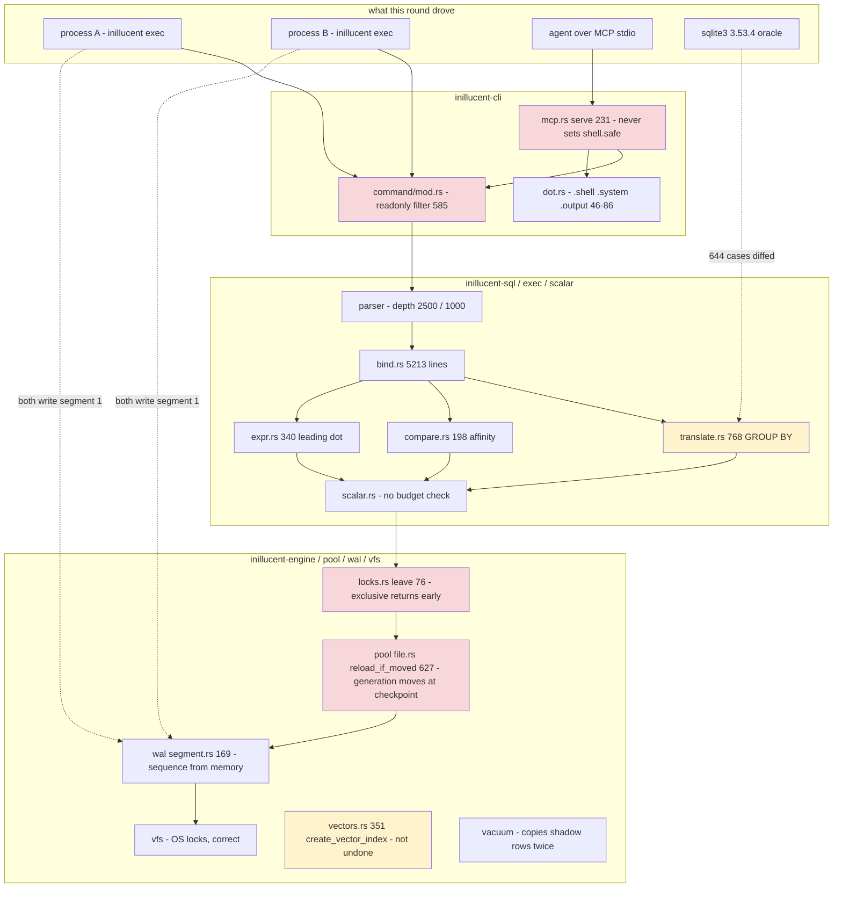
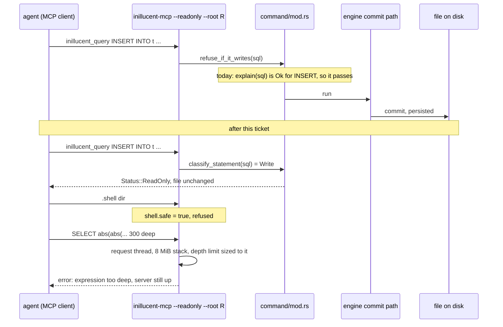

# task-1979 - inillucent code review, part eight: two processes lose commits, a read only server accepts writes, and 23 answers SQLite gives differently

Reviewed at commit `30730586a45fc96a3aadc11e3b139e09bc8df374`, the tip of `main` when this review
started. Every file and line cited below is at that revision. Unlike part six, this round ran the
built binaries: every finding marked CONFIRMED was reproduced against `target/debug/inillucent.exe`
(built 2026-09-18 01:38 from this commit) or the pinned SQLite 3.53.4 shell at
`.sqlite-ref/3.53.4/shell/sqlite3.exe`, and the seven headline findings were reproduced a second
time by the reviewer before being written down. The eight lane reports, their scripts, their SQL
case files and the databases they left behind are under `_agent_output/task-1979-code-review-part-8/`
(`sql-differential.md`, `concurrency.md`, `hostile.md`, `retrieval.md`, `feature-gaps.md`,
`drivers.md`, `release/release.md`, `quality/quality.md`).

## Introduction

This is the eighth review of the repository and the fifth that produced a design document. The four
earlier design rounds were task-1920 (41 findings), task-1946, task-1961 (architecture, tests,
documentation, roadmap) and task-1969 (the 61 places a test could pass having checked nothing, and
end to end coverage), implemented by task-1932, task-1953, task-1962 and task-1970. task-1970 closed
with 3,016 tests across 190 targets, one skip helper, every verb run as a subprocess, and a strict
run that names the suites whose prerequisite is missing. At this commit a strict run reports 3,044
tests, 0 failed, and five suites without a prerequisite (network, PostgreSQL, MySQL, ONNX), which is
the behaviour task-1969 asked for.

Those rounds read the code. This round ran it against the two things it is measured against: the
operating system (a second process, a killed process, a hostile client) and SQLite (644 statements
through both engines). The ticket asks for a world class product with a complete feature set and
thorough tests, so the question this round asks is: **what does the engine do wrong that no test in
the tree can see, because the test would need a second process, an adversary, or SQLite?**

### The short version

The single process engine is in good shape. Recall@10 through the HNSW index is 1.0000 against a
brute force at 20,000 rows. Rollback, savepoints, delete and update are honoured for vectors, FTS5
and the hybrid table together. Crash recovery across a real process boundary held on every shape
tried: a writer killed inside a 10,000 row transaction, during a checkpoint, during `CREATE INDEX`
and during `VACUUM` all reopened consistent. 200 random byte flips and 40 truncations of a database
file produced errors and never a panic. 552 of 644 differential SQL cases agree with SQLite. The
`--root` confinement refused every path trick tried against it. Lints are clean across the
workspace, `cargo fmt --check` is clean, and there is no TODO in non test code.

What needs changing, in the order it matters:

- **Two processes writing one `.rdb` lose acknowledged commits, silently.** Every statement returns
  exit 0, no busy error is ever raised, and `integrity-check` says `ok` on the result. In the one
  process per statement shape, which is what the MCP server and every `inillucent exec` call uses,
  43% of acknowledged commits were discarded on three rounds of three; the reviewer's own run of two
  writers with 60 inserts each acknowledged 120 and kept 60. Six places in the documents and one test
  file say "37 stress rounds, two processes, zero lost writes". No suite in the tree runs two engine
  writer processes. Section 4.
- **`--readonly` does not refuse writes sent through `query` or `export`.** INSERT, UPDATE, DELETE,
  a write PRAGMA, ATTACH and VACUUM INTO all run and persist through a read only MCP server, a read
  only CLI and the read only driver, because the check looks for an EXPLAIN error text that EXPLAIN
  never produces for those statements. Section 5.2.
- **`.shell` and `.system` run operating system commands on an MCP server started with `--root`**,
  and `.output`, `.once` and `.read` reach any path, because the MCP server never turns on the
  shell's safe mode. Section 5.1.
- **A statement can end the process.** 300 nested `abs()` calls, well under the declared depth limit
  of 1000, overflow the 1 MB stack; over MCP that ends the server for every client. One scalar
  expression can allocate 5.7 GB past the 256 MiB served budget, because the budget is charged
  between rows and never inside an expression. Section 5.3, 5.4.
- **23 SQL defects against SQLite 3.53.4, four of them wrong rows on common statements.**
  `SELECT g FROM t GROUP BY g` returns NULL rows when no index covers `g`. An INTEGER column
  compared to a TEXT column matches nothing. `'.5'+0` is the integer 0. `ALTER TABLE ADD COLUMN c
  INTEGER DEFAULT '5'` stores text in old rows and integers in new ones. None is recorded as a
  deliberate difference. Section 6.
- **The retrieval schema lifecycle is not transactional.** A `CREATE INDEX ... USING inillucent_hnsw`
  that fails, or whose process is killed, leaves a half made index the planner keeps using, every
  vector query on the column then fails, and it cannot be retried or dropped. `VACUUM` writes a
  duplicate `sqlite_master` row for every shadow table and makes `dump` unreplayable. `bm25()`
  disagrees with SQLite whenever a term occurs in two columns of a row. `^term` is parsed and
  ignored. Section 7.
- **92 `unsupported` sites in code, none named by `capabilities`**, and the one that matters most,
  a correlated `IN` subquery, is documented as working in `docs/sql.md`. There is no documented way
  to insert a `VECTOR(N)` value from SQL. Section 8.
- **Release polish**: a read verb with a mistyped `--db` path silently creates a new database; the
  getting started page shows a JSON shape the binary no longer prints; there is no inillucent
  format version on disk. Section 9.
- **Carried over**: `bind.rs` is 5,213 lines and the A15 ticket task-1969 section 15 asked for was
  never filed. Section 11.

## Goals and Non-Goals

### Goals

Measurable, each with the check that proves it, restated as criteria in section 14.

1. Two processes writing one database never lose an acknowledged commit. A test spawns two real
   writer processes and asserts rows present equals commits acknowledged, under both locking modes.
2. `--readonly` refuses every statement that is not a read, on the CLI, over MCP and in the driver,
   by statement class and by a storage level check, and a test asserts the file is unchanged.
3. An MCP server cannot run an operating system command or touch a path outside `--root`, through
   any dot command, and a test proves each one is refused.
4. No statement can end the process: depth limits are sized to the stack, an MCP request runs on a
   thread with a known stack, and a single value cannot exceed `Limit::Length`.
5. The four high SQL defects are fixed and the 644 case differential corpus runs in the tree, so a
   later regression on any of the 23 fails a test.
6. A failed or interrupted vector index build leaves no trace, `VACUUM` preserves the schema
   exactly, `bm25()` matches SQLite to four decimal places on a corpus where terms repeat across
   columns, and `^term` restricts to the first token.
7. Every `unsupported` family has a `no` row in `capabilities`, `docs/sql.md` claims nothing the
   engine refuses, and a correlated `IN` subquery works.
8. A read verb never creates a file; the on disk format carries an inillucent version and a stated
   compatibility rule.

### Non-goals

- A shared memory wal index and cross process snapshot isolation. Section 4.5 designs the protocol
  and section 15 asks whether to build it; this ticket makes the engine correct and honest with one
  writer at a time, and corrects the two documents that claim more.
- The A15 `bind.rs` split. Still a separate ticket (section 15).
- The 46 missing SQLite scalar functions and the roughly 25 rare planner and window shapes that
  return exit 3 (section 8.4). They are documented, not built.
- Live PostgreSQL and MySQL migration. No server was available; the code was not exercised.
- Performance. Nothing here changes a gate or a published number except where a correctness fix
  costs a page write, which section 4.4 measures.

## Problem statement

The tree has 3,044 tests and they all pass. They run inside one process, against a connection the
test itself opened, with SQL the test author wrote knowing what the engine does. Three classes of
defect are invisible to that shape:

1. **Cross process state.** The engine's cache invalidation keys on a generation number that moves
   at checkpoint, and its lock release path under the default `locking_mode = exclusive` never runs
   between statements. Inside one process every test passes. With two processes, each believes it
   is current, and the file ends up holding one of them.
2. **The trust boundary.** The MCP server is the product's answer to "give an agent a database".
   Its confinement is three flags (`--readonly`, `--root`, and the shell's `safe`), enforced in
   three places by three mechanisms, and two of the three do not do what their names say.
3. **SQLite's actual behaviour.** `docs/feature-comparison.md` measures 416 cases and
   `differential.rs` runs a corpus, and both were written from the same understanding of SQLite
   that the engine was. The 92 disagreements found this round are in the cases nobody wrote,
   and the largest (GROUP BY without an aggregate) is hidden because the one existing test uses an
   indexed key, where the answer is right.

The user impact: an application with a web server and a background worker, the most common
deployment there is, loses rows and is never told. An agent given a read only database can drop a
table. A query an ORM emits every day returns NULL for a grouped column. Each of these ships today.

## Architectural overview



Red is where a commit is lost or a confinement flag is not enforced. Amber is a wrong answer inside
one process.

## 4. Two processes

### 4.1 What was measured

`concurrency/exp3-no-rowid-collision.sh`, `exp5-locking-mode.sh`, `exp9-synchronous-and-repeat.sh`.
The table is `CREATE TABLE note (who TEXT NOT NULL, n INTEGER NOT NULL, UNIQUE(who,n))`, no
`INTEGER PRIMARY KEY`, so a missing row cannot be a rowid collision or a silent replace.

**Shape A, one process per statement** (the MCP server's shape, and every `inillucent exec`):

```
round 1: a_reported_ok=120 b_reported_ok=120 present=137 lost=103 integrity=ok
round 2: a_reported_ok=120 b_reported_ok=120 present=140 lost=100 integrity=ok
round 3: a_reported_ok=120 b_reported_ok=120 present=133 lost=107 integrity=ok
```

Reviewer's own run, 60 inserts per writer: `a_ok=60 b_ok=60`, then
`a 30 rows (n 1..60), b 30 rows (n 2..58)`, `integrity_check ok`.

**Shape B, two long lived `inillucent-shell` processes, 300 autocommit inserts each**, 11 rounds:
3 rounds lost an entire writer (300 rows), both writers exit 0, both printed 300 for their own count.

**By locking mode** (`exp5`):

```
mode=exclusive writers=1  present=600
mode=normal    writers=1  present=600
mode=exclusive writers=2  present=300   A said [self-a|300]  B said [self-b|300]
mode=normal    writers=2  present=579   A said [self-a|579]  B said [self-b|469]
```

Under `normal` the loss is `b`'s rows 1 to 21: the rows written before the other process's
checkpoint moved the generation. Under `exclusive` each writer saw only its own rows for its whole
life and the survivor's file replaced the other's.

The same loss goes through `ATTACH` (C2, `exp7-reader-readonly-attach.sh`): two processes with
different main databases attaching one shared file, one side lost entirely.

### 4.2 Cause, as far as it was traced

Four facts, each at a line:

1. `crates/inillucent-pool/src/file.rs:627-645` `reload_if_moved`: the staleness check is
   `found.generation <= self.meta.generation`, and the doc comment above it says the generation is
   bumped by every checkpoint. A commit that is durable in the log and not yet checkpointed does
   not move it, so another process's commit is invisible until its checkpoint.
2. `file.rs:639` `self.pool.discard_all()` when the generation has moved. That discards every cached
   page, including this connection's own pages holding commits it has already acknowledged and that
   live only in its own log segment. That is `b`'s rows 1 to 21 under `normal`.
3. `crates/inillucent-engine/src/engine/state.rs:458` `locking_exclusive: Cell::new(true)`, and
   `crates/inillucent-engine/src/engine/locks.rs:76-99` `leave()` returns before the checkpoint and
   before `end_access()` when `locking_exclusive()` is set. The comment in that function says the
   first version of `normal` mode "did eight times in ten under two concurrent writers" exactly this,
   and was fixed for `normal` by checkpointing before release. The default is `exclusive`, which
   skips that path.
4. `crates/inillucent-wal/src/segment.rs:169-176`: the segment is `{base}-wal.{sequence:010}` and
   both processes computed sequence 1 and appended from their own remembered tail. After the
   `exclusive` two writer run the directory holds one segment of 220,160 bytes with one writer's
   work.

The VFS lock protocol is correct. `exp4-lock-probe.sh` shows the engine refusing to open while
`inillucent-lock-probe` holds EXCLUSIVE, and `exp4c-autocommit-lock.sh` shows a writer holding the
file through a 6,000 statement autocommit stream. The defect is above the locks: what a process
reads before it holds the lock (the meta record, the log tail) is trusted after it holds the lock,
and what a process wrote before another process moved the generation is discarded.

Shape A is the case that has to be understood first. Each process opens, writes, checkpoints on
close (which moves the generation) and exits, so the generation check should fire for the next
process. It loses rows anyway, which means the open path reads the meta record or the log tail
before taking the lock and does not re-read it after. The implementer's first step is the test in
4.3, then instrumenting `open`, `begin_write_within` (`file.rs:539-556`) and the segment open to
print generation, sequence and tail offset with the process id, to establish the exact interleaving.
The design below is written to be correct regardless of which interleaving it is.

### 4.3 The test, first

`crates/inillucent-compat/tests/process_concurrency.rs`, tier `durability`, a row in
`tests/selection.toml` beside `process_crash` (near line 1083). `process_crash.rs` is the model: it
already spawns a real child with `Command::new` through `inillucent_compat::cliproc` and feeds a
shell a script file.

Cases, each asserting a value:

- `two_writer_processes_lose_nothing_one_statement_each`: two children, each running N single
  statement `inillucent exec` inserts; a third process counts. Assert `count == acknowledged`, where
  acknowledged is the number of child invocations that exited 0. A child that was refused with
  `busy` and exited non zero is a pass for that row; a child that exited 0 and whose row is missing
  is the failure. N = 60 per writer is enough: shape A fails on every round at N = 120.
- `two_writer_processes_lose_nothing_long_lived`: two `inillucent-shell` children, 300 autocommit
  inserts each, same assertion.
- Both cases run under `PRAGMA locking_mode = normal` and `= exclusive`, because the two modes fail
  differently.
- `two_processes_attaching_one_file_lose_nothing`: C2.
- `a_readonly_process_reads_while_a_writer_holds_a_transaction`: a writer child holds `BEGIN` with
  one insert uncommitted; the parent runs `inillucent --readonly --db f query "SELECT count(*)"` and
  asserts a row count. Fails today with the writer's busy error after 5.4 s (C5).
- `a_refusal_names_the_holder_and_the_operation`: C6.

Rule 1.2 of the testing standard is satisfied: the current build fails the first case on every
round.

### 4.4 The fix, phase one: one writer at a time, and never a lost write

The invariant: **a connection acts only on state it read while holding the lock, and never discards
a page that holds a commit it acknowledged and has not checkpointed.**

1. **Read the meta record and discover the log tail under the lock, every time the lock is taken
   from `None`.** `begin_read` (`file.rs:499-510`) and `begin_write_within` (`file.rs:539-556`)
   short circuit when `lock_level() != FileLock::None`; when it is `None` and the lock is acquired,
   the acquisition itself is the point to run `reload_if_moved` and to re-open the segment at its
   real tail. Nothing read at `open()` before the first lock may be trusted afterwards.
2. **Make a commit visible to the staleness check.** Two options; the ticket picks one and measures
   it. (a) Move the generation on every commit: the meta slot write already exists and the commit
   path already syncs, so the cost is one more page in the commit's write set. (b) Keep the
   generation at checkpoint and add a commit counter to the segment header, checked under the lock
   alongside the generation. (a) is simpler and reuses `Meta::choose`; the cost is measured with
   `inillucent-writegate` before and after, and `docs/performance.md` is updated if a number moves
   by more than its noise band.
3. **`discard_all()` is never reached with acknowledged, uncheckpointed commits.** `reload_if_moved`
   checkpoints this connection's own log first, then discards, or returns `busy` and leaves the
   cache alone. Losing the write is the failure; `busy` is a correct outcome.
4. **The segment sequence comes from the directory under the lock**, not from the opening process's
   memory: `segment.rs:169` names the file from a sequence the connection read at open; the
   connection re-lists after taking the lock and appends to the real tail or opens the next
   sequence.
5. **`locking_mode` defaults to `normal`.** `docs/feature-comparison.md:844` chose `exclusive` on a
   benchmark that was single process. With `exclusive` the lock is never released between
   statements, so a second process either waits the whole life of the first or, as measured, reads
   stale state. `normal` releases and checkpoints at `leave()`, which is the path that already
   contains the lost write reasoning. Section 15 asks Jason to confirm; if he keeps `exclusive`,
   every document that mentions more than one process says the default is unsafe for it.
6. **`PRAGMA busy_timeout` governs the cross process wait.** `BUSY_BUDGET_MILLIS = 5_000` at
   `crates/inillucent-pool/src/file.rs:734` becomes the default value of the pragma rather than a
   constant it ignores (C7). The pragma's `docs/pragmas.md` row says so.
7. **The refusal names the holder and the operation** (C6): "another process holds the file for
   reading" or "for writing", never "a writer holds PENDING" for a reader.
8. **`PRAGMA locking_mode = <unknown>`** returns an error rather than keeping the current value
   (`pragma/tuning.rs:394`, the `_ => {}` arm) (C8).
9. **An out of sequence segment beside a database** is reported at open, not ignored forever (C9),
   and **recovery says it ran**, in text and in the JSON object, with the frame count (C10).

### 4.5 Phase two, the design, for the decision in section 15: readers that do not block

`crates/inillucent-pool/src/file.rs:521-537`'s doc comment states the current design directly:
writers take EXCLUSIVE rather than RESERVED because there is no shared memory index a reader could
use to find the log. That is a coherent design. `docs/sql.md:201` ("readers never block") and
`docs/product-overview.md:88` ("snapshot isolation") describe a different one. Phase one corrects
the two documents. The protocol that would make them true without shared memory:

- A writer takes RESERVED, appends frames to the segment, and takes PENDING then EXCLUSIVE only
  for the checkpoint, exactly as SQLite's rollback journal mode does for the main file.
- A reader takes SHARED, reads the segment header for the committed tail at that moment, and reads
  main file pages overlaid with frames up to that tail. Frames are append only and a writer never
  rewrites an earlier frame, so the reader's prefix is a consistent snapshot. Cost: one scan of the
  segment index per read transaction, bounded by checkpoint frequency.
- A checkpoint needs EXCLUSIVE, so it waits for readers to finish; a long reader delays the
  checkpoint, never blocks a writer, and the segment grows meanwhile. That is SQLite's WAL trade,
  with the wal index replaced by a scan.

This is a real feature and a real week of work. Section 15 asks whether it is in this sprint.

### 4.6 The six claims

`docs/roadmap.md:152`, `docs/architecture-overview.md:97`, `docs/feature-comparison.md:844`, `:1147`,
`:1789` and `crates/inillucent-compat/tests/concurrency.rs:116` say "37 stress rounds, two processes,
zero lost writes". `concurrency.rs` runs two sessions in one process. Each of the six lines is
rewritten to what 4.3's test measures, once it passes, with the test named.

## 5. The trust boundary: `--root`, `--readonly`, and the process itself

### 5.1 H1: dot commands escape `--root`

CONFIRMED. On an MCP server started `--root <dir>` and not `--readonly`, `.shell`, `.system`,
`.output`, `.once` and `.read` run against the operating system with no confinement.

- `crates/inillucent-cli/src/dot.rs:86` dispatches `"shell" | "system"` to
  `crates/inillucent-cli/src/commands.rs:39` `system()`, which spawns `cmd /C` (line 49) or
  `/bin/sh -c` (line 54). Its only guard is `shell.unsafe_refused(".system")` at line 40, which
  returns false whenever `shell.safe` is false.
- `dot.rs:46-47` route `.output` and `.once` to a file open, and `.read` to
  `std::fs::read_to_string(path)`, with no confinement and no safe check.
- `crates/inillucent-cli/src/mcp.rs:231-239` `serve()` builds the context with `readonly` and
  `root` and never sets `shell.safe = true`. `inillucent-mcp` has no flag that would.
- L1: a child spawned by `.shell` inherits the server's stdout and writes into the JSON-RPC frame
  stream, hanging the client.

Fix: `serve()` sets `shell.safe = true` unconditionally, and safe mode is documented as always on
over MCP. Independently, every dot command that takes a path (`.open`, `.output`, `.once`, `.read`,
`.import`, `.dump` to a file, `.backup`, `.restore`) resolves it through the same confinement
function `--root` applies to `db` paths, so a future dot command cannot be added outside it. The
function that confines a path already exists and refused every trick in `hostile/`; it gains one
more caller per path taking dot command.

### 5.2 H2: `--readonly` accepts writes through `query` and `export`

CONFIRMED on the CLI (`inillucent --readonly --db f query "INSERT ..."` exit 0, row present on
reopen), over MCP (`inillucent_query` with INSERT, UPDATE, DELETE, `PRAGMA user_version=7`, all
`isError=false`, all persisted), and in the driver.

- `crates/inillucent-cli/src/command/mod.rs:585-605` `refuse_if_it_writes` calls `explain(sql)` and
  refuses only when the error message contains `"not a read-only statement"`.
- `crates/inillucent-engine/src/engine/compiled.rs:267` `compile_explain` special cases `Select`,
  `Update` and `Delete` to describe a plan, and sends `Insert`, `Directive` (PRAGMA, ATTACH, VACUUM
  INTO) and the rest to `describe_statement` at line 322, which returns `Ok`. The text the filter
  looks for is never produced for a write.
- `drivers/inillucent-driver/src/lib.rs:934` has the same function with the same check, under a
  doc comment at line 928 that describes what `explain` does not do.
- The `readonly_open` note in `capabilities` says "a statement that does not bind to a SELECT is
  refused". For `query` and `export` that is false.
- A correct classifier exists and is unused for this: `classify_statement` and `StatementClass`
  (`ReadOnly`, `Write`, `SchemaChange`, `Pragma`, `TransactionControl`) in
  `crates/inillucent-sql/src/parser/mod.rs`.

Fix, two layers, because a text filter in the CLI is the wrong place for a security property:

1. **Statement class.** Both `refuse_if_it_writes` bodies become: parse, classify, and refuse any
   class other than `ReadOnly`, plus the read only pragmas (a list, in one place, with a test that
   every pragma in `docs/pragmas.md` is in exactly one of the two lists).
2. **Storage level.** A connection opened read only carries the flag to the engine, and the commit
   path (the one place every write goes through) refuses with `Status::ReadOnly` when it is set. C5
   is fixed in the same change: `OpenMode::of(readonly)` at `command/mod.rs:342-350` is threaded
   through `Context::open` (`mod.rs:360-401`) to `Shell::open` and to `inillucent_vfs::OpenOptions`,
   and a read only open takes SHARED only, never raising. `Pager::open_read_only` at
   `crates/inillucent-storage/src/pager.rs:268-297` exists and is reachable only from the legacy
   transaction path and benchmarks; the live engine starts using it.

With layer 2 in place, layer 1 is what gives the caller a good message; layer 2 is what makes the
property true.

### 5.3 H3: a nested expression ends the process

CONFIRMED. `SELECT abs(abs(...(1)...))` 300 deep: `thread 'main' has overflowed its stack`, exit
code 0xC00000FD, in debug and release, CLI and MCP server. `Limit::ExprDepth` is 1000
(`crates/inillucent-sql/src/parser/mod.rs:302-303`) and `Limit::ParserDepth` is 2500 (`:269`); the
binaries carry a 1 MB stack reserve (read from the PE header). The 2,000 case parser fuzz reached
the same overflow from two other shapes (`SELECT count((((` and `INSERT ... VALUES ((((`). Nested
subqueries hit `MAX_SELECT_DEPTH = 64` in `bind.rs` cleanly, but 1,000 nested subqueries overflow
the parser before bind runs.

Fix, with the invariant **any statement the parser accepts cannot overflow any later stage**:

1. Measure bytes of stack per nesting level in parse, bind, plan and execute (a debug build with a
   stack probe, once, recorded in the test's comment), and set `ExprDepth` and `ParserDepth` so that
   the deepest stage at the limit uses under half the smallest stack the binary runs on.
2. The MCP server runs each request on a `std::thread::Builder` thread with an explicit
   `stack_size` (8 MiB), so the limit is against a known number and one request's overflow cannot
   end the server. The same for the CLI's `query` and `exec`.
3. `crates/inillucent-compat/tests/hostile.rs` gains: at the limit, `Ok` or a clean `Err`; one past
   the limit, `Err` naming the limit; after both, `SELECT 1` still answers on the same connection.
   It drives a real connection, because the failure is a stack overflow that a unit test of the
   constant cannot reach.

### 5.4 H4: one expression allocates past every budget

CONFIRMED. Over MCP with the 256 MiB served budget: `SELECT length(printf('%2000000000d', 1))`
reached 5,734 MB of working set and returned `2000000000`, `isError=false`;
`SELECT length(zeroblob(1073741824))` reached 2,873 MB. On the CLI and driver, whose default is
`Limits::unbounded()`, the recursive doubling `WITH RECURSIVE c(s) AS (SELECT 'aa' UNION ALL SELECT
s||s FROM c) SELECT length(s) FROM c` reached 49 GB before the harness timeout.

`crates/inillucent-exec/src/scalar.rs` evaluates a scalar expression with no `budget::check` or
`budget::materialise` call; `crates/inillucent-base/src/budget.rs` is charged between rows, scan
leaves and result batches. `Limit::Length` (default 1e9) is enforced on the write path at
`crates/inillucent-value/src/record.rs` and never on a value that is only read.

Fix: `Limit::Length` is enforced at value construction in `scalar.rs` for `zeroblob`, `randomblob`,
`printf` and `format` width, `hex`, `char`, `replace`, `||` and `repeat` if present, with the error
SQLite gives ("string or blob too big"); and the budget is charged for any single allocation over a
threshold (1 MiB) so the served ceiling stops a large intermediate before the row completes. The
CLI default stays unbounded for rows and time (section 15 asks about a default memory ceiling), but
`Limit::Length` applies everywhere because it is a value bound, not a resource budget. Tests in
`hostile.rs` run each shape under a small `StatementLimits` and assert the refusal.

### 5.5 M1: `migrate` publishes a database missing a table and reports success

CONFIRMED. A SQLite source with a corrupted page is read by `inillucent-sqlite-reader`, which skips
what it cannot read; the migration copies what the reader returned, verifies by reading the source
with the same reader, and publishes with exit 0 and `integrity-check ok`, one table short. The
verification cannot see an omission the reader made on both sides.

Fix: the reader never skips. An unreadable page, a cell whose payload does not parse, or a
`sqlite_master` row whose root page cannot be walked is an error that names the page, and `migrate`
refuses to publish. Independently, `migrate` compares the table count and per table row count it
copied against the source's `sqlite_master` row count and, where the source has one, the source's
own `sqlite_stat1`; a mismatch refuses. A corrupted source fixture (one byte flip in a leaf page of a
two table database, produced by the `hostile/` script and checked in under `tests/` corpora) is
the test, asserting `exit != 0` and no published file.

### 5.6 What held

Every `--root` attack in `hostile.md` section "What held" was refused: absolute paths, `..`, UNC,
`\\?\` verbatim, trailing dot and space, `::$DATA`, double slash, mixed case, a junction inside the
root pointing out, ATTACH and VACUUM INTO destinations, per call `db` redirect, and the backup,
restore, export and import verbs. 200 byte flips and 40 truncations of a database file: errors, no
panic, no hang. 2,000 mutated statements: no panic except the nesting overflow. P1 (a byte flip in
an un checkpointed segment changed a query's row count with `integrity_check ok`) is PLAUSIBLE and
recorded for the implementer to reproduce under 4.3's instrumentation; if a frame checksum exists
and did not catch it, that is a finding of its own.

## 6. SQL: 644 cases against SQLite 3.53.4

`sql-differential/` holds the harness, the case files and the JSON results. 552 agree (503 rows
identical, 49 both refuse), 92 disagree: 70 wrong rows, 11 inillucent refused where SQLite answered
(5 are exit 3 gaps), 11 inillucent answered where SQLite refused. 23 distinct defects. Nothing in
`docs/sql.md` or `docs/feature-comparison.md` records any as deliberate.

### 6.1 The four that return wrong rows on ordinary statements

| id | statement | SQLite | inillucent | where |
|---|---|---|---|---|
| F1 | `SELECT g FROM t GROUP BY g` with no aggregate in the statement and no index on `g` | `a`, `b` | two NULL rows | `crates/inillucent-sql/src/translate.rs:768` |
| F2 | `WHERE i = s`, `i INTEGER` column, `s TEXT` column, rows (5,'5') (7,'7') | 2 rows | 0 rows; and an untyped column against TEXT matches rows it should not | `crates/inillucent-exec/src/compare.rs:198`, two entries of the affinity table |
| F3 | `SELECT '.5'+0` | 0.5 | integer 0; every leading dot numeral in arithmetic | `crates/inillucent-sql/src/expr.rs:340` |
| F4 | `ALTER TABLE t ADD COLUMN c INTEGER DEFAULT '5'` then insert | `typeof(c)` integer for all rows | text for old rows, integer for new | `crates/inillucent-sql/src/alter.rs:591` |

F1 accounts for 18 of the 92 disagreements, F2 for 15, F3 for 6. F1 is hidden from the existing
suite because `ordering.rs:116` groups on an indexed key, where the plan takes a different path and
the answer is right. The fix for each is at the cited line; the test is the corpus in 6.3.

### 6.2 The nineteen others

| id | sev | what | where known |
|---|---|---|---|
| F5 | medium | `(a=b) COLLATE NOCASE` applies the collation inside the parentheses | `bind.rs:4674` |
| F6 | medium | `DROP TABLE` ignores foreign keys with `PRAGMA foreign_keys=ON` | |
| F7 | medium | `INDEXED BY <missing index>` is silently ignored on SELECT, DELETE and UPDATE | |
| F8 | medium | an insert past the maximum rowid fails `UNIQUE constraint failed` instead of choosing a free rowid | |
| F9 | medium | `UPDATE t SET rowid = 100` is `no such column: rowid` | |
| F10 | medium | `round(2.675, 2)` is 2.68; SQLite 2.67 (scales by a power of ten) | `builtin.rs:962` |
| F11 | medium | no date range limit: `date('9999-12-31','+1 day')` is `10000-01-01`; SQLite NULL | |
| F12 | medium | hour 24 is normalised into the next day | |
| F13 | medium | the `utc` modifier is ignored; `localtime` returns NULL | |
| F14 | medium | the `floor` and `ceiling` modifiers return NULL | |
| F15 | medium | `... UNION ... ORDER BY a COLLATE NOCASE` is a parse error | |
| F16 | medium | `char()` with no arguments is a parse error | |
| F17 | low | `ntile(0)` returns NULL; SQLite errors | |
| F18 | low | `EXCLUDE` accepted with no frame clause | |
| F19 | low | scalar `min()` tie keeps the first; SQLite the last | `builtin.rs:570` |
| F20 | low | `UNION` and `DISTINCT` keep a different duplicate across storage classes | |
| F21 | low | `'1e'+0` is real 0.0; SQLite integer 1 | |
| F22 | low | `oid` and `_rowid_` column names are not normalised to `rowid` | |
| F23 | low | a negative year renders `-001-12-31`; SQLite `-0001-12-31` | |

Exit 3 gaps met on the way, not wrong answers: a window function inside a derived table; `LIMIT
1+1`; `LIMIT '2'`; `(a,b) IN (SELECT ...)`; `UPDATE t SET (a,b) = (3,4)`.

### 6.3 The corpus becomes a test

The 644 cases are hand written, deterministic, and already split by category. They move from
`_agent_output/` (gitignored) into `crates/inillucent-compat/tests/corpora/differential-part8/`,
one file per category, and `differential.rs` gains a case that runs every file through the oracle
and the engine and asserts zero disagreements outside an explicit allow list. The allow list starts
at the 23 rows above and shrinks as each is fixed; a test asserts the allow list has no entry that
now agrees, so a fixed defect cannot stay listed (the rule from task-1969 section 4: a test that
cannot fail is worse than none). The suite already declares `requires = ["oracle"]`, so a machine
without the oracle skips visibly.

## 7. Retrieval: right answers, wrong lifecycle

### 7.1 What is right, measured

Recall@10 is 1.0000 at 20,000 rows and 64 dimensions against a numpy brute force, through a cosine
index, an L2 index, and the unindexed `vector_dot` scan. Rollback, `SAVEPOINT` and `ROLLBACK TO`,
delete and update are honoured for vectors, FTS5 and the hybrid table in one transaction. After
deleting 10,000 of 20,000 indexed rows, no deleted id came back and recall on the survivors stayed
1.0000. Results are identical across reopen. 28 of 41 FTS5 parity queries matched SQLite exactly,
including `NEAR`, prefix, column filter, diacritic folding, `highlight`, `snippet`, `ORDER BY rank`,
the three `fts5vocab` shapes, `porter` stemming and external content tables.

### 7.2 Findings

| id | sev | what | where |
|---|---|---|---|
| R1 | high | a `CREATE INDEX ... USING inillucent_hnsw` that fails or is killed is not undone: catalog rows and shadow tables stay, the planner keeps using it, every vector query on the column fails with `bad parameter or other API misuse`, and it cannot be retried or dropped | `crates/inillucent-engine/src/vectors.rs:351-504` `create_vector_index`; the finiteness check that fails the build is `crates/inillucent-search/src/store.rs:1027-1064` |
| R2 | high | `VACUUM` writes a second `sqlite_master` row for every virtual table shadow (6 rows become 11 for 6 names, 131,072 bytes become 458,752) and `dump` then produces SQL that cannot be replayed | the shadow tables are ordinary catalog rows (`crates/inillucent-ext/src/shadow.rs:9-16`) and the copy sees them twice |
| R3 | high | `bm25()` saturates term frequency per column and adds; SQLite sums the weighted frequencies across columns and saturates once. Scores and order differ whenever a term is in two columns of a row, and always when weights are passed | the differential test that claims "to the last digit" has a four row corpus with no such row and passes no weight |
| R4 | high | the initial token operator `^` is parsed and dropped: `^alpha` returned 206 rows, SQLite 82 | |
| R5 | high | `content=''` is accepted but the table is not contentless: text is stored and returned where SQLite returns NULL, and `delete-all` is refused | |
| R6 | medium | `DROP INDEX` on a vector index reports success and removes nothing | |
| R7 | medium | `{col1 col2}:term`, `{col}:term`, `-col:term` and `"a b"*` are refused; SQLite answers all four | |
| R8 | medium | a `VECTOR(N)` column accepts NaN and Infinity (byte length is the only check); those rows sort ahead of every real neighbour and a later `CREATE INDEX` fails, which is how R1 is reached with no crash | `crates/inillucent-exec/src/dml/insert.rs:698-718` |
| R9 | medium | ten delete and reinsert cycles grow the file 5.4 times at constant row count; `compact` does not shrink it; `VACUUM` reclaims to 2.5 times a fresh build | |
| R10 | medium | `search --k 0`, `vector-search --k 0` and `--k -1` return one row | |
| R11 | medium | `CREATE TABLE ... CHECK (unknownfn(x))` and a generated column over an unknown function are accepted; SQLite refuses at `CREATE TABLE` | |
| R12 | medium | `docs/architecture.md:263` and `docs/vector-search.md:170` say the default fusion is reciprocal rank fusion; the shipped default is a normalised score fusion with adaptive weights | |
| R13 | medium | `PRAGMA hnsw_ef_search`, documented at `docs/feature-comparison.md:1339` and `options.rs:198`, does not exist; accepted and ignored | |
| R14 | low | every FTS5 query syntax error collapses to `SQL logic error`; the parser builds a specific message and drops it | |
| R15 | low | `detail=`, `columnsize=`, `content_rowid=` and `prefix=` are accepted and ignored | |
| R16 | low | in a hybrid query a document with no vector is labelled `origin='both'` and given a vector score; a pure vector query returns it at 0 | |
| R17 | low | MATCH strings SQLite rejects are accepted: `co-operate`, `it's`, an unterminated `"cat` | |
| R18 | low | dropping a vector index leaves its five shadow tables permanently; `VACUUM` left temporary files on disk in three runs | |
| R19 | low | `inillucent indexes` never lists a vector index, because it is recorded as a virtual table row | |

### 7.3 Fixes

- **R1, R6, R18, R19: the vector index is a catalog object with a lifecycle.** `create_vector_index`
  runs inside the DDL statement's undo scope (task-1850 gave statements undo), so a failure at any
  point, including the finiteness refusal, removes the catalog rows and shadow tables it created;
  a kill mid build is covered by the same recovery that already handles `CREATE INDEX` on a B-tree
  (`reindex_crash` passes today). `DROP INDEX` removes the rows and the shadow tables. `indexes`
  lists it. Test: `search_crash.rs` gains a kill during an HNSW build asserting the column is
  queryable and the index absent after reopen; `vector.rs` gains a NaN row, a failed build, and a
  successful retry.
- **R8: validate at insert.** `insert.rs:698` checks dimension and finiteness, with SQLite's error
  class (`constraint`), so R1's no crash path closes.
- **R2: `VACUUM` skips shadow rows** when copying the catalog and lets each virtual table recreate
  its own; the count of `sqlite_master` rows and the `dump` replay are the test.
- **R3: `bm25()` computes SQLite's formula**: for each phrase, `tf = sum over columns of
  weight[col] * hits[col]`, `dl = sum over columns of weight[col] * tokens[col]`, one saturation.
  Test: a corpus where a term appears in both columns of one row and in one column of another,
  with and without weights, compared to the oracle to four decimal places, so the existing test's
  blind spot is closed rather than kept.
- **R4, R7, R14, R17: the FTS5 query parser** honours `^`, accepts the three column filter forms
  and the phrase prefix, keeps its own error message, and rejects what SQLite rejects. Parity is the
  41 query file in `retrieval/`, promoted to a corpus beside 6.3's, run against python's sqlite3
  FTS5 or the pinned shell, asserting rows and order.
- **R5, R15: options are either honoured or refused.** `content=''` becomes contentless (NULL
  columns, `delete-all` accepted); `detail`, `columnsize`, `content_rowid` and `prefix` are
  implemented where cheap and refused with exit 3 where not. Accepting and ignoring an option is the
  one outcome that is never right.
- **R9: reclaim.** `compact` reclaims tombstoned vector nodes, or the document says only `VACUUM`
  does and the file growth per cycle is the test's assertion.
- **R10, R11**: `k <= 0` is an error; unknown functions in `CHECK` and generated columns are refused
  at `CREATE TABLE`.
- **R12, R13, R16**: the two documents say what the code does; `hnsw_ef_search` is implemented
  (the search already takes an `ef` internally) or the two mentions are removed; a document with no
  vector is `origin='keyword'` with no vector score.

## 8. Feature gaps and the documents that describe them

`gaps/` holds the census. 92 distinct `unsupported()` call sites, about 45 distinct feature
messages. 49 ORM statements (Django, SQLAlchemy, Prisma, Rails, sqlx, Knex): 45 succeed, 1 real gap.
218 SQLite functions, 172 present, 46 missing, all scalar. 68 pragmas, 68 documented, 68 live.

### 8.1 The gaps that matter

| # | feature | fails how | documented | who emits it | sev |
|---|---|---|---|---|---|
| 1 | correlated `IN` / `NOT IN` subquery | exit 3 | **contradicted**: `docs/sql.md:82-84` says subqueries in `IN` work "including correlated ones" | Django `__in=Subquery(...)`, SQLAlchemy | high |
| 2 | no SQL literal or `--params` form inserts a `VECTOR(N)` | constraint / invalid_state | undocumented; the only working form is a little endian float32 BLOB hex literal that appears only in `crates/inillucent-compat/tests/vector.rs` | every vector adopter's first write | high |
| 3 | `ON CONFLICT` targeting a partial unique index | exit 3 | undocumented | Django, Rails partial index upserts | medium |
| 4 | `ON CONFLICT` targeting an expression index | exit 3 | undocumented | same | medium |
| 5 | `INSERT INTO <virtual table> SELECT ...` | exit 1 syntax, not exit 3 | undocumented | the FTS5 backfill idiom | medium |
| 6 | `capabilities` names zero refusals: 24 rows, all `yes` or `partial` | | | anyone following AGENTS.md's advice to ask before composing | medium |
| 7 | a real SQLite file opened as an `.rdb` reports corruption | | refusal documented, the runtime text is not | the most common first mistake | medium |
| 8 | `sqlite_temp_master` absent before a TEMP object exists | not_found | undocumented | Knex, older TypeORM | low |
| 9 | an unimplemented FTS5 tokenizer name (`trigram`) | exit 3 | which tokenizers exist is undocumented (`ascii`, `unicode61`, `porter` work) | substring search | medium |
| 10 | an unknown HNSW metric | generic "SQL logic error" | valid values documented, failure text not | pgvector ports | low |
| 11 | `--params` cannot bind a BLOB or an array | invalid_state | undocumented | CLI vector scripting | medium |
| 12 | `embed()` with no model installed | invalid_state, not exit 3 | documented, breaks the exit 3 rule | | medium |

### 8.2 Fixes

- **#1, correlated `IN`.** Lower `x IN (SELECT y FROM s WHERE corr(outer))` to
  `EXISTS (SELECT 1 FROM s WHERE corr(outer) AND s.y = x)` with SQLite's NULL rules kept: if `x` is
  NULL the result is NULL, not false; `NOT IN` where any `y` is NULL yields NULL, so the lowering
  for `NOT IN` is `NOT EXISTS (... AND (s.y = x OR s.y IS NULL))` guarded by `x IS NOT NULL`. The
  engine already runs correlated `EXISTS`, so this is a bind time rewrite in `bind.rs` (recorded
  against A15's line budget: one function, under 50 lines, or it goes in a new module). Test: the
  six NULL cases against the oracle.
- **#2, a vector literal.** A TEXT value that parses as a JSON array of N numbers converts to a
  `VECTOR(N)` on insert and on bind (affinity conversion, the same place F4 applies affinity), and
  `--params` accepts a JSON array for a vector parameter. `docs/vector-search.md` shows an INSERT.
- **#3, #4**: resolve the conflict target against partial and expression indexes the way SQLite
  does (match the index's expression list and `WHERE`), or refuse with exit 3 and a `no` row.
- **#5, #7, #10, #12**: the message and the code: exit 3 where the feature is absent, the named
  status elsewhere; the SQLite file message says "this is a SQLite database; run
  `inillucent-migrate`".
- **#6, the `no` rows.** `capabilities` gains one row per `unsupported` family (about 45), status
  `no`, note naming the statement shape, and the capability test's existing "both directions"
  check covers them: a `no` row that now works fails the build, which is how the census stays true.
  `docs/sql.md:82-84` is corrected the same day, and the `directive.rs:728` arm that presents as a
  refusal of `CREATE TABLE ... AS SELECT` but is unreachable is removed.
- **#9, #11**: document the tokenizers; `--params` binds a BLOB as `{"blob":"<hex>"}` and an array
  as a vector.

### 8.3 Stale documents found by the census

| where | says | reality |
|---|---|---|
| `docs/sql.md:82-84` | correlated IN subqueries work | exit 3 |
| `docs/vector-search.md` | CREATE and SELECT shown | no working INSERT shown |
| `docs/sql.md` refusal table | the SQLite file refusal is clean | runtime text says corruption |
| `AGENTS.md` binding table | reads as if Node, Go and PHP bindings ship | `docs/feature-comparison.md` states what ships; the row is ambiguous |
| `directive.rs:728` | a refusal of CTAS | unreachable |
| FTS5 tokenizers | nothing | `ascii`, `unicode61`, `porter` work; others exit 3 |

### 8.4 Documented, not built, left alone

46 scalar functions; about 10 correlated join and index seek planner shapes
(`inillucent-exec/src/physical/keys.rs`, `stages.rs`); about 7 window function edge cases;
compound query edge cases; `RETURNING` inside a trigger; row value `(a,b) IN (...)`; `DISTINCT` in a
window or scalar function; multi column HNSW; `ATTACH ... KEY`; `.expert` and `.session`. Each
gets a `no` row (8.2) and nothing else in this ticket.

## 9. Release readiness

| id | sev | what | where |
|---|---|---|---|
| E1 | high | `docs/getting-started.md:148-155` shows `--output json` as `"status":"ok"`, `"columns":["id","body"]`; the binary prints `"ok":true`, `"columns":[{name,type}]` and eight more fields. `agent-skills/inillucent-quickstart/SKILL.md` has the right shape | |
| E2 | medium | a read verb (`tables`, `query`, ...) with a `--db` path that does not exist creates an empty database and a segment file, exit 0, no message | the open path |
| E3 | medium | no inillucent format version on disk: `crates/inillucent-storage/src/header.rs` `write_library_version` stores SQLite's version number; no document states whether `.rdb` is stable across point releases | |
| E4 | medium | `agent-skills/inillucent-quickstart/SKILL.md:22-26` says Go install 404s because the repository is private; it is public | |
| E5 | medium | `packaging/install.sh:195-201` prints a zsh PATH instruction on Ubuntu, whose shell is bash | |
| E6 | low | `inillucent-shell` `.tables` ignores `.headers` and `.mode`; `.databases` omits `temp` | |
| E7 | low | `docs/repository.md` coverage table is labelled v0.1.3 at v0.1.4 | |
| E8 | low | the params count mismatch and errno messages are accurate but do not say what to do | |

Version strings agree everywhere (Cargo.toml, npm, pyproject, MCP `serverInfo`, `--version`).
`release.ps1`'s refusal gates and smoke test, `install.ps1`'s PATH handling, crates.io metadata,
and the 30 command, 63 of 65 dot command and 403 of 416 claims are internally consistent.

Fixes: E2, only `create` and `migrate` make a file; every other verb fails with `not_found` naming
the path (test in `cli_commands.rs`: `tables` on a missing path exits non zero and the path does
not exist afterwards). E3, an inillucent format version in the reserved header bytes, checked on
open with a clear refusal for a newer format, and one paragraph in `docs/relational-architecture.md`
stating the rule: a point release reads every earlier point release's file; a format bump is a
minor version and a documented migration. E1, E4, E5, E7 are text; E6, E8 are small.

## 10. Drivers and bindings

`drivers.md`, with `drivers/capi-findings.md`, `rust-findings.md`, `packages-findings.md`. Symbol
parity across `drivers/abi.toml`, the header and the exported symbols is exact. The Rust driver
passed every value edge (64 bit integers, NaN, Infinity, negative zero, unicode with an embedded
NUL, BLOB, NULL), transactions with rollback on drop, prepared statement reuse and large result
iteration. Only Python has an in process driver; Node, PHP and Go are wrappers that spawn the CLI
per call, and `docs/feature-comparison.md` says so.

### 10.1 The C ABI

| id | sev | what |
|---|---|---|
| D1 | high | freeing an `inillucent_db`, `inillucent_conn` or `inillucent_error` twice corrupts the heap and ends the process; using a freed handle is undefined behaviour with no liveness check, sometimes a silently wrong value (an empty path, a query that returns OK against a freed connection), sometimes an abort that `catch_unwind` cannot intercept |
| D2 | high | a TEXT value of 32,768 bytes or more bound through `inillucent_bind_text` fails at execute with `INILLUCENT_SYNTAX` ("bad parameter or other API misuse") or `INILLUCENT_CORRUPT` depending on size; 32,767 succeeds; a BLOB of the same size succeeds. A 40,000 byte TEXT built by a literal expression through the CLI inserts and reads back at length 40,000, so the defect is in the bind path of the driver or the C ABI, not in storage; the lane did not find the cast and the implementer pins it |
| D3 | high | `inillucent_bind_int`, `_real`, `_text`, `_blob` and `_null` take a caller supplied `uint32_t` index with no upper bound; one call with a large index allocates up to an estimated 137 GB and stalls for tens of seconds |
| D4 | medium | `inillucent_bind_text` with invalid UTF-8 silently binds a BLOB; correct, and the header does not say so |
| D5 | low | the panic guard stops an unwinding panic and not the abort behind D1; thread safety is documented as the caller's job; the `!Send` and `!Sync` guarantee has no compile fail test |

Fixes: handles carry a liveness tag (a magic word cleared on free, checked on every entry, with a
named status `INILLUCENT_MISUSE` rather than undefined behaviour; SQLite does the same with
`SQLITE_MISUSE`); the bind index is checked against the statement's parameter count before any
allocation; D2's cast is found and the driver's bind path accepts `Limit::Length`; the header
documents D4; a `compile_fail` doctest asserts `!Send`. Tests: `drivers/conformance` gains a C
program that calls every function with NULL, a freed handle, a double free and an index of
`u32::MAX`, asserting the status and that the process is alive; and a 64 KiB TEXT round trip.

### 10.2 The Rust driver

Missing against what an application expects from `rusqlite`: a busy timeout or retry setting (D6,
which section 4.4 item 6 supplies as the pragma), incremental BLOB reads (D7), change hooks (D8), a
typed savepoint with rollback on drop (D9), aggregate function registration (D10), and
`open_in_memory()` (D11). The README's Rust example calls a deprecated method and warns on build
(D12). D9 and D12 are in this ticket; D7, D8, D10, D11 are recorded on the roadmap.

### 10.3 The packages

| id | sev | what |
|---|---|---|
| D13 | high | Node stores NULL for a NaN or Infinity REAL parameter with no error; PHP throws; Python's CLI helper fails; the Rust driver and the Python driver are correct |
| D14 | high | Python's module level `inillucent.query()` raises an unrelated `TypeError` on every failed query instead of `DriverError` or `Unsupported` |
| D15 | medium | PHP cannot bind a binary BLOB at all |
| D16 | medium | `-0.0` loses its sign through Node's and PHP's JSON encoding plus the CLI `--params` parser |
| D17 | medium | a parameter over about 32 to 64 KB fails outright through the Node wrapper on Windows, because it travels on the command line; the same ceiling applies to PHP and Go |
| D18 | low | four version numbers in one release's packaging: the manifests say 0.1.4, the staged binaries self report 0.1.1, npm's `optionalDependencies` pin 0.1.2 (the release lane checked the three manifests and `--version` of the built binary, which agree; the staged copies do not) |
| D19 | low | PHP's `unsupported` is not its own exception type; PHP's "argument list too long" message is identical to "binary not found"; the Python README's `Unsupported` example raises a syntax error because no statement in it is unsupported |
| D20 | low, engine | `length()` miscounts a TEXT value with an embedded NUL; the bytes are intact |

Fixes: the CLI wrappers pass parameters on stdin (a `--params-file -` or `--params-stdin` flag on
the CLI, added to the registry so `command_parity` covers it), which closes D17 and gives D15 and
D16 a JSON encoding that carries `{"blob":"<hex>"}`, `"NaN"`, `"Infinity"` and `-0.0` losslessly;
D13 becomes an error in Node rather than NULL; D14 is a one line exception mapping; D18 is a release
script check that the staged binary's `--version` equals the manifest; D19 is text and one class;
D20 is `length()` counting characters up to the value's byte length rather than the first NUL.

### 10.4 Drivers criteria (criterion 39)

- 39a. The C conformance program runs every function with NULL, a freed handle, a double free and
  index `u32::MAX`; each returns `INILLUCENT_MISUSE` and the process exits 0.
- 39b. A 65,536 byte TEXT bound through `inillucent_bind_text` round trips; the same through the
  Python driver.
- 39c. Node raises on NaN and Infinity; PHP binds a BLOB; `-0.0` and a 1 MiB parameter round trip
  through Node and PHP; `inillucent.query()` raises `DriverError` on a bad statement.
- 39d. `packaging/release.sh` fails when a staged binary's `--version` differs from `Cargo.toml`.
- 39e. `SELECT length('a' || char(0) || 'b')` is 3.

## 11. Code quality carryovers, at this commit

| item | task-1969 state | now |
|---|---|---|
| A6, `OwnedDatum` exported as `Value` | half closed | closed |
| A15, an `Identifier` type and the `bind.rs` split | recommended, not filed | **not filed**; `bind.rs` is 5,213 lines; `policy.rs` `OVER_THREE_HUNDRED` still carries `bind_expr` |
| 7.1 bench crate lints | designed | closed; `cargo clippy -p inillucent-bench --all-targets` clean |
| 7.2 ratchet cap and parameter bar | designed | closed |
| 7.3 six state groups written through `pub(crate)` fields | Pragmas and Writing designed | Pragmas and Writing closed; `Schema`, `Storage`, `SessionState` still written from 21 to 24 files each |
| 7.4 `embed` not `direct_only` | designed | closed (task-1972) |
| facade doctest `no_run` | open | closed |
| target count disagreement | open | closed, 190 everywhere |
| duplicate skip helpers | open | closed |
| facade line count | 39 lines, met | 64 lines, no ratchet |

New, small:

- Q3: a fourth JSON string escape at `crates/inillucent-cli/src/render.rs:409` `json_escape` (the
  shell's `.mode json`), after `inillucent-base/src/json.rs` says task-1946 reduced it to one; this
  copy does not escape DEL and spells `\b` and `\f` as `` and ``. It calls the base one.
- Q2: the facade gets a line ratchet in `policy.rs` beside the module one.
- Q5: `docs/repository.md`'s reproduction block names 5 of 9 gate binaries; the test unions a
  hard coded list with the document, so coverage is intact and the document is short.

Workspace: 0 clippy warnings across all targets, `cargo fmt --check` clean, `cargo doc -p inillucent`
0 warnings, 0 TODO or FIXME in non test code, a 40 function sample of doc comments about 80% intent.

## 12. Components and interfaces

| component | change | contract file touched |
|---|---|---|
| `inillucent-pool` `file.rs` | lock acquisition reloads; generation per commit (or commit counter); no discard over uncheckpointed commits; busy budget from the pragma | |
| `inillucent-wal` `segment.rs` | sequence and tail from the directory under the lock | |
| `inillucent-engine` `state.rs`, `locks.rs`, `pragma/tuning.rs` | `locking_mode` default `normal`; unknown value errors; recovery reported | `docs/pragmas.md` |
| `inillucent-vfs` `OpenOptions` | read only opens take SHARED only | |
| `inillucent-engine` commit path | refuses under a read only connection | |
| `inillucent-cli` `command/mod.rs`, `mcp.rs`, `dot.rs` | class based readonly filter; `shell.safe` on for MCP; every path taking dot command confined; request thread with a known stack | `registry.rs` if a flag is added, and `command_parity` |
| `inillucent-driver` `lib.rs:934` | class based filter; read only flag to the engine | `drivers/abi.toml` if the C ABI gains a flag |
| `inillucent-sql` parser, `expr.rs`, `translate.rs`, `alter.rs`, `bind.rs` | depth limits sized to the stack; F1, F3, F4, correlated IN, and the mediums | `policy.rs` ratchets |
| `inillucent-exec` `compare.rs`, `scalar.rs`, `dml/insert.rs` | F2; `Limit::Length` at construction; vector validation | |
| `inillucent-engine` `vectors.rs`, vacuum | index build under undo; DROP INDEX; shadow rows skipped | |
| `inillucent-ext` FTS5 | bm25 formula; `^`; column filter forms; contentless; error text | |
| `inillucent-sqlite-reader`, `inillucent-migrate` | never skip; count checks before publish | |
| `inillucent-storage` `header.rs` | format version | `docs/relational-architecture.md` |
| `capabilities` | about 45 `no` rows | `--test capability` |
| tests | `process_concurrency.rs`, corpora for 6.3 and 7.3, `hostile.rs` cases, `search_crash.rs`, `vector.rs`, `cli_commands.rs` | `tests/selection.toml` |
| documents | the six claims, `sql.md`, `product-overview.md`, `vector-search.md`, `architecture.md`, `getting-started.md`, `pragmas.md`, the quickstart skill, `install.sh` | `documentation.rs` |

## 13. Data flows and security



Risks in the change itself:

- **Generation per commit** adds a meta slot write to every commit. It is measured (4.4 item 2)
  and the alternative (a commit counter in the segment header) is ready if the write gate moves.
- **Default `locking_mode = normal`** changes single process throughput for a long autocommit
  stream, because `leave()` checkpoints and releases between statements. The writer gate measures
  it; if it costs more than the noise band, the document says what `exclusive` buys and when to set
  it, and the default stays `normal` because the alternative is 4.1.
- **A read only connection that takes SHARED only** can read a file another process is writing in
  place under a rollback journal. Under WAL mode the main file is only written at checkpoint, which
  takes EXCLUSIVE, so a SHARED reader is safe; under `journal_mode = delete` the read only open must
  still wait for the writer. The open path branches on the journal mode it finds.
- **Depth limits lowered** could refuse a statement that worked yesterday. The limit is set from a
  measurement with a two times margin, and the number is in `docs/sql.md` with the pragma to raise
  it and the note that raising it needs a larger stack.

## 14. Alternatives considered

| decision | alternative | why not |
|---|---|---|
| Fix multi process correctness (4.4) | Refuse the second process outright at open, for the life of the first | Shape A, one process per statement, is the MCP server's own shape; refusing it makes every second `inillucent exec` wait or fail. 4.4 item 3 keeps refusal as the fallback when a write would otherwise be lost. |
| Generation per commit | Commit counter in the segment header | Kept as the fallback; per commit generation reuses `Meta::choose` and the existing slot write |
| Read only by statement class plus a storage check | Statement class only | A filter in the CLI is bypassable by the next verb someone adds; the commit path is the one place every write passes |
| `shell.safe` on for MCP | A `--safe` flag on `inillucent-mcp` | An operator who forgets the flag hands an agent a shell; there is no case for MCP with safe off |
| Depth limits from a measurement, request on a sized thread | Only raise the main thread stack | A larger stack moves the crash, it does not remove it; the limit has to be the thing that fires |
| `Limit::Length` at construction | A memory budget on every allocation | The budget is the served server's tool; a value bound is what SQLite has and what stops the one row case everywhere |
| Correlated IN as an EXISTS rewrite | A decorrelating planner | The rewrite is bind time, under 50 lines, and the NULL rules are enumerable; decorrelation is a planner feature for later |
| The 644 corpus in the tree with an allow list | Fix all 23 first, then add the corpus | The corpus is the test; the allow list shrinks under a test that refuses stale entries |
| The reader was never allowed to skip (5.5) | Verify against a second reader | There is no second reader without linking SQLite, which the dependency policy forbids |

## 15. Testing strategy

Every fix above names its test; this is the list by file, with tier and `requires`.

| file | tier | requires | asserts |
|---|---|---|---|
| `crates/inillucent-compat/tests/process_concurrency.rs` (new) | durability | | rows present equals commits acknowledged, two writers, both modes; ATTACH; read only during a write transaction; refusal text |
| `crates/inillucent-compat/tests/differential.rs` + `corpora/differential-part8/` | differential | oracle | zero disagreements outside the allow list; allow list has no stale entry |
| `crates/inillucent-compat/tests/hostile.rs` | engine | | depth at and past the limit, connection survives; `zeroblob`, `printf`, recursive doubling refused under a small limit |
| `crates/inillucent-compat/tests/mcp_wire.rs` | engine | | over real pipes: INSERT, UPDATE, DELETE, PRAGMA write, ATTACH, VACUUM INTO refused under `--readonly`, file hash unchanged; `.shell`, `.system`, `.output`, `.read` refused under `--root` |
| `crates/inillucent-compat/tests/cli_commands.rs` | engine | | `--readonly query "DROP TABLE"` refused; `tables` on a missing path exits non zero and creates nothing |
| `crates/inillucent-compat/tests/search_crash.rs` | durability | | kill during an HNSW build; reopen; column queryable; index absent |
| `crates/inillucent-compat/tests/vector.rs` | engine | | NaN refused at insert; failed build leaves nothing; retry succeeds; DROP INDEX removes; `indexes` lists; `--k 0` errors |
| `crates/inillucent-compat/tests/fts5_parity.rs` (new) + corpus | differential | oracle | rows and order for the 41 queries; bm25 to four places on a cross column corpus with and without weights |
| `crates/inillucent-compat/tests/vacuum.rs` (or existing) | engine | | `sqlite_master` row count unchanged by VACUUM; `dump` replays |
| `crates/inillucent-migrate/tests/corpus.rs` | migrate | | the corrupted fixture refuses to publish |
| `crates/inillucent-driver/tests/capability.rs` | engine | | every `no` row is refused by the engine; every `unsupported` family has a row |
| `crates/inillucent-compat/tests/documentation.rs` | engine | | the six claims name the new test; `sql.md` has no correlated IN claim; `pragmas.md` has `busy_timeout` and `locking_mode` defaults |

New files get a row in `tests/selection.toml`; `selection.rs` fails otherwise.

## 16. Implementation order

Six phases. Each ends with `inillucent-testrun --changed` green and `cargo fmt`.

- **A. Two processes** (4.3 then 4.4, then 4.6). The test first, failing. Then items 1 to 4, one
  commit each, re-running the test after each so the commit that makes it pass is identifiable.
  Then the default, the pragma, the messages, the six claims.
- **B. The trust boundary** (5.1, 5.2 with C5, 5.3, 5.4, 5.5). Confinement before limits.
- **C. SQL** (6.3 corpus with the 23 row allow list, then F1 to F4, then F5 to F16, then F17 to
  F23 as time allows; the allow list records what is left).
- **D. Retrieval** (R8, R1, R6, R18, R19 together; R2; R3; R4, R7, R14, R17; R5, R15; R10, R11;
  R9; R12, R13, R16).
- **E. Gaps and documents** (8.2 in the order listed; 8.3; section 9).
- **F. Quality** (Q3, Q2, Q5) and the task-1969 style closing check that every criterion below has
  the command that answered it.

## 17. Acceptance criteria for the implementation ticket

Each with the command that answers it.

1. `process_concurrency.rs` exists, is in `tests/selection.toml` at tier `durability`, and passes
   under both locking modes: `inillucent-testrun --target inillucent-compat::process_concurrency`.
2. Reviewer's shape A script (`concurrency/exp3-no-rowid-collision.sh`) reports `lost=0` on three
   rounds.
3. The `locking_mode` default is `normal`, or section 15 recorded Jason keeping `exclusive` and
   every multi process mention in `docs/` says so: `grep -rn "locking_mode" docs/`.
4. `PRAGMA busy_timeout` governs the cross process wait: `grep -n BUSY_BUDGET_MILLIS crates/`
   returns nothing, and `docs/pragmas.md` gives the default.
5. The six "zero lost writes" lines name `process_concurrency`:
   `grep -rn "37 stress rounds" docs/ crates/` returns nothing.
6. `docs/sql.md:201` and `docs/product-overview.md:88` describe one writer at a time; "snapshot
   isolation" does not appear in either unless 4.5 was built.
7. A read only process reads while a writer holds a transaction: the test in 4.3, plus
   `inillucent --readonly --db f query "SELECT 1"` against a held file returns a row.
8. `inillucent --readonly --db f query "INSERT ..."` exits with `Status::ReadOnly` and the file hash
   is unchanged; the same over MCP for INSERT, UPDATE, DELETE, `PRAGMA user_version=7`, ATTACH and
   VACUUM INTO (`mcp_wire.rs`).
9. `refuse_if_it_writes` in both places calls `classify_statement`:
   `grep -n "not a read-only statement" crates/ drivers/` returns nothing.
10. The engine's commit path refuses under a read only connection: a driver test opens read only and
    asserts `Status::ReadOnly` from `execute("INSERT ...")` with no CLI involved.
11. `mcp.rs` `serve()` sets `shell.safe = true`, and `.shell`, `.system`, `.output`, `.once`,
    `.read` are refused over MCP (`mcp_wire.rs`).
12. Every path taking dot command calls the confinement function:
    `grep -n "confine" crates/inillucent-cli/src/dot.rs` lists `.open`, `.output`, `.once`,
    `.read`, `.import`, `.backup`, `.restore`.
13. `SELECT abs(abs(...))` at `ExprDepth` returns Ok or a clean Err, one past it returns Err naming
    the limit, and the process is alive: `hostile.rs`, and the same statement over MCP followed by
    `SELECT 1` on the same server.
14. The MCP server and the CLI `query`/`exec` run the statement on a thread with an explicit
    `stack_size`: `grep -n stack_size crates/inillucent-cli/src`.
15. `SELECT length(zeroblob(1073741824))` under `Limit::Length = 1e9` returns "string or blob too
    big"; `printf('%2000000000d', 1)` the same; the recursive doubling is refused under a 64 MiB
    served budget before working set exceeds 256 MiB (measured in the test with the process's own
    working set).
16. `migrate` on the corrupted fixture exits non zero and publishes nothing; the reader has no
    skip path: `grep -n "skip" crates/inillucent-sqlite-reader/src` shows none on a page or cell.
17. The 644 case corpus is in the tree and `differential.rs` runs it with an allow list; the allow
    list test refuses stale entries.
18. F1 to F4 are off the allow list and the four statements in 6.1 return SQLite's rows.
19. F5 to F16 are off the allow list, or each remaining one is on it with the ticket that owns it.
20. R1: a failed HNSW build leaves no catalog row and no shadow table; a retry succeeds; a kill mid
    build reopens with the column queryable (`search_crash.rs`).
21. R8: `INSERT` of a NaN or Infinity or wrong dimension into `VECTOR(N)` is a `constraint` error.
22. R2: `SELECT count(*), count(DISTINCT name) FROM sqlite_master` is equal before and after
    `VACUUM` on a database with an FTS5 table, a vector index and a hybrid table; `dump` replays.
23. R3: `bm25()` equals SQLite to four decimal places on the cross column corpus, with and without
    weights (`fts5_parity.rs`).
24. R4, R7: `^term`, `{a b}:term`, `{a}:term`, `-a:term`, `"a b"*` return SQLite's rows.
25. R5: `content=''` returns NULL columns and accepts `delete-all`.
26. R6, R18, R19: `DROP INDEX` on a vector index removes its rows and shadow tables; `indexes` lists
    a vector index.
27. R10, R11: `--k 0` errors; `CHECK (unknownfn(x))` is refused at `CREATE TABLE`.
28. R12, R13: the two documents describe the shipped fusion; `PRAGMA hnsw_ef_search` works or is
    unmentioned: `grep -rn hnsw_ef_search docs/ crates/`.
29. A correlated `IN` and `NOT IN` subquery returns SQLite's rows on the six NULL cases.
30. `INSERT INTO v(vec) VALUES ('[1,0,0,0]')` and `--params '[[1,0,0,0]]'` insert a `VECTOR(4)`,
    and `docs/vector-search.md` shows it.
31. `capabilities --output json` has a `no` row for every `unsupported` family; `--test capability`
    passes in both directions; `docs/sql.md:82-84` no longer claims correlated IN.
32. `directive.rs`'s unreachable CTAS refusal is gone.
33. `inillucent --db missing.rdb tables` exits non zero with `not_found` and `missing.rdb` does not
    exist afterwards.
34. The header carries an inillucent format version, an older binary refuses a newer format with a
    named status, and `docs/relational-architecture.md` states the compatibility rule.
35. `docs/getting-started.md`'s JSON example matches `--output json` byte for byte for the shown
    command (`documentation.rs` runs it).
36. The quickstart skill's Go paragraph and `install.sh`'s PATH message are correct.
37. Q3: `render.rs` has no `json_escape`; Q2: the facade has a line ratchet.
38. `INILLUCENT_STRICT=1 inillucent-testrun --strict` reports 0 failed and names only the suites
    whose prerequisite this machine lacks.
39. Section 10's drivers criteria, appended below.

## 18. Decisions for Jason

1. **`locking_mode` default.** The design says `normal`. The cost is a checkpoint and lock release
   between autocommit statements in one process, which the writer gate will measure. Keep
   `exclusive` only if that number is unacceptable, and then every document says the default is for
   one process.
2. **Phase two, readers that do not block (4.5).** A week of work, and the difference between "one
   writer at a time" and what `sql.md` currently promises. This sprint or the roadmap?
3. **A default memory ceiling on the CLI and driver.** SQLite has none; the served MCP server has
   256 MiB. With `Limit::Length` enforced, one value is bounded but a result set is not. Leave the
   CLI unbounded (SQLite's choice) or give it the served default?
4. **The A15 ticket**, `bind.rs` at 5,213 lines and the three state groups still written from 21 to
   24 files. Recommended twice; file it, or say it stays.
5. **The 46 missing scalar functions and the rare planner shapes** (8.4) stay documented and unbuilt
   under this design. Any of them wanted before release?
