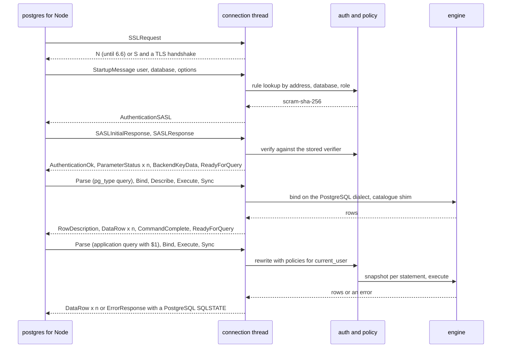
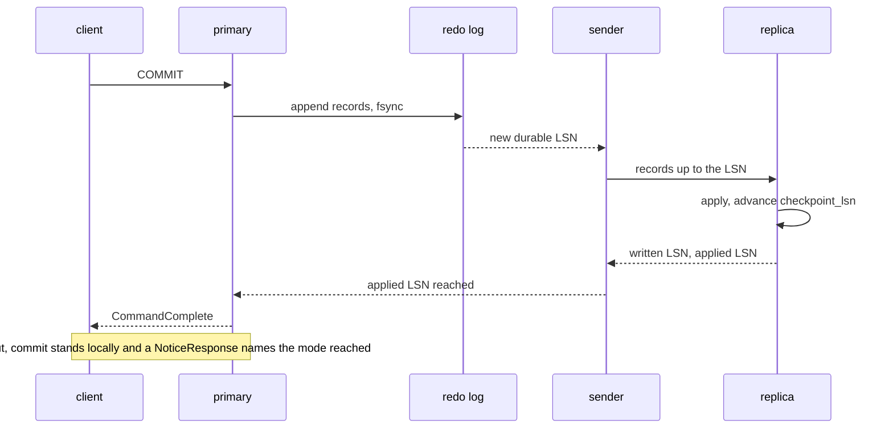

# task-1998 - The path from an embedded engine to PostgreSQL parity

Worked from commit `db3be74` of this repository on 2026-09-19. The measurements this document
rests on are in the ai-service repository under `_agent_output/task-1998-postgres-parity/`: the
`schema-compat` folder holds every statement that was run through the engine and what it answered,
and the `concurrency` folder holds the two engines under the same writer and reader load. Every
number below that is not cited to a published source comes from one of those two folders or from a
query run against the PostgreSQL server on this box.

## 1. Introduction

inillucent is an embedded engine: one file, one process, no port, no login, no copy of the data
anywhere else. That is what makes it fast and what makes it simple to run, and it is also the whole
list of what PostgreSQL has and it does not. An application that today runs against PostgreSQL 17
through an ordinary driver cannot be pointed at inillucent, because there is nothing to point it
at; a second machine cannot hold a copy of the data that stays current; and a second connection
cannot read while the first one writes.

This document lays out the order in which those gaps close, what each one is built from, and what
"closed" is measured by. The order is the priority order: a server that runs as a service first,
because everything else is reached through it; a primary with a replica second, because that is
the difference between a database and a file; readers alongside a writer third; roles, passwords
and row policies fourth; the PostgreSQL dialect fifth; and the operational tools last. Each is a
ticket or a short chain of tickets on its own, and the ladder is written so that every rung is
useful on its own, with the one before it and without the one after.

## 2. Goals and non goals

**The finish line, in one sentence:** the ai-service backend, which is written against PostgreSQL
17 through the `postgres` npm library, boots and serves against an inillucent server with no code
change beyond its connection string, and a second inillucent server on another machine holds a
copy of its data that is never more than a stated number of seconds behind.

Measurable goals, each with the number that decides it:

| goal | measured by | done when |
|---|---|---|
| A server that runs as a service | `psql`, `postgres` 3.4.5 for Node and the `postgres` Rust crate connect, authenticate with SCRAM-SHA-256 and run the extended query protocol | all three pass the conformance run in `tests/wire/`, and the server survives a Service Manager restart with no lost commit |
| Primary and replica | a replica opened from a base copy replays the primary's redo stream | the replica's `integrity-check` digest equals the primary's after 100,000 commits with the primary killed at 101 seeded cut points, and the lag under a steady 1,000 commits a second stays under one second |
| Readers alongside a writer | four readers polling a count while one writer holds a 50,000 row transaction | reader p99 under 5 ms for the whole write, where today a reader waits for the writer to finish |
| A commit that costs one sync, shared | one writer committing single rows, then sixteen | one writer at or above 1,000 commits a second, up from 38; sixteen writers above one writer's number, where today they are below it |
| Roles and row policies | ai-service's `ownershipMigration.ts`, which installs 240 policies | a member's connection sees zero rows of another member's, checked by the same cross member test ai-service runs against PostgreSQL |
| The dialect | the 340 DDL statements and 657 query literals in ai-service's backend | `ensureTablesExist.ts` runs to completion unmodified, up from 91 of 340 statements today |
| Operations | backup, restore to a point in time, statement statistics | a base copy plus archived redo restores to a named LSN, and `inillucent_stat_statements` answers the same columns as `pg_stat_statements` |

Non goals, stated so nobody builds them by accident:

- **Automatic failover.** A replica is promoted by a person or by an external supervisor. Raft and
  leader election are not on this ladder; section 9 says why.
- **Parallel query, table partitioning, PostGIS, `plpgsql`.** None of the two applications on this
  box use them and each is a project of its own.
- **Logical replication and change data capture.** The redo stream is physical. A logical decoder
  can be built on it later; nothing here needs it.
- **Encryption at rest.** PostgreSQL does not have it either, and ai-service encrypts its own
  columns above the database. It stays on the roadmap as its own item.
- **Multiple concurrent writers.** Section 6.3 puts one writer with many readers on the ladder and
  makes row level write concurrency conditional on a measurement, because the measurement taken
  for this document says one writer is enough for the workload that exists.

## 3. Problem statement

### 3.1 What PostgreSQL is doing on this box today

PostgreSQL 17.2 runs as the Windows service `postgresql-x64-17`, one instance, on port 5432. It is
not replicated: `wal_level` is at its default of `replica`, there are no replication slots, no
publications and no subscriptions. `ssl` is off. `max_connections` is 100 and `shared_buffers`
is 128 MB, both untouched defaults. `pg_hba.conf` accepts an `md5` password login from any address
to any database as any role over plain TCP, a line that the server design in section 6.1 refuses
to have an equivalent of.

The `ai` database is 1,572 MB with 126 tables, 688 B-tree indexes, one GIN index and roughly 22,300
live rows in total. It carries 240 row level security policies, one `app_current_member()`
function that reads the login role, and 38 login roles, one per application member, because the
application connects as the member's own role so that a client cannot re-point the policy with a
`SET`. At inspection there were 28 connections, 22 of them idle. The `nikaya` database, 5,852 MB,
is the record Nikaya moved off PostgreSQL onto inillucent and left behind; Nikaya's server no
longer opens PostgreSQL at all.

### 3.2 What ai-service asks of it

Read from `backend/src` rather than assumed. The `postgres` library, version 3.4.5, holds one pool
per role and member, 6 connections for a member role and 10 for the system role, 32 pools cached,
30 second idle timeout. Every new connection sends `-c app.current_member=<id>` in the startup
`options` parameter, and, because `fetch_types` is on by default, its first query on every
connection is a `SELECT` against `pg_catalog.pg_type` joining `typelem` to `typarray`. It uses the
extended query protocol for every statement and names a prepared statement for each one it can
prove static.

The schema uses `SERIAL`, `TIMESTAMPTZ DEFAULT now()`, `JSONB` with `->>` and `@>`, native arrays
such as `TEXT[] NOT NULL DEFAULT '{}'`, one `vector(1024)` column read with `<=>`, `RETURNING *`
throughout, `sql.begin()` transactions at the default `READ COMMITTED`, one plain CTE, one `LAG()
OVER`, one `DISTINCT ON`, one `LATERAL`, `EXTRACT`, `INTERVAL` arithmetic and `= ANY(array)`. It
does not use `LISTEN`, `NOTIFY`, advisory locks, `FOR UPDATE`, `SKIP LOCKED`, savepoints, explicit
isolation levels, `COPY`, `pg_dump`, triggers or `ILIKE` (the columns it would search are encrypted
above the database).

### 3.3 What inillucent answers today

The 340 DDL statements ai-service runs at startup and 40 of its query literals were run through
`inillucent 0.1.4`, one at a time, against a fresh file. The full tables are in
`schema-compat/results.md`.

| set | total | accepted | refused as unsupported | error | blocked by an earlier failure |
|---|---:|---:|---:|---:|---:|
| DDL as written | 340 | 91 | 1 | 167 | 81 |
| DDL after a mechanical type rewrite | 340 | 208 | 1 | 126 | 5 |
| 40 sampled queries, against the rewritten schema | 40 | 10 | 0 | 30 | 8 of the 30 |
| 20 statements PostgreSQL has and SQLite does not | 20 | 7 | 0 | 13 | |

The refusals cluster. Counted across all 740 executions:

| cause | count | what the engine says |
|---|---:|---|
| `ALTER TABLE ... ADD COLUMN IF NOT EXISTS` | 96 | `near "NOT": syntax error` |
| `now()` | 51 | `no such function: now` |
| the `::type` cast | 16 | `unrecognized token: malformed parameter` |
| `CREATE POLICY`, `ENABLE ROW LEVEL SECURITY`, `ALTER COLUMN SET DEFAULT`, `DROP CONSTRAINT`, `CREATE FUNCTION`, `DO $$` | 19 | `near "POLICY": syntax error` and kin |
| `ARRAY[...]` and `= ANY(...)` | 7 | `no such column: ARRAY`, `near "[1,2,3]": syntax error` |

What already works, and it is more than the table suggests: `ON CONFLICT DO UPDATE ... RETURNING`,
`string_agg`, `WITH RECURSIVE`, window functions, `CREATE TABLE t (v VECTOR(3))` and
`SELECT v <=> '[1,2,3]'`, which the engine accepted as its own vector column and its own distance
operator. The dialect gap is a list of specific tokens, not a missing engine.

The larger gaps are not in the dialect. There is no listener of any kind: `inillucent-mcp` is
stdio JSON-RPC, and the only production socket in the workspace is the outbound client in
`inillucent-remote` that `migrate` uses to read a running PostgreSQL or MySQL server. There is no
replication and no encryption. One writer holds the file at a time and a second process's reader
waits for it; inside one process `SharedDatabase` runs exactly one statement at a time. There are
no roles, no passwords and no policies, only a per statement authorizer hook and a read only mode.

### 3.4 Under load

Section 6.3 carries the measurement of both engines under the same concurrent writers and readers.
The short version: a single row commit costs about 27 ms against PostgreSQL's 0.35 ms because the
default journal mode syncs three times a commit; sixteen writers commit fewer rows a second than
one, because commits never share a sync; and four readers complete four reads while a 50,000 row
transaction is open, because a reader waits for the writer to release the file. The executor
itself is not the gap: a point lookup is 0.30 ms against 0.20.

## 4. What parity means here

Parity is not PostgreSQL. YugabyteDB reached it by running PostgreSQL's own parser, planner and
optimizer unchanged on every node and swapping the storage underneath
([yugabyte.com](https://www.yugabyte.com/blog/why-we-built-yugabytedb-by-reusing-the-postgresql-query-layer/)),
and PGlite reached it by compiling PostgreSQL itself to WebAssembly
([pglite.dev](https://pglite.dev/docs/about)). Both are closed to this repository by the dependency
policy, which forbids linking another database engine, SQL parser or storage engine, and by the
reason the policy exists: the engine is the thing being built.

Parity here means the definition in section 2: a PostgreSQL application, through a PostgreSQL
driver, runs unchanged, and the data is somewhere else as well. Where the two dialects answer a
question differently, the server answers as PostgreSQL does on a PostgreSQL connection and as
SQLite does on an embedded one, and section 6.5 says how one engine does both. Turso's own server
took the other choice, following SQLite wherever the two differ, and documents that PostgreSQL
tooling which reads the system catalogue then does not work
([turso.tech](https://turso.tech/blog/sqlite-based-databases-on-the-postgres-protocol-yes-we-can-358e61171d65)).
That is the choice that keeps an application from running unchanged, so it is the one not taken.

## 5. Architectural overview

```mermaid
flowchart LR
    subgraph clients [PostgreSQL clients]
        psql[psql]
        node[postgres for Node]
        rust[postgres crate]
    end
    subgraph primary [inillucent-server, primary]
        listener[listener thread]
        conn1[connection thread]
        conn2[connection thread]
        wire[inillucent-wire: protocol v3, SCRAM, TLS]
        auth[roles, grants, policies]
        front[dialect front end: pg or sqlite]
        shared[SharedDatabase: one writer, N snapshot readers]
        engine[inillucent-engine]
        wal[redo log with LSN]
        file[(app.rdb)]
        sender[replication sender]
        archive[redo archive]
    end
    subgraph replica [inillucent-server, replica]
        receiver[replication receiver]
        apply[redo apply]
        rfile[(app.rdb copy)]
        rconn[read only connections]
    end
    psql --> listener
    node --> listener
    rust --> listener
    listener --> conn1
    listener --> conn2
    conn1 --> wire --> auth --> front --> shared --> engine
    conn2 --> wire
    engine --> wal --> file
    wal --> sender
    wal --> archive
    sender -->|redo records by LSN, acked| receiver --> apply --> rfile
    rconn --> rfile
```



Three decisions are visible in the diagram and the rest of the document defends them.

**The server is a thread per connection over blocking sockets, with no async runtime.** The
dependency policy already rejected Tokio once, when the migration client was written by hand
rather than pulling in the `postgres` crate, and the argument has not changed: a runtime in a
shipped binary whose resident set is a published number. PostgreSQL forks a process per connection
and needs PgBouncer because each costs 5 to 10 MB
([cybertec-postgresql.com](https://www.cybertec-postgresql.com/en/pgbouncer-types-of-postgresql-connection-pooling/));
a thread costs a stack, and ai-service opens under thirty. The engine runs one statement at a
time, so a thousand connections would queue on the database, not on the sockets. A connection
limit in the config file is the pooler.

**The engine is the same engine.** `inillucent-server` is a fifth program beside the four that
exist, built on `inillucent-driver` the way the command line now is. The PostgreSQL front end is a
second dialect compiled onto the existing binder and executor, the way Turso is adding its
PostgreSQL front end onto the one bytecode machine its SQLite front end already targets
([github.com/tursodatabase/turso](https://github.com/tursodatabase/turso)), not a second engine.

**Replication ships redo records, not statements.** rqlite ships SQL text through Raft and has to
rewrite `RANDOM()` into a literal before it enters the log so every node applies the same value
([rqlite.io](https://rqlite.io/docs/api/non-deterministic/)); an engine with `now()`, `random()`
and `gen_random_uuid()` would need that interception for every such function forever. A redo
record is the bytes the primary already wrote, and the replica applies them through the recovery
path that already exists and is already idempotent. Litestream, dqlite, libSQL and PostgreSQL
itself all ship frames for this reason.

## 6. The ladder, in priority order

Each rung says what it is, why it sits where it does, what it is built from, and what closes it.
Sizes are in tickets of the size this repository has been working in, and are estimates.

### 6.1 A server that runs as a service

**What.** `inillucent-server`, a binary that opens one or more `.rdb` files, listens on a TCP port,
speaks PostgreSQL wire protocol version 3, and runs as a Windows service or a systemd unit. It is
the single rung every other rung is reached through, which is why it is first: a replica is a
second server, a role is a thing a server checks, and a PostgreSQL driver is a thing a server
answers.

**The protocol subset, and why each part is in it.**

| message | needed by | in the first ticket |
|---|---|---|
| `StartupMessage` with `user`, `database`, `options`, `application_name` | every client; ai-service's member id rides in `options` | yes |
| the one byte `SSLRequest` answer | every client that tries TLS first, which is most; PostgreSQL treats any other reply as an attack ([postgresql.org](https://www.postgresql.org/docs/current/protocol-flow.html)) | yes, answering `N` until 6.6 adds TLS |
| `AuthenticationSASL`, SCRAM-SHA-256 | the default since PostgreSQL 13; `md5` is not offered ([cybertec-postgresql.com](https://www.cybertec-postgresql.com/en/from-md5-to-scram-sha-256-in-postgresql/)) | yes |
| `ParameterStatus`, `BackendKeyData`, `ReadyForQuery` | every client reads `server_version`, `client_encoding`, `DateStyle` before its first query | yes |
| simple query: `Query`, `RowDescription`, `DataRow`, `CommandComplete` | `psql` | yes |
| extended query: `Parse`, `Bind`, `Describe`, `Execute`, `Sync`, `Close` | every driver; `postgres` for Node uses it for every call and names prepared statements ([github.com/porsager/postgres](https://github.com/porsager/postgres)) | yes |
| `CancelRequest` on a new connection with the session's secret key | drivers on a timeout; CockroachDB hung for two minutes on every cancel for years because it ignored these ([cockroachdb issue 32973](https://github.com/cockroachdb/cockroach/issues/32973)) | yes, wired to the engine's existing `cancel` flag |
| `COPY` in and out | `psql \copy`, bulk load | a later ticket |
| `NotificationResponse` | `LISTEN`, which ai-service does not use | 6.6 |

The codec and the SCRAM exchange go in a new crate, `inillucent-wire`, and the server half of SCRAM
is the client half already in `crates/inillucent-remote/src/auth.rs` with the roles reversed: the
HMAC, PBKDF2 and SHA-256 are there, checked against published vectors, and move to a shared
`inillucent-auth` crate that both link. Nothing new is written in cryptography. The `pgwire` crate
would give all of this in a day and is not used, for the reason the `postgres` crate was not: it
brings Tokio, and the policy is an allowed list.

**The catalogue shim.** A driver's first query is not the application's. `postgres` for Node reads
`pg_catalog.pg_type` on every connection; `psql`'s `\d` reads `pg_class`, `pg_namespace`,
`pg_attribute` and `pg_index`; every ORM reads `information_schema.columns`. The server answers
these from virtual tables in `inillucent-ext` generated from the catalogue the engine already keeps
in `inillucent-catalog`, with fixed OIDs for the types the engine has: `int8` 20, `text` 25,
`float8` 701, `bool` 16, `bytea` 17, `jsonb` 3802, `timestamptz` 1184, and the `vector` type given
an OID above 16384 the way an extension's type would be. The shim is the difference between a
server `psql` can inspect and one it cannot, and it is the part Turso's server documents as the
part it did not do.

**Running as a service.** On Windows the service control handler is written with `windows-sys`,
already on the allowed list, rather than the `windows-service` crate: register the handler, report
`START_PENDING` with a checkpoint while the files open and recover, `RUNNING` when the listener is
bound, `STOP_PENDING` while connections drain and the final checkpoint writes. On Linux the same
binary writes `READY=1` and `STOPPING=1` to the socket named by `NOTIFY_SOCKET`, which is one
`sendmsg` and needs no crate ([freedesktop.org](https://www.freedesktop.org/software/systemd/man/latest/sd_notify.html)).
On this box the service is registered in the Service Manager like the four Comfy and llama
instances are, with `autoRestart` on.

**Configuration** is one file, `inillucent-server.toml`, playing the part of `postgresql.conf` and
`pg_hba.conf` together and reloaded on `SIGHUP` or the service control `PARAMCHANGE`:

```toml
listen = "127.0.0.1:5433"
max_connections = 64
[[database]]
name = "ai"
path = "C:/data/ai.rdb"
pool_mb = 1024
[[rule]]              # pg_hba: first match wins, default deny
address = "127.0.0.1/32"
database = "ai"
role = "*"
method = "scram-sha-256"
```

There is no `trust` method and no `md5` method, and a rule for `0.0.0.0/0` requires `tls = true`
(6.6) or the server refuses to start and names the line. That is the response to the line found in
this box's `pg_hba.conf`.

**Shutdown and recovery.** A connection thread that is mid transaction at shutdown is rolled back,
which the engine already does for a dropped transaction; the redo log is checkpointed; the file is
released. A kill without shutdown is the case the crash campaigns already cover, and the server
adds nothing to it except that the recovery runs before the listener binds, so a client never
sees a half recovered file.

**Closes when** the conformance run in `tests/wire/` passes against `psql` 17, `postgres` 3.4.5 for
Node and the `postgres` Rust crate, each as a prerequisite row in `tests/selection.toml` that
`--strict` counts; the ai-service backend boots against it with the 340 DDL statements as the
fixture (this depends on 6.5 for the last of them, so the 6.1 acceptance is the 208 that pass after
the rewrite, and 6.5's is the rest); and a Service Manager restart mid load loses no acknowledged
commit, measured the way `process_concurrency.rs` measures it now.

**Size.** Four tickets: the wire codec and SCRAM; the connection loop, extended query and cancel;
the catalogue shim; the service handlers and the config file.

### 6.2 A primary with a replica

**What.** A second `inillucent-server` on another machine holds a copy of every database, applies
the primary's redo stream as it is written, serves reads, and can be promoted. This is the rung the
ticket names by its old name, and it is second because it is what makes the data survive the
machine.

**What it is built from.** The redo log in `inillucent-wal` already has everything a physical
stream needs: every record carries a page number and an LSN, a page carries the LSN of the last
record applied to it so replay is idempotent, replay of a record for a freed page is skipped, and a
record stamped by a log stream that is not the current one is refused. The last of those is the
timeline check PostgreSQL needs a `timeline id` for, and it already exists. What is missing is a
reader of the log that is not recovery, a retention rule, and the wire.

**The stream.** A replica opens an ordinary connection with `replication = true` in its startup
options and sends `START_REPLICATION <slot> <lsn>`, the same shape as PostgreSQL's replication
protocol so that the same connection, authentication and TLS serve both. The primary's replication
sender thread reads the redo log from that LSN and sends records as they become durable, in the
log's own byte format, in batches of up to 128 KiB; Neon measured that batch size as the one that
took their safekeeper to pageserver path from 215 to over 705 MiB a second
([neon.com](https://neon.com/blog/recent-storage-performance-improvements-at-neon)). The replica
answers with the LSN it has written and the LSN it has applied.

**Retention: the slot.** A slot is a row in the primary's own catalogue naming the oldest LSN a
replica has not confirmed. The checkpointer, which today truncates the log up to `checkpoint_lsn`,
truncates to the minimum over the slots instead. A slot with no connected replica holds the log
until `max_slot_retention_mb`, after which the slot is marked invalid and the replica has to be
rebuilt from a new base copy, which is what PostgreSQL does and the only alternative to filling the
disk. Litestream solves the same problem by holding a read transaction open to block SQLite's
checkpoint ([litestream.io](https://litestream.io/how-it-works/)); a slot is the same idea with a
name.

**The base copy.** `inillucent-server basebackup` takes a consistent copy of a database while
writes continue: it records the current LSN, copies the pages, and ships the redo from the recorded
LSN to the end of the copy, so the copy plus that tail is a consistent snapshot exactly as
`pg_basebackup` relies on full page writes to repair a torn page
([postgresql.org](https://www.postgresql.org/docs/current/app-pgbasebackup.html)). The engine's
`VACUUM INTO` is a logical rebuild, not a page copy, and stays what it is; the base copy is a new
verb that copies pages under the pool's LSN fence.

**Apply and reads on the replica.** The replica's apply thread is the recovery loop, run
continuously: it writes each record to the pool and advances `checkpoint_lsn`. Reads on the
replica are ordinary connections on a `SharedDatabase` whose writer is the apply thread, so, until
6.3, a reader on the replica waits for a batch to apply the way a reader today waits for a writer.
After 6.3, a reader takes a snapshot and apply continues, and the replica is a hot standby. The
replay conflict PostgreSQL has, where apply needs to remove a row version a reader still holds
([postgresql.org](https://www.postgresql.org/docs/current/hot-standby.html)), maps onto the version
log's reclamation and is handled the same way: apply waits for `max_standby_delay`, then the reader
is cancelled with the same error code.

**Durability modes.** `synchronous_commit` on the primary, with PostgreSQL's names and meanings
([postgresql.org](https://www.postgresql.org/docs/current/runtime-config-wal.html)): `local`
(default: the primary's fsync only), `remote_write` (a replica has received the bytes),
`remote_apply` (a replica has applied them, so a read on the replica after the commit returns sees
the write). A commit under `remote_*` waits on the sender's acknowledgement with a timeout, after
which the commit is durable locally and the client is told which mode was satisfied in a notice.

**Promotion and the timeline.** `inillucent-server promote` on a replica finishes applying what it
has, increments the log stream identity that recovery already stamps records with, and starts
accepting writes. An old primary that comes back and tries to stream into the new one is refused
by the existing stamp check, and the operator re-points it as a replica with a fresh base copy.
Nothing elects anybody. rqlite and dqlite run Raft for a single group and CockroachDB runs one Raft
group per 64 MB of data and needed a coordination layer to keep heartbeats from multiplying
([cockroachlabs.com](https://www.cockroachlabs.com/blog/scaling-raft/)); PostgreSQL itself has no
election and leaves it to Patroni. The database here is on one box with one replica, and a promote
verb that a supervisor can call is the whole of the failover story until something measures that
it is not enough.

**Archive and point in time recovery.** The same reader that feeds the sender writes closed
segments to an archive directory or, later, to object storage, which is exactly Litestream's
design. `inillucent-server restore --target-lsn` or `--target-time` takes a base copy and replays
the archive to the target. Section 6.6 lists it; the mechanism is this rung's.

**Closes when** a replica built from a `basebackup` and streamed 100,000 commits, with the primary
killed at each of 101 seeded cut points through `inillucent-sim` and restarted, ends every round
with an `integrity-check` digest equal to the primary's; steady state lag under 1,000 single row
commits a second stays under one second at p99; `remote_apply` makes a read on the replica see a
write the client was told committed, every time in 10,000 tries; and an old primary's stream is
refused after a promote.

**Size.** Five tickets: the log reader and slots; the sender and receiver over the wire from 6.1;
`basebackup` under the LSN fence; the durability modes and promote; the archive and restore verbs.

### 6.3 Readers alongside a writer, and a measured decision on concurrent writers

**What is measured.** Both engines were driven with the same schema and the same load, three runs
each, medians reported. The scripts and raw runs are in the `concurrency` folder.

PostgreSQL ran with `synchronous_commit = on`, `fsync = on` and `wal_sync_method =
open_datasync`, its existing configuration. inillucent ran through `SharedDatabase` in one
process, in its default journal mode, and every commit syncs. Both engines make a commit durable
before acknowledging it, so the gap is design, not one side skipping the disk.

Single row transactions, W writers each committing one row at a time (PostgreSQL 2,000 commits a
writer; inillucent 100 a writer, because at its measured cost the full count would have taken a
quarter of an hour a repetition):

| W | PostgreSQL commits/s | inillucent commits/s | inillucent p99 commit, ms |
|---:|---:|---:|---:|
| 1 | 2,837 | 38.2 | |
| 4 | 7,859 | 23.5 | |
| 8 | 11,453 | 22.9 | |
| 16 | 20,619 | 17.6 | 11,549 |

Batched, 20 transactions of 100 rows a writer:

| W | PostgreSQL rows/s | inillucent rows/s |
|---:|---:|---:|
| 1 | 8,264 | 2,491 |
| 8 | 30,361 | 2,318 |

Four readers polling a count while one writer holds a 50,000 row transaction:

| engine | write elapsed, s | reads completed during the write | reader p50, ms |
|---|---:|---:|---:|
| PostgreSQL | 4.34 | 28,191 | 0.35 |
| inillucent | 4.74 | 4 | 4,746 |

Eight readers, point lookups by primary key on 100,000 rows, no writer:

| engine | reads/s | p50, ms |
|---|---:|---:|
| PostgreSQL | 25,237 | 0.20 |
| inillucent | 3,221 | 0.30 |

Three facts in those tables, and each is a rung:

**A single commit costs about 27 ms.** One writer, one row, no contention: 38 commits a second
against PostgreSQL's 2,837 on the same disk. PostgreSQL's commit is one append to its log and one
sync. The default journal mode here is a rollback journal, and the relational architecture page
records what a commit in it syncs: the journal's bytes before a page is overwritten, the pages,
and the directory entry when the journal is unlinked. On Windows each of those is a
`FlushFileBuffers`, and three of them are the 27 ms. Setting `PRAGMA journal_mode = wal` through
the driver before the run did not move the number (29.7 a second against 34 to 38), which is
either the pragma not taking effect on the driver's open path or the log mode syncing as often; the
first ticket in this rung finds out which, because the redo log exists precisely so that a commit
can be one append and one sync.

**Commits do not share a sync.** PostgreSQL at 16 writers does 20,619 commits a second because
concurrent commits wait on one flush of the log together. Here 16 writers do 17.6 a second, fewer
than one writer, because every commit queues for its own turn and its own syncs, and the worst
commit at 16 writers waited 11.5 seconds. Group commit is what the server's connection threads
make possible: the log already has the group commit path (`inillucent-wal` lists it), and the
server is the first caller with more than one committer to group.

**A reader waits for the whole write.** Four readers completed four reads in 4.7 seconds, one each,
when the writer released the file; PostgreSQL's readers completed 28,191 at 0.35 ms. This is the
`ImportedDatabase` exclusive lock described below, and it is what makes a replica unable to serve
reads while it applies, an application unable to read a list while a batch inserts, and a long
migration a full stop for every user.

The batched table says what a single writer delivers once the sync cost is paid per transaction
rather than per row: 2,491 rows a second, a third of PostgreSQL's single connection, from an engine
that is measured faster than SQLite on the same workload shape. The point lookup table says the
executor itself is not the problem: 0.30 ms a lookup against 0.20 ms, with the eightfold gap in
throughput being eight cores against one thread.

**What the tables say about the two applications on this box.** ai-service's `ai` database holds
about 22,300 rows and grew them over months; its writes are a chat message, a task comment, a
queue row. At 38 commits a second it would not notice, and at 2,491 rows a second in a batch it
would not notice. What it would notice is the third table: one member's batch insert stalls every
other member's page load until it commits. So the order inside this rung is readers first, the
commit sync second, group commit third, and the writers table is what decides, later, whether a
second writer is ever needed.

**What it is built from.** `inillucent-txn` was designed for one writer and many readers under
snapshot isolation: a reader takes a snapshot, a writer publishes before images into a version log,
and a reader keeps seeing its snapshot. The relational architecture page records that the shipped
open path, `ImportedDatabase`, holds the log directly and takes the file's `EXCLUSIVE` lock for the
whole write, so a second process's reader waits, and that the protocol to make snapshot reads true
across processes is what the roadmap would need. The server changes the problem: every connection
is in one process, and that process owns the file the way `postmaster` owns a cluster, so there is
no cross process reader to build a shared memory index for. The rung is to route the server's
connections through the transaction manager rather than around it, so a reader on one connection
thread holds a snapshot while the writer on another proceeds.

That needs `SharedDatabase` to stop being one statement at a time. Today it is one database thread
and a channel, chosen because `Connection::set_authorizer` holds an `Rc` a caller keeps a clone of,
which makes `Database: Send` unsound. The server never installs a caller's authorizer, so the
server's own handle type, `ServerDatabase`, is built without that method, holds the engine behind a
lock that a writer takes for its transaction and readers do not take at all, and reads go to the
pool through the snapshot. The `Rc` audit the roadmap records found no thread local and no raw
pointer, so what is left is replacing `Rc` with `Arc` on the paths a reader touches, which is a
mechanical change measured by the read gate not moving.

**The decision on concurrent writers, and why it is conditional.** Two writers on one file is the
change that alters the file format and the cost model. Turso's row versioned writes reached beta in
March 2026 and shipped as an opt in preview in August 2026, and their own notes say versions are
stored as whole copies so memory rises under write load, the lock on the version index becomes the
bottleneck at high thread counts, and a file written under the mode is no longer readable by stock
SQLite ([turso.tech](https://turso.tech/blog/beyond-the-single-writer-limitation-with-tursos-concurrent-writes);
[docs.turso.tech](https://docs.turso.tech/tursodb/concurrent-writes)). SQLite's own `BEGIN
CONCURRENT` branch has been experimental since 2017, conflicts on every insert to a monotonically
increasing key because every writer lands on the same trailing page, and has no merge date
([sqlite.org](https://sqlite.org/forum/info/84fe63b7b3)). The measurement above says what one
serialized writer sustains against PostgreSQL's many. The rule this document sets: concurrent
writers are designed when a real application on this server measures its writer queue as the
bottleneck, and the design then is Turso's, row versions in memory with reclamation tied to the
oldest reader, not a page conflict scheme. Until then the writer lock is the design and the number
in the table is the reason.

**Isolation as PostgreSQL names it.** A PostgreSQL connection defaults to `READ COMMITTED`, where
each statement takes a fresh snapshot; the engine's snapshot is per transaction, which is
`REPEATABLE READ`. The server takes a snapshot per statement on a PostgreSQL connection unless the
client asks for `REPEATABLE READ` or `SERIALIZABLE`, and answers `SERIALIZABLE` with `REPEATABLE
READ` plus the single writer, which with one writer is serializable by construction. That last
sentence is a claim the testing section proves, not a hope.

**The commit sync and group commit.** Two tickets that belong to this rung because the server is
their first caller. The first measures what a commit syncs in each journal mode through the
driver's open path, makes a commit in `wal` mode one append and one sync, and finds out why the
pragma did not take in the measurement above. The second lets commits share a sync: a connection
thread that reaches `COMMIT` while another commit's sync is in flight waits for that sync rather
than starting its own, which is the group commit path `inillucent-wal` already has, given its first
concurrent callers. `synchronous_commit = off` as PostgreSQL defines it, where a commit returns
before the sync and a crash can lose the last few hundred milliseconds but never corrupt, is
offered as a per connection setting and is not the default.

**Closes when** the reader during a writer number in the table above moves from waiting for the
whole transaction to a p99 under 5 ms; one writer commits single rows at or above 1,000 a second,
up from 38; sixteen writers commit more a second than one, where today they commit fewer; eight
readers with no writer scale with the cores the way the PostgreSQL column does; and the write gates
on the performance page do not move.

**Size.** Five tickets: the server's handle without `set_authorizer`; snapshot readers through the
transaction manager; the per statement snapshot and the isolation level mapping; one sync per
commit; group commit.

### 6.4 Roles, passwords, grants and row policies

**What.** `CREATE ROLE ... LOGIN PASSWORD`, `GRANT` and `REVOKE` on tables, `ALTER TABLE ... ENABLE
ROW LEVEL SECURITY`, `CREATE POLICY`, `current_user`, `current_setting()`, `SET` and the startup
`options` parameter, and the `BYPASSRLS` attribute. This is the shape ai-service's
`ownershipMigration.ts` installs, 240 policies of the form `USING (owner_member_id =
app_current_member())`, and nothing less runs it.

**Where it is built.** Passwords are SCRAM verifiers in a `pg_authid` equivalent inside the
database's own catalogue, stored the way PostgreSQL stores them, so a stolen file does not contain
a password and a stolen verifier cannot log in
([cybertec-postgresql.com](https://www.cybertec-postgresql.com/en/from-md5-to-scram-sha-256-in-postgresql/)).
Grants are rows the binder checks on every table reference, which is where the existing
`--readonly` refusal already lives, so a `SELECT` hidden inside a `WITH` cannot slip past a
missing `SELECT` grant any more than a `DROP` slips past read only today.

Policies are query rewriting in the binder, as PostgreSQL does it and as SQLite Cloud and the
Turso row level security proxy do outside the engine
([docs.sqlitecloud.io](https://docs.sqlitecloud.io/docs/rls)): a table with row security on and a
connection whose role lacks `BYPASSRLS` gets every reference to that table wrapped in the
disjunction of its permissive `USING` policies, and every insert or update checked against the
conjunction of the `WITH CHECK` policies, with no matching policy meaning no rows, as PostgreSQL
specifies ([postgresql.org](https://www.postgresql.org/docs/current/sql-createpolicy.html)). The
rewrite happens after name resolution and before planning, so the planner sees a plain predicate
and the index on `owner_member_id` is used. `app_current_member()` is a SQL function the
application defines reading `current_user`, exactly as it does today; `SET app.current_member`
from the startup options is a session variable read by `current_setting()`.

**The refusal shape.** A row a policy hides is not there: zero rows, not an error, because an
error is a channel that says the row exists. That is ai-service's own 404 rule and PostgreSQL's
behaviour.

**Closes when** ai-service's cross member test, which today asserts a member cannot read another
member's rows against PostgreSQL, passes against the server unchanged; a role without `SELECT` on
a table gets `permission denied` through a view, a CTE and a trigger body; and the read gates on
the performance page do not move with row security on, because the rewrite adds a predicate the
index answers.

**Size.** Three tickets: roles, verifiers and the connection rule; grants in the binder; policies
in the binder and the session variables.

### 6.5 The PostgreSQL dialect

**What.** The tokens and functions in section 3.3, as a front end selected per connection: a
PostgreSQL wire connection gets the PostgreSQL dialect, an embedded open and the MCP server keep
SQLite's, and a pragma can switch either. The list is exactly what the experiment refused, in the
order of how many statements each unblocks:

| item | statements unblocked in the fixture | note |
|---|---:|---|
| `ALTER TABLE ... ADD COLUMN IF NOT EXISTS` | 96 | also `DROP COLUMN IF EXISTS`, `ALTER COLUMN SET DEFAULT`, `DROP CONSTRAINT` |
| `now()`, `current_timestamp` as a function, `date_trunc`, `EXTRACT(field FROM x)`, `INTERVAL '3 days'` arithmetic, `timestamptz` semantics | 51 and the 8 query literals | a `timestamptz` is stored as UTC microseconds in an integer slot and rendered with the session `TimeZone`; `TIMESTAMP` without zone renders as it is stored |
| `::type` casts and `$1` parameters | 16 | the tokenizer reads `::` as a cast and `$n` as a bind, on the PostgreSQL dialect only |
| `SERIAL`, `BIGSERIAL`, `GENERATED AS IDENTITY` | in the 91 | `INTEGER PRIMARY KEY AUTOINCREMENT` with a sequence row per column so `nextval`, `currval` and `setval` answer |
| `JSONB` as a declared type, `->`, `->>`, `@>`, `?`, `#>`, `jsonb_build_object`, `jsonb_agg` | in the 91 | stored in the engine's existing JSON representation; `@>` is a new function the operator maps onto |
| `TEXT[]`, `INTEGER[]`, `ARRAY[...]`, `= ANY(...)`, `unnest`, `array_agg` | 7 | stored as a JSON array in the slot, typed by the declaration, rendered in PostgreSQL's `{a,b}` text form on the wire |
| `DISTINCT ON`, `LATERAL`, `ILIKE`, `gen_random_uuid()`, `string_agg` with `ORDER BY` | 6 | `DISTINCT ON` plans as a window over the sort key |
| `CREATE EXTENSION vector`, `vector(n)` lower case, `<=>`, `<->`, `<#>` | 1 | `<=>` already works on the engine's `VECTOR(N)`; the extension statement is accepted and does nothing, and `CREATE INDEX ... USING hnsw` maps onto the engine's own HNSW |
| `CREATE FUNCTION ... LANGUAGE sql`, `DO $$ ... $$` | in the 19 | SQL bodied functions only; `plpgsql` is a non goal and is refused with the exit code 3 shape |
| `pg_catalog` and `information_schema` | every driver | 6.1's shim, listed here because the dialect is where it is read |

Type affinity is the difference underneath all of it. A PostgreSQL column is strictly typed and a
SQLite column is not; the engine already has `STRICT` tables, and a table created on the PostgreSQL
dialect is `STRICT` with the declared types mapped onto the engine's slots, so an insert of text
into an integer column fails as PostgreSQL fails it rather than being stored as text.

**Closes when** `ensureTablesExist.ts` runs to completion against the server unmodified, all 340
statements; the 657 query literals in `backend/src` each parse and bind on the PostgreSQL dialect
(a fixture generated from the repository so it cannot go stale); and the 416 case SQLite
differential run still reports 403 identical, because the SQLite dialect did not move.

**Size.** Five tickets, one per row group above from the top; the first alone takes the fixture
from 208 to 304.

### 6.6 Operations

What a person running the server for a year reaches for, in the order they reach for it.

| tool | PostgreSQL | here | built on |
|---|---|---|---|
| dump and restore | `pg_dump`, `pg_restore` | `inillucent dump` already writes SQL; the server adds `--format custom` with a parallel restore | the command table |
| online backup | `pg_basebackup` | `inillucent-server basebackup` | 6.2 |
| point in time recovery | archived WAL and `recovery_target` | `inillucent-server restore --target-lsn` and `--target-time` | 6.2's archive |
| TLS | `ssl = on`, `sslmode=verify-full` | the platform TLS already in `inillucent-remote` (SChannel, system OpenSSL) as a server, a certificate path in the config file, and `verify-full` honoured because only it stops an active attacker ([postgresql.org](https://www.postgresql.org/docs/current/libpq-ssl.html)) | `inillucent-remote/tls` |
| statement statistics | `pg_stat_statements` | `inillucent_stat_statements`: the statement cache already keys by text hash; add calls, total and mean time, rows, and pool hits and misses per key | the statement cache and `.stats` |
| actual execution statistics | `EXPLAIN ANALYZE` | the operator chain `EXPLAIN` prints, with rows and time per operator measured on a run | `inillucent-exec` |
| health and metrics | `pg_isready`, exporters | `GET /health` and `GET /metrics` on a second port in Prometheus text form | one blocking listener, no HTTP crate |
| `LISTEN` and `NOTIFY` | built in | a channel table in the server, delivered on commit as `NotificationResponse` | 6.1 |
| advisory locks, `FOR UPDATE SKIP LOCKED` | built in | after 6.3, where a row lock has something to attach to; nothing on this box uses either | 6.3 |
| `COPY` | built in | the wire message and a bulk path into the tree that skips per row logging, which is also the answer to the roadmap's `write.insert.batch` item | 6.1 |

**Closes when** a base copy plus archive restores to a named LSN and the restored file's digest
equals a copy taken at that LSN; `verify-full` refuses a certificate for the wrong host; and
`inillucent_stat_statements` answers the columns `pg_stat_statements` answers for the same query.

**Size.** Six tickets, one per row from the top, the last three each small.

## 7. Components and interfaces

New crates and where they sit in the layering contract:

| crate | for | may depend on | new `[[external]]` rows |
|---|---|---|---|
| `inillucent-auth` | SCRAM-SHA-256 both halves, verifier storage format, moved out of `inillucent-remote/src/auth.rs` | `inillucent-base` | none |
| `inillucent-wire` | protocol v3 codec, message types, the catalogue OID table | `inillucent-base`, `inillucent-value`, `inillucent-auth` | none |
| `inillucent-server` | the binary: listener, connection threads, config, service handlers, replication sender and receiver, the HTTP health listener | `inillucent-driver`, `inillucent-wire`, `inillucent-wal` (for the log reader), `windows-sys`, `libc` | none: `windows-sys` and `libc` are already allowed |

Changes inside existing crates:

- `inillucent-sql`: a `Dialect` on the tokenizer and parser (`::`, `$n`, `IF NOT EXISTS` on `ADD
  COLUMN`, `DISTINCT ON`, `LATERAL`, `ILIKE`, `INTERVAL`, `EXTRACT`, `ARRAY[]`, `ANY`), and the
  policy rewrite and grant check in the binder.
- `inillucent-scalar`: `now`, `date_trunc`, `gen_random_uuid`, the `jsonb` containment and path
  functions, the array functions, the timestamp with zone rendering.
- `inillucent-catalog`: roles, grants, policies, sequences and slots as catalogue tables.
- `inillucent-ext`: the `pg_catalog` and `information_schema` virtual tables.
- `inillucent-txn` and `inillucent-engine`: the snapshot reader path the server uses, `Rc` to `Arc`
  where a reader touches it, and the per statement snapshot.
- `inillucent-wal`: a log reader that follows the tail, the slot minimum in the checkpointer, the
  stream identity increment on promote.
- `inillucent-pool`: the LSN fence for `basebackup`.
- `crates/inillucent-cli/src/command/registry.rs`: `serve`, `basebackup`, `restore`, `promote`,
  so the MCP server and the command line get them together, as the command parity test requires.

The public driver does not change shape. An application that links `inillucent-driver` still gets
an embedded database with no server in it; the server is one more program that links the driver.

## 8. Data flows and security

### 8.1 A query on a PostgreSQL connection



Errors carry a PostgreSQL `SQLSTATE`: `23505` for a unique violation, `42P01` for a missing table,
`42501` for permission denied, `57014` for a cancel, and `0A000` (feature not supported) for what
the engine answers with exit code 3 today, so a driver's own error mapping works and a script can
still branch on "not yet".

### 8.2 A commit under `remote_apply`



### 8.3 Risks, each with what bounds it

| risk | bound |
|---|---|
| A protocol subset that a driver needs and the server lacks, found in production | the conformance run uses the three real drivers, not a model of them, and `--strict` fails when a driver is not installed rather than passing |
| The catalogue shim answers a query a tool expects differently from PostgreSQL | `psql \d`, `\dt`, `\di` output is compared to PostgreSQL 17's on the same schema, line for line, the way the shell is compared to `sqlite3` today |
| A policy rewrite that misses a reference path (a view, a CTE, a trigger body, a subquery in `DEFAULT`) | the cross member test enumerates every path the binder resolves a table through, and a new resolution path fails the test until it is listed |
| Replication that reports a lag it does not have, or a replica that diverges silently | the digest comparison after every crash round; a replica that cannot apply a record stops and reports the LSN rather than skipping it |
| The slot fills the disk | `max_slot_retention_mb` invalidates the slot and the server logs which replica needs a rebuild |
| A default that is open | no `trust`, no `md5`, default deny, a public bind requires TLS; the config file is refused with the line named rather than started insecurely |
| The `Rc` to `Arc` change costs the read gates | the gates on the performance page are the acceptance for 6.3 and a loss there is a failed ticket |
| Two dialects drift | the 416 case SQLite differential run is unchanged and stays in the selection map |

## 9. Alternatives considered

| decision | taken | not taken | reason |
|---|---|---|---|
| wire protocol | PostgreSQL v3 | an HTTP or Hrana style protocol of our own, as rqlite, libSQL and SQLite Cloud did | every language already has a PostgreSQL driver and ai-service already uses one; a protocol of our own means a client library per language, which is the client repository's whole cost again. DuckDB's Quack chose HTTP because its clients are DuckDB too; ours are not |
| protocol implementation | in house, on blocking sockets | the `pgwire` crate | the crate is complete and brings Tokio; the allowed list refused Tokio for the migration client and the argument holds |
| concurrency model | thread per connection | a runtime with an event loop | the engine runs one statement at a time, so connections queue on the engine either way; a thread per connection costs a stack and is the simplest thing that is correct |
| replication payload | redo records | SQL statements (rqlite), Raft over frames (dqlite), logical changes (Turso's newer sync) | statements need nondeterminism rewriting forever; Raft buys election, which is a non goal; logical changes are smaller on the wire and Turso measured them at 17 seconds against 152 for 3,000 inserts ([turso.tech](https://turso.tech/blog/sync-benchmark)), which is the right second step once the physical stream exists |
| failover | a `promote` verb | Raft election | one replica on one box; election is a distributed consensus project and PostgreSQL itself leaves it to Patroni |
| concurrent writers | conditional, on a measurement | Turso's row versions now, SQLite's `BEGIN CONCURRENT` page conflicts | the load on this box is one writer's worth; the page scheme conflicts on every insert to a serial key, which is every table ai-service has |
| the PostgreSQL parser | a dialect on our parser | PostgreSQL's own parser (YugabyteDB), PGlite | forbidden by the dependency policy, and the policy is the point |
| row security | rewriting in the binder | a proxy in front of the server | inside the engine it sees every reference path; a proxy sees text and is the thing the `--readonly` design already rejected |
| catalogue | generated virtual tables with fixed OIDs | answering `pg_catalog` queries with an error, as Turso's server does | a driver's first query is a catalogue query, and refusing it is refusing the driver |

## 10. Testing strategy

Every test is registered in `tests/selection.toml` and runs under `inillucent-testrun`; the ones
needing an installed client are prerequisite rows that `--strict` counts and names.

**Wire conformance, `tests/wire/`.** Three real clients, `psql` 17, `postgres` 3.4.5 for Node and
the `postgres` Rust crate, each driven through the same script: connect with SCRAM, run the
catalogue queries the client sends on its own, prepare and execute a parameterised statement,
run a transaction with a rollback, cancel a long statement from a second connection and assert
the first gets `57014` within one second, and disconnect mid transaction and assert the next
connection sees the rollback. `psql \d` output on the ai-service schema is compared to PostgreSQL
17's line for line.

**The ai-service fixture, `tests/wire/ai-service.rs`.** The 340 DDL statements and the 657 query
literals, extracted from the ai-service repository by a generator so the fixture cannot go stale,
run on the PostgreSQL dialect. The test asserts the count that passes and fails when it goes down,
the way the roadmap's number tests do; each rung of 6.5 raises the asserted count.

**Service lifecycle, `tests/service/`.** Start the server under the Service Manager on a free port,
drive 1,000 commits a second from four clients, restart the service through the manager's control
call, and assert that the rows in the file equal the commits the clients were acknowledged, which
is the assertion `process_concurrency.rs` already makes for processes.

**Replication, `tests/replication/`.** A primary and a replica on two ports and two files, driven
under `inillucent-sim` so the primary can be killed at each of 101 seeded cut points while
streaming; after each round both are recovered and their digests compared. Lag is measured under
steady load. `remote_apply` is tested by a client that commits on the primary and immediately reads
on the replica, 10,000 times. A promote followed by the old primary reconnecting asserts the
refusal and its message.

**Concurrency gates.** The four measurements in section 6.3 become a gate binary,
`inillucent-servergate`, run the way the read and write gates are run, with the bars in section
6.3's closing conditions and the same lower bound rule the performance page uses: a number that
straddles the bar has not met it.

**Row security, `tests/policy/`.** Two members through two connections, every table reference
path the binder has (a plain reference, a view, a CTE, a subquery, a trigger body, an `UPDATE ...
FROM`, an `INSERT ... SELECT`), asserting zero rows across members and full rows within. A grant
test asserts `42501` on each path for a role without the grant. Row security on must not move the
read gates.

**Recovery of the dialect.** The 416 case SQLite differential run stays as it is and stays at 403
identical, which is what proves the second dialect did not change the first.

**Documentation.** `docs/README.md` gains the server page, the roadmap carries this item until the
ladder is done, and `documentation.rs`'s existing rules cover both.

## 11. Order of work, as tickets

In the order they are worked, each one sized for the lane it belongs to:

1. `inillucent-auth` and `inillucent-wire`: the codec and SCRAM both halves, with the client in
   `inillucent-remote` moved onto the shared crate and its migration tests unchanged.
2. `inillucent-server`: listener, connection threads, simple and extended query, cancel, errors
   with SQLSTATE, the config file, default deny.
3. The catalogue shim, and the `psql` and `postgres` for Node conformance runs.
4. Service handlers for Windows and systemd; registration in this box's Service Manager.
5. The dialect, first ticket: `ADD COLUMN IF NOT EXISTS` and the other `ALTER TABLE` forms, `now()`
   and the timestamp functions, `::` and `$n`. Takes the fixture from 208 to past 300.
6. The redo log reader, slots and retention.
7. The replication sender and receiver, lag reporting, the digest test under crash injection.
8. `basebackup` under the LSN fence, `promote`, the durability modes.
9. Snapshot readers on the server's handle, `Rc` to `Arc`, per statement snapshots.
10. One sync per commit in `wal` mode, measured through the driver; then group commit across
    connection threads.
11. Roles, verifiers, grants.
12. Policies and session variables; the ai-service cross member test.
13. The dialect, remaining tickets: `JSONB` operators, arrays, `SERIAL` sequences, `DISTINCT ON`
    and the rest of the table in 6.5, ending with `ensureTablesExist.ts` unmodified.
14. Archive and restore, TLS on the server, statement statistics, `EXPLAIN ANALYZE`, health and
    metrics, `LISTEN` and `NOTIFY`, `COPY`.

Tickets 1 to 4 make the server exist and run as a service; 5 makes ai-service's schema mostly
load; 6 to 8 are the replica; 9 and 10 are readers alongside a writer and a commit that costs one
shared sync; 11 and 12 are what ai-service needs to boot at all; 13 and 14 finish the ladder. The first
four and the fifth can proceed on the `opus` lane in sequence; 6 to 8 are one chain, and 9 and 10
are independent of them and of each other.

## 12. Evidence

- `schema-compat/results.md`: the 340 DDL statements as written and after the rewrite, the 40
  query literals, the 20 PostgreSQL only statements, with every status string.
- `schema-compat/ddl.sql`: the statements, numbered, with their source file and line.
- `concurrency/results.md`: both engines under the four loads, three runs each, with the scripts.
- The PostgreSQL facts in section 3.1 are from `SHOW`, `pg_stat_replication`,
  `pg_replication_slots`, `pg_publication`, `pg_policies`, `pg_roles` and `\l+` on the running
  server, and from `postgresql.conf` and `pg_hba.conf` in its data directory.
- The ai-service facts in section 3.2 are from `backend/src/db/sqlClient.ts`,
  `backend/src/db/ownershipMigration.ts`, `backend/src/db/ensureTablesExist.ts` and
  `node_modules/postgres/src/connection.js` at version 3.4.5.

Published sources cited inline, collected:

- PostgreSQL protocol flow: https://www.postgresql.org/docs/current/protocol-flow.html
- `synchronous_commit` levels: https://www.postgresql.org/docs/current/runtime-config-wal.html
- `pg_basebackup`: https://www.postgresql.org/docs/current/app-pgbasebackup.html
- hot standby conflicts: https://www.postgresql.org/docs/current/hot-standby.html
- `CREATE POLICY` semantics: https://www.postgresql.org/docs/current/sql-createpolicy.html
- `sslmode` levels: https://www.postgresql.org/docs/current/libpq-ssl.html
- SCRAM over md5: https://www.cybertec-postgresql.com/en/from-md5-to-scram-sha-256-in-postgresql/
- PgBouncer's reason to exist: https://www.cybertec-postgresql.com/en/pgbouncer-types-of-postgresql-connection-pooling/
- `postgres` for Node: https://github.com/porsager/postgres
- rqlite on nondeterministic statements: https://rqlite.io/docs/api/non-deterministic/
- Litestream's design: https://litestream.io/how-it-works/
- Neon's batch size measurement: https://neon.com/blog/recent-storage-performance-improvements-at-neon
- CockroachDB on Raft at scale: https://www.cockroachlabs.com/blog/scaling-raft/
- CockroachDB's cancel request bug: https://github.com/cockroachdb/cockroach/issues/32973
- Turso's server on the PostgreSQL protocol: https://turso.tech/blog/sqlite-based-databases-on-the-postgres-protocol-yes-we-can-358e61171d65
- Turso's concurrent writes: https://turso.tech/blog/beyond-the-single-writer-limitation-with-tursos-concurrent-writes and https://docs.turso.tech/tursodb/concurrent-writes
- Turso's sync benchmark: https://turso.tech/blog/sync-benchmark
- Turso, the engine: https://github.com/tursodatabase/turso
- SQLite's `BEGIN CONCURRENT` status: https://sqlite.org/forum/info/84fe63b7b3
- YugabyteDB reusing PostgreSQL's query layer: https://www.yugabyte.com/blog/why-we-built-yugabytedb-by-reusing-the-postgresql-query-layer/
- PGlite: https://pglite.dev/docs/about
- DuckDB's Quack protocol: https://duckdb.org/2026/05/12/quack-remote-protocol
- SQLite Cloud row level security: https://docs.sqlitecloud.io/docs/rls
- systemd readiness notification: https://www.freedesktop.org/software/systemd/man/latest/sd_notify.html
- the `pgwire` crate, considered and not used: https://github.com/sunng87/pgwire
