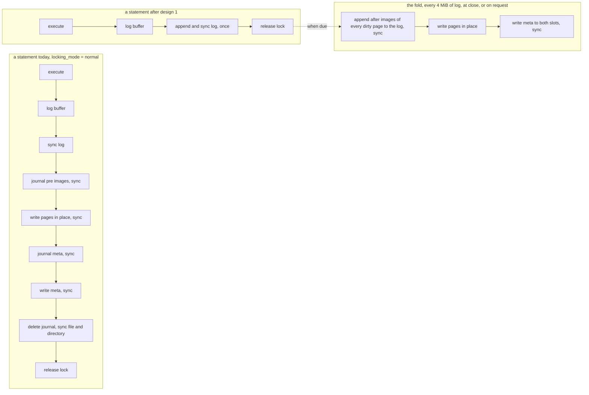
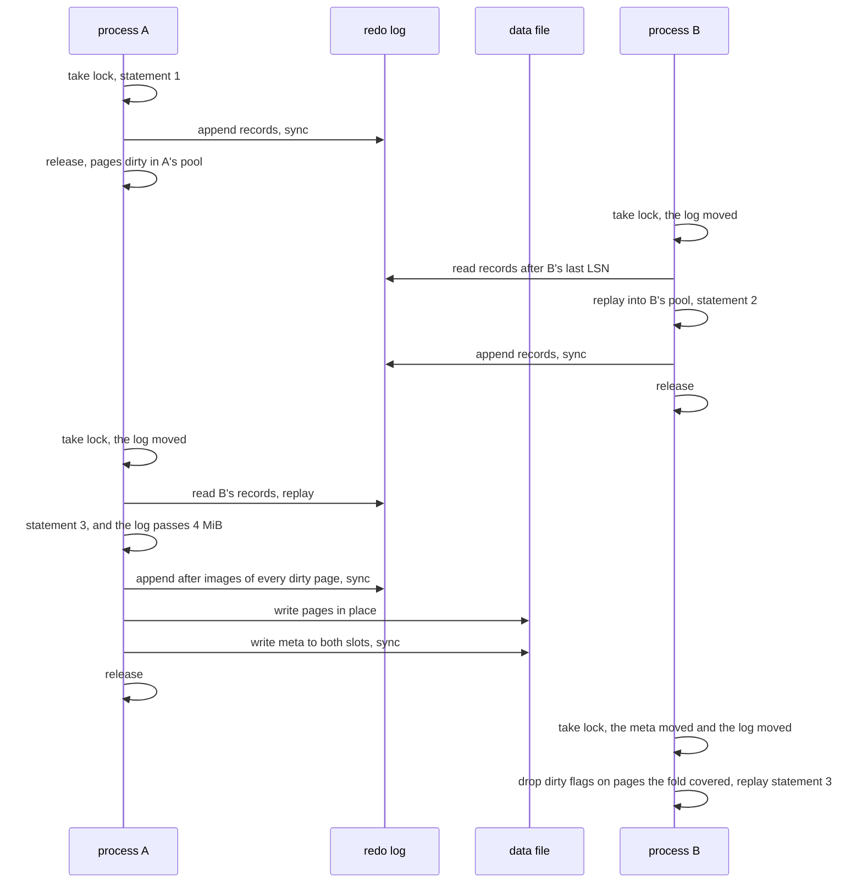

# task-2000: faster on every surface, and a commit that is one append and one sync

## Introduction

task-1935 re-measured the SQLite comparison on 2026-09-19 and found two things. The released
engine, v0.1.3, is 4.39x SQLite's speed on the weighted plan, with six of thirty workloads slower
than SQLite. The engine on `main` is not that engine: `locking_mode = normal` became the default
after the tag, and under it every statement that writes forces its pages into the file before it
releases the lock. task-1999 took five pieces of housekeeping off that path, and `main` still
reads 3.44x to 3.53x with the `transaction` family at 0.75x and `schema` at 0.33x to 0.53x, both
under the contract's 1.00x floor, so the release condition is not met.

This document designs the changes that take `main` past the released engine on every family, not
back to it. The largest single change is to the commit path: today a statement's commit is a
checkpoint, with a rollback journal protecting the checkpoint's in place page writes, and that
costs six to eight fsync class calls a statement. The design makes a commit one log append and one
sync, makes the fold into the file lazy, and makes the fold safe without a rollback journal by
logging the after images of the pages it is about to write. Around it are nine smaller designs,
one per measured cost, covering the read path, the analytical operators, statement compilation,
batch inserts, index builds, the FTS5 build, the retrieval engine and memory. Each design carries
the measurement it starts from, the mechanism, and the number it has to reach.

The work is filed for Opus as its own ticket. This document is the design; nothing in it is built.

## Goals and Non-Goals

### Goals, each measured by the instrument named

All SQLite figures are the four run protocol `docs/performance.md` describes: `inillucent-fullgate
<fixture> --scale medium --rounds 30 --page-size 32768 --frames 4096`, four consecutive runs on a
quiet box, medians of the two middle runs, against the pinned SQLite 3.53.4 arm. Every goal is
measured on `main` with the shipped defaults, `locking_mode = normal` and `journal_mode = wal`,
because that is what a user gets.

| goal | today, v0.1.3 tag | today, `main` after task-1999 | target |
|---|---:|---:|---:|
| weighted headline, median of runs | 4.39x | 3.44x to 3.53x | **at least 5.50x** |
| weighted headline, 95% lower bound | 4.09x | 3.31x to 3.43x | **at least 5.00x** |
| workloads slower than SQLite | 6 | 9 | **0** |
| any required family, 95% lower bound | `schema` 0.99x | `schema` 0.33x | **every family at least 1.50x** |
| `transaction` family | 2.50x | 0.75x | at least 2.50x |
| `write` family | 2.17x | 1.22x to 1.29x | at least 2.50x |
| `schema` family | 1.36x | 0.33x to 0.53x | at least 2.00x |
| `read.analytical` family | 5.36x | about 5.2x | at least 10.0x, lower bound over its 5.00x bar |
| `read.range` family | 5.13x | about 5.0x | at least 6.50x |
| `read.join` family | 4.38x | about 4.2x | at least 6.00x |
| `extension` family | 1.58x | about 1.55x | at least 1.80x, lower bound over its 1.50x bar |
| `open.prepare` family | 1.50x | about 1.54x | at least 2.00x |
| processor time, one round, ratio to SQLite | 0.325 | 0.65 to 0.74 | **at most 0.30** |
| peak resident set, ratio to SQLite | 1.14 | 1.14 | **at most 1.00**, and the 0.95 bar if the process floor investigation in design 10 finds the bytes |
| an autocommit `UPDATE` of one row, `txn.autocommit`, per statement | 1.18 ms | 8.7 ms | **at most 0.8 ms** against SQLite's 1.17 |
| fsync class calls per autocommit statement when no fold is due | 6 to 8 | 6 to 8 | **1** |

Per workload targets are in the section "What each workload has to reach". The three that decide
whether the headline goal is met are `scan.aggregate` to at least 40x, `range.lookaside` and
`join.range` to at least 1.80x, and `txn.autocommit` to at least 1.40x.

Retrieval, measured by `inillucent-bench grade` on the synthetic corpus, the same protocol
task-1935 ran, on the same PostgreSQL baseline on port 5433:

| goal | today | target |
|---|---:|---:|
| index build, 185,078 chunks at 768 dimensions, `index.add` and `commit` | 129.7 s | **at most 25 s** on this box's 24 threads |
| vector search p50, no predicate | 0.934 ms | at most 0.65 ms |
| hybrid search, title query | 5.125 ms | at most 3.5 ms |
| ranking rows on the card | 15 better, 1 equivalent, 1 inconclusive, 0 worse | **unchanged**, every correctness gate passing |

The publication goal: `docs/performance.md`, `docs/feature-comparison.md`, `docs/roadmap.md`,
`docs/closed-items.md`, `docs/product-overview.md`, `README.md`, `CHANGELOG.md`, the agent skills
that quote a figure, `inillucent-scorecard.md` and `.json`, and inillucent.com's `src/data/content.ts`
and `PRODUCT.md` all carry the new run, with no occurrence of the old figures left, the site
rebuilt, its service restarted, and `tests/live-errors.mjs` clean.

### Non-Goals

- The contract's weights and bars in `compat/perf/contract.toml` do not move. `open.prepare`'s
  5.00x bar and `schema`'s 3.00x are unreachable by arithmetic, which `docs/closed-items.md`
  already records, and this ticket does not decide the contract.
- Group commit, snapshot readers beside a writer, and a server process are task-1998's rungs.
  Design 1 is that TDD's first rung, "one append and one sync", and it is built here because the
  gate measures it; the rest stays there.
- The retrieval index's resident footprint, roadmap item 3, is a memory design and is not built
  here. The retrieval work here is speed only.
- ~~`journal_mode = delete`, the mode with no redo log, keeps its rollback journal and its current
  commit path. Design 1 changes `wal` mode, which is the default.~~ **Corrected during
  implementation, task-2006.** Two of those three claims are false and the correction changes what
  design 1 covers, so it is struck rather than edited away. `wal` is not the default:
  `Pragmas::fresh` starts at `JournalMode::Delete` (`crates/inillucent-engine/src/engine/state.rs`)
  for SQLite parity, and the gate sets `journal_mode = delete` on both arms
  (`crates/inillucent-compat/src/perf.rs`, and `PRAGMA journal_mode=delete` to SQLite in
  `compat/oracle/sqlite_bench.c`). And `delete` is not "the mode with no redo log" - every mode in
  this engine has one, and `PRAGMA journal_mode` selects how the **fold** is protected, after images
  in the log for `wal` and pre images in `app.db-journal` for the rollback modes. So design 1
  confined to `wal` would have been measured by nothing.

  **What design 1 does instead:** it changes the fold's timing in every mode. The rollback modes
  keep their rollback journal around the fold; what changes is that the fold no longer runs on every
  commit. The after images are `wal`'s alone, as this non-goal intended. One durability property
  goes with the per-commit fold and it is not a journal property: an eager fold left every
  acknowledged commit in the log *and* in the data file, so a device that acknowledges a write and
  stores half of it could lose one copy of two. `wal` mode already granted that exemption in
  `crates/inillucent-compat/tests/wal_crash.rs`, and
  `durability::a_short_write_at_every_cut_point_is_recoverable` is where the argument and the count
  now live for every mode.
- No change to the on disk page format, the record format inside a leaf, or the meta record.
  Design 1 adds one log record kind and design 6 changes one, and both are additive.
- No new dependency. The parallel build uses `rayon`, which `inillucent-core` already links.

## Problem statement

### What a statement costs on `main` today

An autocommit statement under the shipped defaults does the following, traced in
`crates/inillucent-engine/src/engine/locks.rs` and `crates/inillucent-engine/src/checkpoint.rs`
and itemised by the write path trace behind this document:

1. Takes the file lock SHARED, RESERVED, then EXCLUSIVE.
2. Reads the meta page and its shadow straight from the file, because the previous release
   dropped trust in the pool's copy.
3. Executes: a descent of the table's tree, the row into the leaf's delta area, the same for each
   secondary index, and a logical `InsertRow` record per tree into the log's memory buffer.
4. On the way out, `release_if_idle` sees dirty pages and takes a `Releasing` checkpoint:
   - write and sync the log buffer (sync 1);
   - for every dirty page, read its current on disk bytes and buffer them as a rollback journal
     pre image, then seal the journal (sync 2);
   - clone every dirty frame, checksum it with crc32c over the whole page, write it in place, sync
     (sync 3);
   - log and sync the free map's pages (sync 4);
   - journal the two meta pages and seal (sync 5);
   - write the meta record to both slots and sync (sync 6), which is the commit point;
   - sync and unlink the journal file, syncing the directory entry (syncs 7 and 8).
5. Releases the lock.

That is 8.5 ms for `write.insert.autocommit` against SQLite's 4.06 ms, and 8.7 ms for
`txn.autocommit` against SQLite's 1.17 ms. SQLite in `journal_mode = delete` at `synchronous =
FULL` pays two syncs and a journal delete. Under `locking_mode = exclusive` the whole of step 4 is
skipped and the statement costs about 1.2 ms, which is where v0.1.3's numbers came from.

The reason the fold runs per statement is the invariant `release_if_idle` states in its own
comment: a connection that released the lock with dirty pages would leave the file describing a
database without the statement that just succeeded, and the next process to write would build on
that file and overwrite the statement. That is the lost write class task-1979 section 4, task-1980
and task-1987 each found once. The comment also records that removing the fold was tried: the next
process replayed the log and lost nothing, and the change was put back because eighteen suites
saw the log where they expected the file.

The reason the fold needs a rollback journal is that the redo log is logical. `InsertRow` and
`DeleteRow` are reapplied by the tree's own decode, so they need the page they apply to intact. A
checkpoint writes pages in place, and a crash in the middle of one leaves a page that is neither
its old bytes nor its new ones, which no logical record can rebuild. `wal_crash.rs` reproduced it
at cut 32. The journal's pre image is what makes a torn fold recoverable. SQLite's write ahead log
holds whole page images, so its checkpoint is a copy and an interrupted one is redone.

### Where the rest of the gap is, per workload

Measured, all on the medium fixture, per round unless stated:

| workload | inillucent | SQLite | ratio | what the trace found |
|---|---:|---:|---:|---|
| `prepare.trivial`, 4,000 `SELECT 1` compiled each time | 3.30 ms | 1.73 ms | 0.50x | 25 heap allocations a compile: 417 ns to parse, 520 more to bind, the rest to build the pipeline. SQLite compiles, binds, steps and resets it in about 430 ns |
| `range.lookaside`, 500 statements of 200 row fetches | 28.1 ms | 27.7 ms | 0.97x | a non covering range is an index nested loop join into the table; every one of the 200 rowids pays a fresh root to leaf descent, a hashed page table lookup and a `RefCell` borrow for the root, a key encode, and a pin and unpin. About 433 ns a probe against SQLite's 277 ns a row all in |
| `join.range`, the same shape through `side_owner` | 27.4 ms | 24.9 ms | 0.90x | the same probe cost, twice |
| `write.insert.batch`, 2,000 rows, two secondary indexes, one transaction | 29.7 ms | 21.5 ms | 0.71x | 15 µs a row. A code comment measures the two indexes at 8.4 µs of a 19 µs insert. Three heap allocations a row. 58% of the log is split records at 24,656 bytes each, three whole page images for one row |
| `schema.index`, `CREATE INDEX` over 100,000 text values | 26.4 ms | 35.4 ms | 1.36x | stages `scan 3.7, sort 5.5, pack 11.4, catalog 0.3, seal 5.8`. The bulk build logs a whole page image per leaf it builds, 6.2 MB of log for a 6.2 MB index, and the fold then writes every page a second time. The sort's arena and the built pages are the 12.5 MiB that puts the resident set over SQLite's |
| `scan.aggregate`, `count(*), sum(key), max(category)` over 100,000 rows | 8.15 ms | 95.3 ms | 11.5x | 81 ns a row over columns that are already PAX vectors of narrow integers. The aggregate reads each row through a boxed `Eval` |
| `scan.distinct`, `DISTINCT category` with 64 values | 0.63 ms | 1.07 ms | 1.69x | `Distinct::push` builds an owned row, encodes the key, clones the encoding and inserts into a SipHash `HashSet` for every row, duplicate or not. An index on `(category, key)` exists and is not used to skip |
| `scan.sort`, `ORDER BY label LIMIT 100` | 23.0 ms | 122 ms | 5.2x | 230 ns a row for a top 100 |
| `extension.fts.build`, 500 documents | 8.12 ms | 5.76 ms | 0.70x | two shadow rows a document, content and docsize, 4.7 ms of the 8.1, and a dictionary flush that descends once per term |
| `extension.json`, one `json_extract` on a literal | 1.16 ms | 1.14 ms | 0.98x | the parse is cached; each call takes two `Mutex` locks and compares the whole document's bytes to find the cache entry |

And on the retrieval side, from the trace of `crates/inillucent-core` and `inillucent-bench`:
`HnswParams::default().build_threads` is 1 and the grading harness never overrides it, so the
129.7 s build runs on one of 24 threads; `Index::search_branches` runs the vector leg and the
lexical leg one after the other; the distance kernel is a four accumulator loop that relies on
auto vectorisation with no explicit AVX2 path; the ranked FTS5 path scores every matched row and
then sorts all of them even when a `LIMIT` is present.

### Why it matters

The number on inillucent.com is v0.1.3's 339%. The next release ships `main`, and `main` is 249%
with two families failing the release condition. Every day the gap stays, the published number
describes an engine nobody can download. And the six slow workloads are the shapes an
application actually runs: a statement compiled and thrown away, a range over an index that
fetches rows, a join, a batch insert, an FTS5 build.

## Architectural Overview

The ten designs and what each reaches:

```mermaid
flowchart TB
    D1["1. commit is one append and one sync; the fold is lazy and needs no journal"] --> F1[transaction, write, schema, cpu]
    D2["2. bulk index build writes its pages once, straight to the file"] --> F2[schema, memory]
    D3["3. a probe cursor: pinned root, sorted probes, no re encode"] --> F3[read.range, read.join, read.point]
    D4["4. vector kernels for aggregates, a skip scan for DISTINCT, borrowed compares for top n"] --> F4[read.analytical]
    D5["5. compile in an arena, six allocations for SELECT 1, one arena for a result"] --> F5[open.prepare, every read]
    D6["6. batch inserts: profile, then a logical split record, a leaf hint, and no per row allocation"] --> F6[write]
    D7["7. FTS5 build: one shadow row a document, a bulk dictionary append"] --> F7[extension]
    D8["8. JSON: no mutex, a hashed cache key"] --> F8[extension]
    D9["9. retrieval: parallel build by default, parallel legs, AVX2 distance, a bounded heap"] --> F9[grade latency and build]
    D10["10. memory: the writeback scratch buffer, the process floor"] --> F10[rss]
```

## Detailed technical sections

### Design 1. A commit is one append and one sync; the fold is lazy and needs no rollback journal

This is the change that moves `transaction`, `write`, `schema` and the processor time bar, and it
is the one task-1998 named as its first rung. It has three parts, and they only work together.

#### 1a. The fold is crash safe without a journal: after images go into the redo log

Today the fold protects its in place writes with a rollback journal of pre images. The design
replaces the pre image with an after image in the log that already exists. Immediately before the
fold writes any page in place, it appends one physical `Body::WritePage { page, image }` record per
dirty page to the redo log and syncs. The record kind exists; `log_free_map_pages` and
`log_built_page` already use it. Then the pages are written in place, then the meta record is
written to both slots and synced.

Recovery already applies records in LSN order per page and already treats a `WritePage` as
idempotent, because the free map depends on it. What changes for recovery is one rule: **a page
whose checksum fails on open is not an error if the log holds a `WritePage` for it at or after the
meta record's checkpoint LSN.** Recovery installs that image and replays the logical records after
it. The torn page `wal_crash.rs` reproduces at cut 32 is repaired by this rule with nothing else.

Segment retirement already refuses to retire below the recovery point, and the recovery point moves
only when the meta record that follows the fold is durable, so the images a fold needs outlive the
fold. The fold order is fixed and a test asserts it: images appended, log synced, pages written,
meta written, meta synced. Nothing else is synced.

The rollback journal is then not created in `wal` mode. `journal_for` returns the journal only
under `journal_mode = delete`, which keeps its current path untouched. `Pool::journal_page`'s
read before write, the journal's two seals, and the unlink with the directory sync all leave the
`wal` mode path.

Cost of the images: a page image a dirty page a fold. Under today's per statement fold that would
be 64 to 192 KiB a statement, which is why 1a is not built alone. Under 1b a fold runs every 4 MiB
of log, and a hot leaf is imaged once per fold however many statements touched it.

#### 1b. The fold is lazy under `locking_mode = normal`, and the lock handoff catches up

`release_if_idle` stops folding. On the way out of a statement that wrote, the connection appends
its records, syncs the log once, and releases the lock. The statement is acknowledged when that
sync returns. This is what `locking_mode = exclusive` already does between statements, and what
the redo log is for.

A fold runs at exactly four points: when `since_checkpoint` passes the 4 MiB bar task-1999 set;
when the connection closes, which needs a `Drop` for `ImportedDatabase` that folds on the way out
so a closed file is self contained, the property `inillucent backup` and anyone copying an `.rdb`
rely on; when a caller asks, through `PRAGMA wal_checkpoint`, `VACUUM`, or the driver's
`checkpoint`; and before a switch of `journal_mode` or `locking_mode`.

The multi process invariant moves from "the file holds every acknowledged statement at release"
to "**the file plus the log hold every acknowledged statement at release, and a connection that
takes the lock replays what it has not seen before it reads or writes anything**". The second half
already exists in outline: `enter_within` runs `the_meta_moved` and `the_log_moved` on every take
under `normal` mode. Today a moved log is an error condition that drops trust; after this design a
moved log tail is the ordinary case, and the connection replays the records between its own last
seen LSN and the tail into its pool, marking those pages dirty with the page LSN the records
carry. Replay is deterministic, so two connections that have both caught up hold identical pages.

Two rules make that safe against the lost write class:

- **A fold only runs while holding EXCLUSIVE, and only after catching up.** A connection that has
  caught up holds the newest version of every page it dirtied, so an in place write can never put
  an older version over a newer one. The sequence is asserted by a test that has process B write
  and fold while A holds unfolded pages, then has A take the lock and fold, and checks the file
  holds B's rows.
- **When the meta record moved, pages the other process folded are dropped from this pool rather
  than rewritten.** A page in the pool whose page LSN is at or below the file's new checkpoint LSN
  is already in the file with the same bytes, so its dirty flag is cleared. This is what stops two
  processes each folding the same pages, which is wasted I/O rather than a defect, and it is
  measured rather than assumed by a counter of pages written per fold in the two process tests.

The sequence for the handoff that the process concurrency campaigns exercise:

A read only open, `readonly_open`, replays into its pool and never folds, which it already cannot.
An `ATTACH`ed file has its own log and follows the same rule per file; `checkpoint_attached`'s
task-1987 rule, never fold a file this connection does not hold, is unchanged.

The eighteen suites that saw the file where they now see file plus log are updated, not worked
around: a test that asserts a statement is in the file after release asserts it is in the file
after `close` or after `PRAGMA wal_checkpoint`, and a test that asserts the log is empty after a
statement asserts it is empty after a close. The two process campaigns, `process_concurrency`,
`process_crash` and `concurrency`, are the correctness gate and are not weakened.

#### 1c. What a statement still pays, and the two counters that prove it

After 1a and 1b an autocommit statement is: lock take with its two cheap staleness checks, execute,
one `write_all_at` of the buffered records, one sync, release. The expected cost is the execution
plus one sync, which task-1999 timed at 0.48 to 1.13 ms on this disk, so about 0.6 to 1.3 ms
against SQLite's 1.17 ms for the same `UPDATE` and 4.06 ms for the same `INSERT`.

`inillucent-fullgate` already prints `log wr` and `log sync` per workload. It gains `file sync`
and `fold` counts, read from the pool, so the run transcript shows `txn.autocommit` at 100
statements, 100 log syncs, 0 or 1 folds, and 0 journal files. A test in `crates/inillucent-compat`
asserts an autocommit statement with no fold due performs exactly one sync, by counting through the
VFS, and that a fold performs exactly two.

#### 1d. The rest of the fold's cost

`Pool::writeback` clones every dirty frame into a fresh `Vec` and then runs a crc32c over the whole
page. The clone becomes one scratch buffer the pool owns and reuses, so a fold of 200 pages
allocates nothing. The checksum uses the SSE4.2 `crc32` instruction through `std::arch` behind
`is_x86_feature_detected!`, with the table version as the fallback, if it is not already; a 32
KiB page is about 2 µs in hardware against about 10 µs in a table. The stale line
`inillucent-fullgate` prints, "this engine takes no file lock at all", and the stale comment in
`engine/open.rs` that argues for `exclusive` as the default are corrected in passing.

### Design 2. A bulk index build writes its pages once

`PagedTree::bulk_build_rows` builds the tree bottom up and, per page, logs an `AllocPage` and a
whole page `WritePage` image. The fold then writes the same page again into the file. For
`schema.index` that is 6.2 MB logged, 6.2 MB written, 16 log writes and 4 log syncs, and `pack`
is 11.4 ms of a 26 ms statement.

The design: pages allocated for a bulk build are written **straight to the data file** by the
build, sequentially, from a small write buffer rather than from pool frames, and the log carries
only the `AllocPage` records and one `BulkBuilt { root, first, count }` record. The commit order
is what makes it safe: build pages written, data file synced, then the statement's own records
appended and synced. If the process dies before the log sync, the catalog never names the root and
the free map replay leaves the pages free. If it dies after, the pages were durable first. A torn
page cannot exist at commit because the file sync preceded it. No journal and no image is needed,
and the pages are never written twice.

The pack no longer holds 190 frames of the pool, and the sort's scratch is released before the
pack as it is today, so the statement's resident peak falls by about the index's own size. That is
the 12.5 MiB `docs/performance.md` names as the whole reason the memory bar is missed, and the
expected result is a peak within about a mebibyte of SQLite's.

Expected: `pack` from 11.4 ms to about 4, `seal` from 5.8 to about 1 because the fold has nothing
of the index left to write, `schema.index` from 26 ms to about 14 against SQLite's 35: about 2.5x.

A pool that is asked for a page in the built range after the build reads it from the file the
ordinary way, which is what an index scan after `CREATE INDEX` does today after a checkpoint.

### Design 3. A probe cursor for the row fetches inside one statement

`range.lookaside` and `join.range` fetch 200 rows a statement through `PagedTree::probe`, and every
probe starts from nothing: `Pool::fetch` for the root through the page table hash and the
`RefCell<State>` borrow, a key encode into a fresh buffer, a descent, a pin and an unpin. SQLite
keeps one cursor open for the statement and seeks it 200 times.

The design adds `ProbeCursor<'p>` in `crates/inillucent-tree/src/paged/cursor.rs`, owned by the
`IndexNestedLoopJoin` for the life of one execution:

- **The root frame stays pinned** for the cursor's life, so a probe starts at a frame it already
  holds: no hash, no `RefCell`, no pin churn on the root. The interior levels below it are already
  swizzled, so the whole descent is pointer chasing.
- **The rowid is compared as an integer**, not encoded into a key buffer and decoded per
  comparison, for a rowid keyed tree; `with_seek_key` is bypassed for the one column integer case.
- **Probes are batched and sorted** per input batch: the join collects the outer batch's up to 2,048
  probe keys, sorts them, and walks them in order. Sorted probes make consecutive descents share
  every interior page and let the cursor keep its current leaf when the next key is under the same
  fence, which for a range over `main_key` is rare but for the `side_owner` prefix scan inside
  `join.range` is common. Results are emitted in the outer order the operator expects by carrying
  the outer row's index with each key.
- **A single projected column skips the column vector assembly**: `sum(length(label))` and
  `count(note)` read one column, and the join builds a `[Vector; INLINE_COLUMNS]` per matched row
  today.

Expected: about 433 ns a probe to about 150. `range.lookaside` from 28 ms to about 13 (2.1x),
`join.range` from 27 ms to about 13 (1.9x). The same cursor serves `point.rowid`, `point.index` and
`join.selective`, each of which is one probe a statement and gains the root pin only.

The `closed-items.md` note that a 200 row range scan did not gain from chain reuse is this cost
named from the other side: the saving is per entry, and this is the per entry change.

### Design 4. The analytical operators

Four workloads, four mechanisms, all in `crates/inillucent-exec/src/ops`.

**`scan.aggregate`**: 81 ns a row for `count(*), sum(key), max(category)` over columns that are
already `Vector::Int64 { bytes, width, base }`. The design adds aggregate kernels that take the
`Vector` rather than a row: `count(*)` is the batch's row count less its tombstones; `sum` and
`max` over an `Int64` vector dispatch once on `width` and run a tight loop over `u8`, `u16`, `u32`
or `u64` lanes with a widening accumulator and an overflow check per batch rather than per row;
`sum` and `max` over a `Float64` vector the same. The generic boxed `Eval` path stays for every
other shape. Expected: at most 1.5 ms, which is 15 ns a row and about 60x SQLite's 95 ms. This is
the single largest lever on the headline after design 1.

**`scan.group`**: `StreamAggregate` already runs on the `main_category` index in key order with a
run finder over the dense integer key. Its per group `count(*)` goes through the same kernel, so a
run of 1,562 rows is one subtraction. Expected: from 9.6 ms to about 4.

**`scan.distinct`**: two changes. `Distinct::push` checks `contains` before it builds the owned
row or clones the key, and its `HashSet` uses the workspace's own multiplicative hasher instead of
SipHash. And the planner gains an **index skip scan** for `DISTINCT` and `GROUP BY` with no
aggregate over the leading column of an index: after emitting `category = c`, seek to the first
entry above `(c, +inf)`. 64 seeks instead of 100,000 rows. Expected: from 0.63 ms to under 0.06,
about 18x SQLite. The skip scan is the mechanism SQLite does not have for this shape and it is
what lifts the family's lower bound, which `scan.distinct` holds down today.

**`scan.sort`**: `TopN` over `label` costs 230 ns a row. After the first hundred rows almost no
row beats the hundredth best, so the comparison against the threshold is made on the borrowed
`&[u8]` of the leaf before anything is materialised, and only a winner is copied into an
`OwnedDatum`. Expected: from 23 ms to about 8.

### Design 5. Compilation in an arena, and one arena for a result

`SELECT 1` compiles in 25 heap allocations and about 825 ns; SQLite does it in about 430 ns. The
workload prepares each time by design, so no cache can help and the compile itself has to be
cheaper.

- **An arena per compile.** `inillucent-base` gains a bump arena, a few dozen lines: a `Vec<u8>`
  chunk list with an `alloc<T>` that returns a `&'a mut T`, reset at the end of the compile. The
  lexer's tokens become `(start, end)` ranges into the SQL text, identifiers are `&'a str` slices,
  and the AST, the binder's scopes and the plan nodes are allocated in the arena. The
  `PhysicalPlan` that outlives the compile is the one structure still built on the heap. Target:
  at most six allocations for `SELECT 1`, measured by `inillucent-prepareprofile` which already
  counts them, and a compile under 400 ns.
- **One allocation for a result.** `Collect::push` builds a `Vec<OwnedDatum>` per row and a
  `to_vec()` per text cell. The materialised result becomes `Rows { cells: Vec<OwnedDatum>, width,
  bytes: Vec<u8> }`, one cell vector for every row and one byte arena for every text and blob, with
  a cell holding an offset and length into it. The driver's `Rows` and the shell's renderer read
  through an accessor, and `total` stays exact because the statement still materialises whole. This
  removes two allocations per row from every `SELECT`, which is why `point.rowid` and the rest of
  the read families gain from it too.

Expected: `prepare.trivial` from 0.50x to at least 1.0x, `open.prepare` from 1.5x to about 2.1x,
and about 100 ns off every point read.

### Design 6. The batch insert: measure the 15 µs, then remove it

`write.insert.batch` is 15 µs a row, the two secondary indexes are 8.4 µs of that by a measured
comment, and nothing has timed the remaining stages of one row. So the first step is a
measurement, with `inillucent-writeprofile` gaining per stage timers for one insert: descent,
locate in the delta area, encode, delta write, compaction, split, log append, per tree. The three
mechanisms below are designed against what the trace found and the profile decides their order.

- **A logical split record.** A split logs three whole page images, 24,656 bytes, 58% of the
  workload's log. The record becomes `Split { left, right, parent, separator, at }`, replayable
  because recovery already has the left page at the state the split saw, by LSN ordering, and a
  split is a deterministic function of that page and the point. This is roadmap item 2's named
  lever, and it carries its own crash campaign: every cut point inside a split, and recovery
  producing the same three pages the live split produced, compared byte for byte.
- **Compaction of a delta area merges rather than sorts.** A leaf with 3,000 narrow entries is
  compacted by re sorting all of them; the delta area is small and the sorted region is sorted, so
  a compaction is one linear merge into a scratch buffer and a copy back. If the profile shows
  compaction under a microsecond a row this item is dropped.
- **No allocation per row.** `write_row` allocates a key `Vec<Datum>`, a record `Vec<u8>` and a
  descent path `Vec<PageId>` per row. They become buffers on the statement that are cleared and
  reused. A **leaf hint** on each tree, the last leaf written with its fence keys, lets an append
  at the right edge skip the descent, which is what `main_table`'s rowid insert is.

Expected: from 0.71x to at least 1.30x. If the profile finds the cost somewhere this section does
not name, the finding goes in the ticket's comment with the number and the fix is designed there.

### Design 7. The FTS5 build

`Fts5Table::add` writes a content row and a docsize row per document, 4.7 ms of 8.1 for 500
documents, and flushes the dictionary with a descent per term.

- **One shadow row a document.** The per column token counts that `%_docsize` holds are written
  into the content row's record as a leading blob column. `bm25::row_sizes` reads them from the
  content row, which `Fts5Cursor::held` already caches per rowid, so the ranked query path gains a
  read too. An existing file with a separate `%_docsize` table reads unchanged;
  `fts5_legacy_layout.rs` gains that case. Expected: about 2 ms.
- **A bulk dictionary append.** The pending buffer is a `BTreeMap` in key order, and the flush
  walks it with one `PagedTree::insert` per term. The flush uses a write cursor that keeps its leaf
  between consecutive keys, the same leaf hint design 6 adds, so 507 terms in order cost one
  descent per leaf touched rather than per term. Expected: about 1.5 ms of the 2.4.

Expected: from 0.70x to at least 1.15x, which with the rest of the family unchanged takes
`extension`'s lower bound over 1.50x. `extension.fts.query` must not regress below 1.35x, which the
segment format that was reverted did and which this design does not touch.

### Design 8. JSON

The document and path caches exist and work. Each call takes two `Mutex` locks and compares the
whole document's bytes with the cached copy. The executor is single threaded, so the locks become
`RefCell`s, and the cache key becomes a 64 bit hash of the document compared before the bytes.
Expected: from 0.98x to about 1.2x.

### Design 9. Retrieval

- **The parallel build is on by default everywhere.** `HnswParams::default().build_threads`
  becomes `available_parallelism()`, which `inillucent-search`'s SQL table already sets and
  `inillucent-core`'s own builds do not. The grading harness records `build_threads` in the run's
  manifest and the score card's provenance line. The parallel build's graph differs from the serial
  one, so the card's ranking rows are compared to the committed card's verdicts and must be
  unchanged; if a ranking row moves past its verdict, the bench keeps `--build-threads 1` and the
  default changes only for the CLI and the table. Expected: 129.7 s to under 25 s on 24 threads.
- **The two legs of a hybrid search run under `rayon::join`.** `Index::search_branches` runs the
  vector leg then the lexical leg; they touch disjoint structures. Expected: the hybrid rows on the
  card fall to about the slower leg, 5.1 ms to about 3.5.
- **An explicit AVX2 and FMA distance kernel.** `distance::dot` relies on auto vectorisation of a
  four accumulator loop, which without `target-cpu` compiles to 128 bit lanes. An
  `#[target_feature(enable = "avx2,fma")]` version with eight 256 bit accumulators, selected once
  through `is_x86_feature_detected!`, with the current loop as the fallback, and a test that the
  two agree to within one unit in the last place on random vectors. Expected: the vector p50 from
  0.93 ms to about 0.65.
- **A prefetch in the layer 0 search.** When a candidate is popped, the vectors of its neighbours
  are prefetched with `_mm_prefetch` before their distances are computed. Measured, and kept only
  if it moves p50.
- **The ranked FTS5 path keeps a bounded heap** of `LIMIT` rows instead of scoring and sorting
  every match, and `row_sizes` comes from the cached content row after design 7.
- **`Bm25Index::build` tokenises in parallel** across chunks with `rayon`, merging per thread
  postings in term order.

### Design 10. Memory

After design 2 the plan's peak is expected within about a mebibyte of SQLite's 37.2 MiB. The
remaining difference `docs/performance.md` attributes to the process floor: 8.49 MiB against
about 4.2, of which "4.1 MiB is what any Rust binary in this workspace costs before the engine
exists". A hello world Rust binary on Windows is about 1.5 MiB of private working set, so that
sentence is worth a measurement: `inillucent-alloc`'s initial reservation, what it touches at
start, and whether a linked ONNX or search symbol pulls pages in. The ticket measures the floor of
a trivial binary with and without `inillucent-alloc` and reports the split; if the allocator's
initial arena is the 2 to 3 MiB, it is sized down to what the first statement needs, and the
0.95 bar is in reach. If the bytes are the operating system's, the page says so with the number and
the bar stays missed at 1.00.

### What each workload has to reach

Targets are paired round ratios on the whole plan, `main`, four runs, median of the two middle.

| workload | v0.1.3 | `main` today | target | design |
|---|---:|---:|---:|---|
| `prepare.trivial` | 0.50x | 0.54x | 1.00x | 5 |
| `prepare.point` | 4.59x | 4.41x | 5.00x | 3, 5 |
| `point.rowid` | 32.1x | 31.4x | 38x | 3, 5 |
| `point.index` | 16.6x | 15.6x | 20x | 3, 5 |
| `point.miss` | 50.8x | 50.9x | 55x | 3, 5 |
| `range.covering` | 8.52x | 8.17x | 9.5x | 5 |
| `range.lookaside` | 0.97x | 0.96x | 1.80x | 3 |
| `range.reverse` | 16.4x | 15.7x | 17x | 5 |
| `scan.aggregate` | 11.5x | 11.4x | 40x | 4 |
| `scan.group` | 7.96x | 7.89x | 15x | 4 |
| `scan.sort` | 5.24x | 5.03x | 12x | 4 |
| `scan.distinct` | 1.69x | 1.68x | 10x | 4 |
| `join.selective` | 21.2x | 20.5x | 24x | 3 |
| `join.range` | 0.90x | 0.87x | 1.80x | 3 |
| `write.insert.batch` | 0.71x | 0.70x | 1.30x | 6 |
| `write.insert.autocommit` | 3.30x | 0.48x | 3.50x | 1 |
| `write.update.indexed` | 1.64x | 1.62x | 1.80x | 6 |
| `write.delete` | 3.01x | 3.01x | 3.20x | 6 |
| `write.upsert` | 4.03x | 4.50x | 4.50x | |
| `txn.autocommit` | 1.03x | 0.13x | 1.40x | 1 |
| `txn.batched` | 3.67x | 3.60x | 5.00x | 1 |
| `txn.large` | 4.17x | 3.88x | 4.50x | 5 |
| `schema.index` | 1.36x | 0.62x | 2.30x | 2 |
| `extension.json` | 0.98x | 0.98x | 1.20x | 8 |
| `extension.fts.build` | 0.70x | 0.69x | 1.15x | 7 |
| `extension.fts.query` | 1.40x | 1.39x | 1.40x, no regression | 7 |
| `extension.rtree.insert` | 1.86x | 1.88x | 1.90x | |
| `extension.rtree.query` | 5.36x | 5.00x | 5.40x | |
| `large.read` | 41.0x | 38.8x | 42x | 5 |
| `large.write` | 3.94x | 3.63x | 4.00x | 1 |

`txn.batched` is 200 commits, so it pays 200 folds today and 200 single syncs after design 1, which
is why its target rises. `write.upsert` and the two R-Tree rows have no design and their target is
that they do not regress.

### Components and interfaces

| component | crate and file | change |
|---|---|---|
| `release_if_idle`, `checkpoint_of`, `checkpoint_within` | `inillucent-engine/src/engine/locks.rs`, `checkpoint.rs` | no fold at release; `CheckpointKind::Releasing` is retired; fold at the 4 MiB bar, at close, on request |
| `enter_within`, `the_log_moved` | `locks.rs` | a moved log tail is replayed into the pool through the existing recovery reader, not treated as a trust drop |
| `Drop for ImportedDatabase` | `inillucent-engine` | folds if dirty and the connection holds or can take the lock |
| `Pool::flush`, `Pool::writeback`, `Pool::checkpoint`, `journal_gate.rs` | `inillucent-pool/src/pool.rs` | after images to the log before in place writes; no journal in `wal` mode; one scratch buffer; hardware crc32c |
| recovery | `inillucent-wal/src/recover.rs` and the engine's open path | a page failing its checksum is rebuilt from the latest `WritePage` at or after the checkpoint LSN, then replayed |
| `bulk_build_rows`, `log_built_page` | `inillucent-tree/src/paged.rs` | pages written to the file through a write buffer; `Body::BulkBuilt` record |
| `ProbeCursor` | `inillucent-tree/src/paged/cursor.rs` | pinned root, integer rowid seek, leaf retention |
| `IndexNestedLoopJoin` | `inillucent-exec/src/join/loops.rs` | sorted probe batches, single column projection |
| aggregate kernels | `inillucent-exec/src/ops/aggregate.rs` | `sum`, `max`, `min`, `count` over `Vector::Int64` and `Float64` |
| `Distinct`, `TopN` | `inillucent-exec/src/ops/order.rs` | contains before clone, fast hasher, borrowed threshold compare |
| skip scan | `inillucent-sql/src/plan.rs`, a new operator in `inillucent-exec` | `DISTINCT` and aggregate free `GROUP BY` over an index prefix |
| arena | `inillucent-base` | bump arena used by the lexer, parser, binder and planner |
| `Rows` | `inillucent-exec/src/ops/collect.rs`, `inillucent-driver` | one cell vector and one byte arena per result |
| `write_row`, split logging, compaction | `inillucent-tree/src/write.rs`, `inillucent-wal/src/record.rs` | reused buffers, leaf hint, `Body::Split`, merge compaction |
| `Fts5Table::add`, `flush_doclists_timed`, `bm25::row_sizes` | `inillucent-ext/src/vtab/fts5/{merge,index,bm25}.rs` | docsize inside the content row; ordered bulk flush |
| `JsonCall` | `inillucent-exec/src/scalar.rs` | `RefCell` caches, hashed key |
| `HnswParams`, `search_branches`, `distance::dot`, `Fts5Cursor::filter`, `Bm25Index::build` | `inillucent-core`, `inillucent-ext` | parallel default, `rayon::join`, AVX2 kernel, bounded heap, parallel tokenisation |
| `inillucent-fullgate`, `inillucent-writeprofile` | `inillucent-compat/src/bin` | `file sync` and `fold` counters; per stage insert timers |

New log record kinds, `BulkBuilt` and `Split`, get a schema version bump in the record header's
kind table and a test that a log written before this change still recovers. No page format, meta
record or file header changes.

### Data flows and risk

**The lost write class is the risk, and it is the one this repository has the most tests for.**
Design 1b is the exact shape that was tried and put back once, so its acceptance is not "the gate
is faster" but "the two process campaigns are green with the fold removed from the release path":
`two_writer_processes_lose_nothing_long_lived`, `two_writer_processes_lose_nothing_one_statement_each`,
`two_processes_attaching_one_file_lose_nothing`, `a_readonly_process_reads_while_a_writer_holds_the_file`,
`a_killed_writer_leaves_every_acknowledged_transaction_whole`, plus a new one that alternates two
processes for a thousand statements with a fold forced every fifty and counts rows against
acknowledgements.

**A torn fold is the second risk**, and it is the one 1a exists for. The crash campaigns
`wal_crash.rs`, `search_crash.rs` and `free_map_checkpoint_crash.rs` run with cut points at every
step of the new fold order: after the image append, after its sync, after each in place write,
after the meta write. Every cut recovers to the acknowledged state, and cut 32 specifically, the
torn page with a retired segment, recovers because the image is in a segment that cannot retire
until the meta record after it is durable.

**A file copied while open** now needs its log, as a SQLite file in WAL mode does. `inillucent
backup` already goes through the engine and is unaffected; the documentation for copying an `.rdb`
by hand says to close or checkpoint first, and `inillucent integrity_check` reports an unfolded
log rather than treating the file as complete.

**Determinism of the parallel HNSW build** changes the graph. The card's verdicts are the
acceptance; a moved verdict keeps the bench serial.

**Design 4's kernels must produce the same values** as the generic path, including overflow to
`REAL` on `sum` and `NULL` handling on `max`, and the 416 feature cases and the differential probe
against SQLite are what say so.

**Design 5's arena** must not outlive the compile: a `PhysicalPlan` that borrowed an arena string
would dangle, and the borrow checker, not a review, is what prevents it, by giving the arena a
lifetime the plan cannot carry.

## Alternatives considered

| alternative | why not |
|---|---|
| Keep the fold per statement and reduce its syncs, by dropping the directory sync and merging the journal seals | Leaves four syncs and the journal's read before write per statement. At best 4 ms against SQLite's 1.17 for an update; the `transaction` floor is not reachable this way, which task-1999 concluded too |
| Make `locking_mode = exclusive` the default again | Restores v0.1.3's numbers and gives up the multi process protocol task-1980 built and the roadmap advertises. The gate would then measure a mode most users do not run |
| A full page image on first touch after a checkpoint, PostgreSQL's `full_page_writes` | Puts a 32 KiB image on the per statement path the first time each page is touched after a fold. With a lazy fold every 4 MiB the byte count is the same as 1a, but 1a keeps the statement path free of images and puts all of them in one sequential append at the fold |
| A copy on write tree, so no page is ever written in place | Removes the torn page problem entirely, and changes the page format, the free map, the parent pointers and every crash campaign. Too large for the gain over 1a |
| A hash join for `join.range` | The cost is the probe, not the join order; a hash join would build a 25,000 row table per statement for 200 matches. Design 3 fixes the probe, which every join and every non covering range shares |
| A statement cache keyed by SQL text for `prepare.trivial` | The gate disables the plan cache on both arms on purpose, and the workload measures a compile. The compile has to be cheaper |
| Spill the index build's sort to a file to meet the memory bar | task-1869 priced it at 8 ms on a 27 ms statement; design 2 removes 6 MiB of pool frames instead and costs nothing |
| Re applying the FTS5 segment format with a cached manifest | `closed-items.md` measured it: no gain on the build and half the query speed. The build's cost is two rows a document and a per term flush, which design 7 addresses directly |
| Lower the bars or the weights | Not this ticket's decision, and a bar that moves towards the measurement is not a bar |

## Testing strategy

Functional and integration tests first, each named so the ticket can check them off.

1. **`an_autocommit_statement_syncs_once`** (`inillucent-compat/tests`): a counting VFS records
   one `sync` for an autocommit `INSERT` when no fold is due, and zero journal files created.
2. **`a_fold_syncs_twice_and_writes_each_page_once`**: force a fold through `PRAGMA
   wal_checkpoint`; the VFS records two syncs, one `write_all_at` per dirty page to the data file,
   and a `WritePage` per dirty page in the log before the first data write.
3. **`a_torn_fold_is_rebuilt_from_its_after_image`**: the crash campaign cut inside the in place
   writes, with the segment holding the image retained; recovery installs the image and replays,
   and the row count equals the acknowledgements. Cut 32's shape.
4. **`a_second_process_reads_the_first_processes_unfolded_statement`**: process A inserts and
   releases without a fold; process B opens, replays, and `SELECT count(*)` shows the row.
5. **`two_processes_alternate_with_folds_and_lose_nothing`**: a thousand statements alternating
   between two processes, a fold forced every fifty on whichever holds the lock, rows equal
   acknowledgements, and the pages written per fold counted so the dropped dirty flag rule is seen
   to fire.
6. **`a_closed_file_is_self_contained`**: after `close`, the log is empty and a fresh open replays
   nothing; the same after `Drop`.
7. **The existing campaigns**, all green under `--strict`: `process_concurrency`, `process_crash`,
   `concurrency`, `wal_crash`, `search_crash`, `free_map_checkpoint_crash`, `durability`, and the
   eighteen suites that are updated to assert file plus log at release and file alone at close.
8. **`a_bulk_built_index_is_durable_before_its_commit_and_absent_after_a_crash_before_it`**: cut
   before the log sync leaves the catalog without the index and the pages free; cut after leaves
   the index readable and `integrity_check` clean.
9. **`a_split_record_replays_to_the_same_three_pages`**: every cut point inside a split; the
   recovered pages compared byte for byte with the live ones.
10. **The 416 feature cases and the differential probe** against SQLite, for the aggregate kernels,
    the skip scan, the top n change, the FTS5 row layout and the JSON change: `inillucent-probe`
    and `tests/differential.rs`, zero new disagreements.
11. **`old_fts5_files_with_a_docsize_table_read_unchanged`** in `fts5_legacy_layout.rs`.
12. **`the_avx2_dot_agrees_with_the_scalar_dot`**: ten thousand random pairs at 768 dimensions,
    within one unit in the last place.
13. **`a_log_written_before_the_new_record_kinds_recovers`**: a fixture log from the current
    format replays under the new reader.
14. **The gate itself**, four runs at HEAD on a quiet box, every number in the goals table met, the
    transcripts kept under `_agent_output/task-<N>-performance/`; then `inillucent-bench grade`
    with the ranking verdicts unchanged; then `documentation.rs` green, which fails if the roadmap
    quotes a number the performance page no longer carries.

The instruments that already exist and that the ticket uses before and after each design:
`inillucent-fullgate`, `inillucent-readgate`, `inillucent-writegate`, `inillucent-prepareprofile`
(allocation counts), `inillucent-writeprofile` and `inillucent-writelogattrib`,
`inillucent-indexprofile`, `inillucent-checkpointperf`, `inillucent-foldgate`,
`inillucent-shellrss`, `inillucent-indexresidency`, `inillucent-bench grade`.

## Order of work

Each step ends with the gate run on the families it touches and the numbers in a ticket comment,
so a regression is caught at the step that made it and not at the end.

1. Baseline: build at HEAD, four runs, record. Add the `file sync` and `fold` counters and the per
   stage insert timers, because the later steps are measured with them.
2. Design 1, in the order 1a, 1d, 1b, 1c, with the campaigns green after 1a before 1b starts. This
   step alone should put `transaction` and `write` back over the floor and the processor time back
   under 0.40.
3. Design 2. `schema` over 2.0x and the resident peak measured.
4. Designs 3 and 5, which share the result arena and the point read families.
5. Design 4.
6. Design 6, starting from the profile.
7. Designs 7 and 8.
8. Design 9, and the grade.
9. Design 10.
10. The full four run gate, the grade, the documents, the site, the release notes.

## Done means

- The goals table is met on `main`, four consecutive runs, all thirty digests agreeing in every
  round, the transcripts kept.
- No workload is slower than SQLite, and every required family's lower bound is at least 1.50x.
- One sync per autocommit statement when no fold is due, asserted by a test.
- Every campaign in the testing strategy green under `inillucent-testrun --strict`.
- The retrieval card regenerated with the verdicts unchanged and the build time recorded.
- Every document and the site carrying the new run, with `documentation.rs` and
  `tests/live-errors.mjs` both clean, and `docs/performance.md`'s "What main measures today"
  section deleted because `main` is the engine the page describes.
