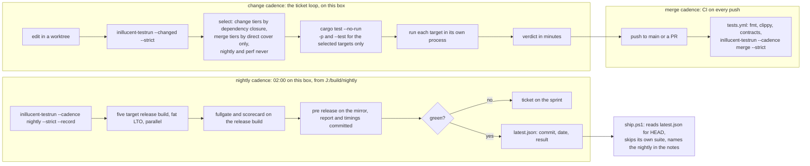
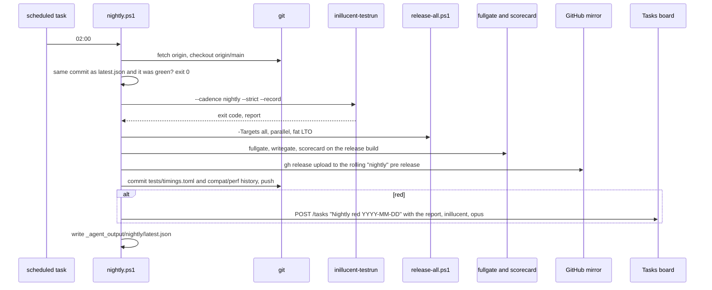
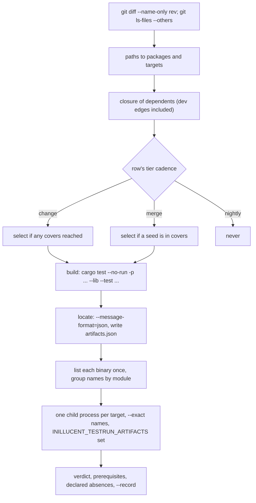

# Build and test time, and a build strategy for inillucent

Technical design, task-2114. Measured on 2026-09-24 on the development box: Intel Core Ultra 9 285,
24 threads, 128 GiB, NTFS on C: and D:, rustc and cargo 1.95.0, no sccache, no alternate linker.
Every number below has its command, its log and its cargo `--timings` report under
`_agent_output/task-2114-build-times/` in the main checkout (`measurements.md`, `survey.md`,
`research.md`). Only this ticket was building during the first pass; one other ticket was
building during the M10 baseline and that run says so.

## 1. Introduction

Working a ticket on inillucent takes far longer than the change itself justifies. The ticket asked
for a deep analysis of where the time goes, research into current practice, and a design for a
build strategy in which a change is tested by what it touched, a release is not cut for every
ticket, and the performance numbers are not taken on every test run.

The analysis found that compiling is not the problem. A cold worktree reaches a runnable test
suite in about two minutes, and an edit to a top crate rebuilds in two seconds. The time goes to
three things: the test runner selects far more than a change touches and nothing keeps the
scheduled tiers out of a change run; one test target builds the whole workspace a second time
inside itself and runs alone for 36 minutes; and the release script runs a strict suite that cannot
pass on this machine and then five serial fat LTO builds. This document sets out a three cadence
strategy (change, merge, nightly), the runner and manifest changes that make the change cadence
cheap, a nightly job that carries the full suite, the gates and the release build so a release can
rely on its evidence, and the profile and layout changes that shrink the compile and the 44 GB a
worktree leaves behind.

## 2. Goals and non goals

### Goals, each with the number that decides it

| # | goal | today | target |
|---|---|---|---|
| G1 | A change confined to `inillucent-sql` or `inillucent-engine` gets a verdict from `inillucent-testrun --changed --strict` | 37 min (178 targets, 36 min in one target) | under 10 min |
| G2 | A change confined to a top crate such as `inillucent-cli` gets a verdict | build step relinks all 227 binaries | under 3 min, and the build step compiles only the selected targets |
| G3 | A cold worktree reaches a runnable suite (`cargo test --workspace --no-run`) | 115 s | under 70 s |
| G4 | No change run executes a `nightly` or `perf` target; a `durability` target runs in a change run only when the change is in a crate that target says it covers | nothing enforces this | enforced by the runner and by a contract test |
| G5 | A release runs no suite of its own when a green nightly exists for the same commit, and its notes name that nightly | the release runs `--strict`, which never passes here, so every release ships with `-SkipTests` | evidence from the nightly, or the release refuses |
| G6 | The five target release build | five serial fat LTO builds, about 100 s each on the native target | the five run in parallel, under 4 min wall |
| G7 | A worktree's target directory after a full test build | 44 GB (2.9 GiB of test executables and 2.6 GiB of PDB files among it) | under 15 GB |
| G8 | The nightly runs unattended on this box, records timings, runs the gates and the scorecard on the release build, publishes a pre release, and files a ticket when red | no nightly exists | exists and has run green once |

### Measured after implementation

Taken on 2026-09-25 in one quiet window with no other agent running, on scratch worktrees of `main`
at b42fb3b (before) and of this change (after), each with its own target directory. The commands and
logs are in `_agent_output/task-2125/` (`measure.ps1`, `measurements.tsv`, one log per measurement).

| # | measurement | before | after |
|---|---|---|---|
| G1 | a change to `inillucent-sql/src/directive.rs` alone, `--changed --strict`, build and run | 37 min recorded for the four file change | 159 s, 165 targets, no crash suite or nightly target |
| G1 | the four file change in `inillucent-engine/src/ddl/` and `directive.rs`, selection only | 191 targets | 187 targets: the nightly tier drops out; every durability row covers `inillucent-engine`, so the crash suites still run, and `vacuum_crash` alone took 1,047 s in a loaded full run |
| G2 | a one line change to `inillucent-cli/src/main.rs` | the build step alone 80.4 s, 283 executables | build and the whole verdict 116.2 s, 24 executables, 50 targets, 837 tests |
| G3 | cold `cargo test --workspace --no-run` (M10) | 102.0 s | 50.1 s (104% faster); 46.3 s and 48.1 s on repeats |
| G3 | an edit to `inillucent-base`, then the test build | 77.5 s | 30.3 s (156% faster), the same 28 crates |
| G5 | `--strict` on the development machine | never passed | passes: 231 targets, 3,774 tests, four suites not evidenced by declaration |
| G6 | the five target release build, cold, fat LTO | 645.9 s serial | 257.4 s parallel (151% faster) |
| G7 | target directory after a full test build | 41.1 GB, 331 test executables, 28.2 GB of PDB files | 10.2 GB, 189 test executables, 4.5 GB of PDB files |
| C2 | `gates_fail_closed` through the runner | 36 min, alone, last | about 30 s, beside the others |
| C10 | rust-lld on the cold test compile | 50.1, 46.3, 48.1 s with link.exe | 44.9, 47.7, 48.6 s: within noise, so it is not set |
| C10 | sccache, cold test compile | 46.3 to 50.1 s | 56.2 s filling the cache, 46.4 s warm: no gain, so it is not set |

G1 for a change inside `inillucent-engine` is not met and is not meant to be by this design: the
crash suites exist for exactly that change. G8 is recorded in the ticket once the first real night
has run.

### Non goals

- **The release profile does not change.** `lto = "fat"` and `codegen-units = 1` are the fairness
  contract against SQLite's amalgamation and every published ratio was taken on them. They stay for
  shipped binaries and for the gates. They are never used for a test build.
- **No test is removed and no assertion is weakened.** Every target keeps its process isolation, its
  `requires` row, its timing row and its kill budget.
- **Publishing to crates.io, npm, PyPI, the Go tag, Packagist and Homebrew stays a person's
  decision.** A published version is permanent, so a nightly never publishes to a registry.
- **No nightly toolchain.** Cranelift and the parallel front end are nightly only on 1.95.
- **No adoption of nextest, hakari or a Dev Drive.** Each is considered in section 7 and either
  rejected or left as an experiment with its own measurement.

## 3. Problem statement

### 3.1 What a change costs today, measured

| measurement | result |
|---|---|
| M1 cold `cargo build --workspace` | 45 s wall; 403 s of processor time in 83 first party units, 209 s in 216 third party units |
| M2 `cargo test --workspace --no-run` after M1 | 73 s; 328 executables, 2.89 GiB; test kind units are 74% of the processor time, test plus bin kind 85% |
| M10 the same from cold in one invocation | 115 s |
| M7 rerun with no edit | 0.4 s, nothing recompiled |
| M7 edit `inillucent-cli/src/main.rs`, rebuild | 1.9 s, one crate |
| M7 edit `inillucent-base/src/lib.rs`, rebuild | 91 s, 28 crates recompiled, 280 binaries relinked |
| M7 `git checkout --` of a file whose content did not change | 92 s, the same rebuild, because cargo reads the mtime |
| M4 build `inillucent-testrun`, then `--tier smoke` | 17 s to build, 0.7 s to run ten tests |
| M5 `cargo build --release -p inillucent-cli`, fat LTO | 99 s |
| M5 the same with thin LTO and 16 codegen units | 48 s; fat is 104% slower |

The compile is two minutes cold and two seconds warm for a top crate. The one expensive compile is a
change to a foundation crate: `inillucent-base` is depended on by 26 of the other 28 members and
`inillucent-vfs` by 21, so an edit there recompiles the graph and relinks every test binary. That
relink is the part that can be cut, because it is 227 separate links of the same 23 crates.

### 3.2 Where the time actually goes: the suite

`tests/selection.toml` maps 231 targets (28 lib, 199 test, 4 bin) into ten tiers, and
`tests/timings.toml` records 19,410 s of processor time across the 184 that have run under
`--record`:

| tier | targets | recorded seconds |
|---|---|---|
| durability | 34 | 7,318 |
| nightly | 3 | 7,348 |
| differential | 34 | 1,933 |
| retrieval | 7 | 831 |
| engine | 68 | 785 |
| e2e | 36 | 604 |
| unit | 31 | 333 |
| tooling | 16 | 188 |
| perf | 1 | 55 |
| smoke | 1 | 16 |

Two tiers are 76% of the total. The `nightly` tier's own comment says its targets "run on a
schedule rather than on a change", and nothing in `testrun.rs` or `selection.rs` reads that
sentence: a run with no `--tier` includes them, `--changed` includes them when their package is
reached, `ship.ps1` includes them, and `.github/workflows/tests.yml` runs them on every push with a
120 minute timeout. `story_ledger_day_nightly` alone is 3,991 s.

`--changed` narrows what is executed and nothing else. `build()` in `testrun.rs` always runs
`cargo test --workspace --no-run --lib --tests`, so every change links all 227 binaries, and every
workspace build compiles `inillucent-bench`, which depends unconditionally on `tokenizers` and
`inillucent-core` with `onnx`, so `ort`, `tokenizers` and the C compile of oniguruma run on every
build and are the reason a plain cargo needs the MSVC environment.

The selection itself is coarse for the crates most tickets touch. `.claude/repo-plan.md` records a
four file change in `inillucent-sql` selecting 178 of 231 targets, because fifteen packages depend
on `inillucent-sql` and `inillucent-engine`, and the durability rows cover `inillucent-engine`
(23 of the 34 do), so a parser change runs the crash suites.

### 3.3 One target is a second build of the workspace

`inillucent-compat::gates_fail_closed` runs a nested `inillucent-testrun` in three of its cases,
and that nested runner builds into a fresh directory under `CARGO_TARGET_TMPDIR`, because a nested
cargo in the outer target directory would try to relink the running `inillucent-testrun.exe` and
Windows refuses. So a cold workspace test build happens inside a test, the row is `alone = true` to
avoid the relink race, and it runs last with one job. The recorded run: 37 minutes, of which the
last target alone took 36.

### 3.4 The release

`packaging/ship.ps1` runs `inillucent-testrun --strict` over all 231 targets before it does
anything else, and `--strict` cannot pass on this machine: no MySQL, no live PostgreSQL, no Go, no
openssl, no embed build. So every release is cut with `-SkipTests` and the release notes carry the
sentence "This release was published without running the test suite." Then `release-all.ps1`
compiles `inillucent-cli`, `inillucent-migrate` and `inillucent-driver-capi` with `embed` under
fat LTO for five targets, one after another, and no gate or scorecard runs at all: the performance
gates are documented as a hand run instrument and `ship.ps1` never calls one.

### 3.5 Disk

One worktree's target directory is 44 GB after a full test build. The main checkout's is 67 GB.
`.claude/repo-plan.md` records unretired worktree target directories reaching 1.64 TB in
aggregate. Every one of those directories holds 328 executables of which 146 are `inillucent-compat`
integration binaries linking the same 43,276 line library and the same 23 crates.

## 4. Architectural overview

### 4.1 Three cadences



A change is tested by what it touched, on the machine it was made on, in minutes. Everything the
change did not touch is tested by the merge run in CI and by the nightly. A release is a person
running `ship.ps1`, and the suite it relies on is the nightly's, for the same commit, or it refuses.

### 4.2 What changes, and what each change is measured against

| # | change | files | decides |
|---|---|---|---|
| C1 | `cadence` on every `[[tier]]`; the runner honours it | `tests/selection.toml`, `selection.rs`, `testrun.rs` | G1, G4 |
| C2 | `gates_fail_closed` runs no cargo: the outer runner hands the nested one its artifact list | `testrun.rs`, `gates_fail_closed.rs`, `selection.toml` | G1 |
| C3 | the build step names the selected packages and targets | `testrun.rs` | G2, G3 |
| C4 | `[profile.dev] debug = "line-tables-only"` | `Cargo.toml` | G3, G7 |
| C5 | `inillucent-compat`'s 146 integration binaries become one binary per tier, with a module per file; a target is a module | `crates/inillucent-compat/tests/`, `selection.toml`, `timings.toml`, `selection.rs`, `testrun.rs` | G2, G3, G7 |
| C6 | `packaging/nightly.ps1` and its scheduled task; `--record` writes timings; red files a ticket | `packaging/` | G8 |
| C7 | `ship.ps1` reads the nightly's evidence; `release-all.ps1` builds the five targets in parallel | `packaging/` | G5, G6 |
| C8 | `--strict` accepts a declared list of prerequisites this machine lacks | `testrun.rs`, a gitignored `tests/prerequisites.local.toml` | G5, G8 |
| C9 | CI: the push run uses the merge cadence; a scheduled workflow runs the nightly cadence | `.github/workflows/` | G4 |
| C10 | optional: `rust-lld` and `sccache` through the machine environment | `AGENTS.md`, a setup script | G3, small |

C1 to C4 are independent of each other and each is a day or less. C5 is the largest and depends
on C3 (the build step must be able to name a binary and the runner must be able to run a module).
C6 to C8 depend on C1 (the nightly needs a cadence to ask for). C9 depends on C1. The order in
section 8 follows from that.

## 5. Components and interfaces

### 5.1 C1: cadence on a tier

`tests/selection.toml` gains one field per `[[tier]]`:

```toml
[[tier]]
name = "durability"
purpose = "crashes, injected faults, corruption and concurrency"
cadence = "merge"
```

| tier | cadence |
|---|---|
| smoke, unit, engine, differential, e2e, retrieval, tooling | `change` |
| durability, perf | `merge` |
| nightly | `nightly` |

The runner reads it in `selection::Tier` and applies it in `choose`:

- `--changed [rev]` selects a `change` tier row when the closure of dependents reaches any package
  the row covers, as today. It selects a `merge` tier row only when a **seed** package (a package
  that actually changed) is one the row covers. It never selects a `nightly` tier row.
- A run with no `--tier` and no `--changed` runs `change` and `merge` (everything except
  `nightly`), which is what "everything, about 300 s" in `AGENTS.md` meant before the nightly
  targets existed.
- `--cadence nightly` runs every tier. `--cadence merge` with `--changed` selects `merge` rows by
  closure as well, for CI. `--tier nightly` by name still works, so a person can run one.
- A durability row's `covers` must name the crates it exercises. Today 23 of the 34 rows name
  `inillucent-engine`, which is the crate the closure reaches from almost anywhere. The
  implementation reviews each row and names the storage crates the suite actually crashes
  (`inillucent-wal`, `-tree`, `-pool`, `-txn`, `-storage`, `-catalog`), keeping `inillucent-engine`
  only where the suite drives the engine's own recovery path.

Contract tests in `crates/inillucent-compat/tests/selection.rs`: every tier has a cadence; the
`nightly` tier's cadence is `nightly`; a `--changed` selection over a synthetic change in
`inillucent-sql` contains no `nightly` row and no `durability` row whose `covers` lacks
`inillucent-sql`; the per tier table in `tests/inillucent-testing-tdd.md` gains a cadence column
and `the_per_tier_table_matches_the_map` checks it.

### 5.2 C2: no cargo inside `gates_fail_closed`

The outer runner already calls `locate()`, which runs `cargo test --no-run --message-format=json`
and reads every `compiler-artifact` line. It writes that list, as JSON, to
`<target-dir>/inillucent-testrun/artifacts.json` and sets `INILLUCENT_TESTRUN_ARTIFACTS` to that
path on every child it starts. The runner gains `--artifacts <file>`: with it, `build()` and
`locate()` are skipped and the artifact list is read from the file.

`gates_fail_closed`'s three nested cases pass `--artifacts $INILLUCENT_TESTRUN_ARTIFACTS` and
`--no-build`. Under a plain `cargo test` the variable is absent and the cases print the strict skip
sentence naming it, as the file already does for its other prerequisites. The nested directory under
`CARGO_TARGET_TMPDIR` goes, and with no nested cargo there is no relink race, so `alone = true`
comes off the row and the target runs beside the others.

The test that proves it: `gates_fail_closed` sets `CARGO` to a program that exits non zero (the
file already uses that trick at its "three exit codes" cases) and asserts the nested run exits 0
with `--artifacts`. If any cargo is invoked, the run fails.

### 5.3 C3: the build step names what was selected

`build()` today:

```
cargo test --workspace --no-run --lib --tests
cargo build -p inillucent-cli -p inillucent-driver-capi
```

`build()` after C3, from the selected rows:

```
cargo test --no-run -p <pkg>... --lib --test <name>... --bin <name>...
cargo build -p inillucent-cli -p inillucent-driver-capi     # only when a selected row requires shell or programs
```

`--lib` applies to every named package, and a `--test` name applies to whichever named package has
it. The implementation confirms on 1.95 that a `--test` name present in one named package and
absent in another is accepted (cargo refuses only a name found in none); if it is refused, the fall
back is one invocation per package, which loses parallelism between packages and is measured
before being accepted. `locate()` runs the same command with `--message-format=json`, as today.
`--no-build` is unchanged. A selection that includes no `retrieval` row never compiles
`inillucent-bench`, so `ort`, `tokenizers` and oniguruma are not built and the MSVC environment is
not needed for a change run outside retrieval; `AGENTS.md`'s paragraph on the MSVC environment is
updated to say so.

The pure function that builds the command line is tested directly: given a set of selected rows it
must name each package once, each test target once, `--lib` when any lib row is present, and
nothing else.

### 5.4 C4: debuginfo

```toml
[profile.dev]
debug = "line-tables-only"
```

`profile.test` inherits it. Backtraces keep file and line; variable inspection under a debugger is
what goes, and nobody debugs this suite under a debugger. Measured cold `cargo test --workspace
--no-run`:

| setting | seconds | versus default |
|---|---|---|
| default (M10) | 115 | |
| `line-tables-only` (M8a) | 68 | 69% faster |
| `debug = false` (M8b) | 56 | 106% faster |
| `rust-lld`, default debuginfo (M9) | 101 | 15% faster |
| `line-tables-only` plus `rust-lld` (M11) | 64 | 81% faster |

`line-tables-only` is chosen over `false` because a panic in a crash suite with no line is a panic
somebody has to reproduce. On MSVC the debuginfo lives in PDB files beside the executables, so the
executables barely change size; the saving is link time and the 2.6 GiB of PDBs shrink.

### 5.5 C5: one binary per tier in `inillucent-compat`

`inillucent-compat/tests/` today holds 146 files, each its own binary linking the 43,276 line
compat library and 23 crates. After C5 it holds one file per tier with a module per former file:

```
crates/inillucent-compat/tests/differential.rs      // mod semantics; mod schema_forms; ...
crates/inillucent-compat/tests/differential/semantics.rs
crates/inillucent-compat/tests/differential/schema_forms.rs
crates/inillucent-compat/tests/engine.rs
crates/inillucent-compat/tests/engine/...
crates/inillucent-compat/tests/durability.rs
crates/inillucent-compat/tests/e2e.rs
crates/inillucent-compat/tests/tooling.rs
crates/inillucent-compat/tests/perf.rs
crates/inillucent-compat/tests/nightly.rs
```

Each former file becomes `mod <name>;` and moves unchanged into the tier directory. Its `//!`
invariant comment stays at the top of the module. The measurement behind this is matklad's on
rust-analyzer: 3x faster compile and 5x smaller artifacts from the same consolidation
(https://matklad.github.io/2021/02/27/delete-cargo-integration-tests.html). Here the test kind units
are 74% of the test compile's processor time and 146 of the 199 are these files.

**A target stays a module, and keeps its process.** `[[target]]` rows in `selection.toml` gain
`module = "semantics"` beside `name = "differential"` (the binary). The runner lists the binary once
(`<binary> --list --format terse`, milliseconds), groups the names by module prefix, and runs each
target as its own child process with `--exact <name>...` for that module's tests. `--exact` with a
list of full names avoids the substring problem (`semantics::` would also match
`dml_semantics::`). So per target timing, the kill budget, `requires`, `covers`, `alone`, the
`perf` tier's exclusive pass and the affinity test's own process all survive, because the unit the
runner runs is still one process per target. `tests/timings.toml` keys move from
`inillucent-compat::semantics` to `inillucent-compat::differential::semantics` by a one time rewrite
in the same commit; `--record` then keeps them current.

`selection::discover` walks `tests/<binary>/*.rs` as well as `tests/*.rs`, so
`no_test_hides_outside_the_map` still names a module that has no row. Doc tests are unaffected.

Two hazards the implementation checks before moving each file: a file that sets process wide state
in a `#[ctor]` or at module load (none found in the survey, but the move makes it a defect), and two
files that define the same `pub` helper name at module top level, which is fine because each file is
its own module, but a `use super::*` written for a flat file will need `use crate::<module>`.

The 12 binaries in `crates/inillucent/tests/` and the 7 in `drivers/inillucent-driver/tests/` are
left alone in this step; they are 19 links, not 146, and the same treatment can follow once the
compat numbers are in.

### 5.6 C6: the nightly

`packaging/nightly.ps1`, run by a Windows scheduled task registered by
`packaging/register-nightly.ps1` at 02:00, from a dedicated worktree `J:/build/nightly` created the
way `AGENTS.md` describes for a release and started with that directory as the working directory
(cargo reads `.cargo/config.toml` from the working directory, which is how the 0.1.8 release built
into a ticket's target directory).



- The suite runs with `--cadence nightly --strict --record`, so every target runs, the 47 rows with
  no timing get one, and the schedule stays longest first with real numbers.
- The release build is the same `release-all.ps1` the release uses, so a build failure on a cross
  target is found the night it happens rather than at release time.
- The gates and the scorecard run on that release build, against the medium fixture, which is where
  a performance claim is measured. The scorecard's `history.jsonl` under `compat/perf/` is committed
  so a regression is a diff.
- The pre release is a rolling tag `nightly` on the public mirror with the five archives and
  `SHA256SUMS` replaced each night. Nothing is sent to a registry.
- Red files a ticket through the board's REST API (`POST /tasks` with `sprintId` the active sprint,
  `agentProjectId: inillucent`, `assignee: claude`, `model: opus[1m]`), with the runner's report as
  the description, and does not file a second ticket while one for the same failing targets is
  open. A green night writes `latest.json` and nothing else.
- `-WhatIf` prints the plan and changes nothing, as `ship.ps1` does.

### 5.7 C7: the release relies on the nightly

`Invoke-ReleaseTests` in `ship.ps1` reads `_agent_output/nightly/latest.json` from the repository
the release worktree belongs to:

| latest.json | ship.ps1 |
|---|---|
| green, same commit as the release's HEAD | skips its own suite; release notes say "Verified by the nightly run of <date> at <commit>" |
| green, older commit | runs `inillucent-testrun --changed <that commit> --cadence merge --strict`, the change since the last verified commit, and names both in the notes |
| red, or absent | refuses, unless `-SkipTests`, whose sentence stays as it is |

`release-all.ps1` starts the five `cargo build --release` invocations at once, each with its own
`--target-dir` under the release worktree (`target/<triple>`), because cargo locks a target
directory and fat LTO with one codegen unit is a single thread for most of its time. The notary
wait for macOS already overlaps nothing; it now overlaps the other four builds. Expected: from five
times about 100 s serial to the slowest one plus contention, under 4 minutes.

### 5.8 C8: a declared absence is not a hollow suite

`--strict` fails a target that ran zero tests or printed the strict skip marker. On this machine
nine to eleven targets always do, for prerequisites nobody is going to install on it (`mysql`,
`postgres`, `go`, `openssl`, `network`, `onnx` without a model). A gitignored
`tests/prerequisites.local.toml`:

```toml
absent = ["mysql", "postgres", "go", "openssl", "network"]
```

Under `--strict`, a target whose every skip names only a declared absent prerequisite is reported
under its own heading, "not evidenced on this machine, by declaration", with the list, and does not
fail the run. A skip naming anything else still fails it. The report and the nightly's `latest.json`
carry the declared list, so a release note can say what the nightly did not evidence. CI declares
nothing, so a hollow suite there is still red.

### 5.9 C9: CI

`tests.yml` on push and pull request runs `inillucent-testrun --cadence merge --strict` (no
`nightly` tier; the two nightly stories were 7,348 s of its "about 45 minutes"). On a pull request
it runs `--changed origin/main --cadence merge --strict` instead, which is the same rule an agent
uses locally plus the merge tier by closure. A new `nightly.yml` on `schedule` (03:00 UTC) and
`workflow_dispatch` runs `--cadence nightly --strict` on `ubuntu-latest` with the oracle and the
fixtures, which is the one place the suite runs on Linux every day. The `concurrency` group with
`cancel-in-progress` stays.

### 5.10 C10: the machine, optional

Two settings need a cargo config, and a committed `.cargo/config.toml` is not available: the
ai-service backend keeps a project's own config file when it creates a worktree and then builds
inside the worktree, which loses the per ticket target directory on D:. So both go through the
environment, set once by `packaging/setup-machine.ps1` as user environment variables and documented
in `AGENTS.md`:

- `CARGO_TARGET_X86_64_PC_WINDOWS_MSVC_LINKER` to the toolchain's `rust-lld.exe`. Measured 15%
  faster on the cold test compile with default debuginfo and about 7% on top of `line-tables-only`.
  Small, free, reversible.
- `RUSTC_WRAPPER=sccache` with `SCCACHE_DIR` on D: and a 50 GB cap. Cargo compiles registry crates
  without incremental, so sccache caches every third party rlib across worktrees with no other
  change; workspace crates keep incremental and are not cached, which is right because they are
  what changed. This addresses the 209 s of third party processor time in a cold build, at most
  about 15 s of the 45 s wall. It is the last item because the cold worktree is not the problem.

Both are measured with M1 and M10 before and after, and either is dropped if it does not reproduce.

## 6. Data flows, failure handling and risks

### 6.1 The change run after C1, C2, C3 and C5



Exit codes 0, 1 and 2 keep their meaning. A selection that names nothing (the tree is clean, or
only `.md` files changed) still exits 0 and says "nothing selected", as today.

### 6.2 What can go wrong, and what catches it

| risk | effect | control |
|---|---|---|
| A durability row's `covers` is too narrow after C1 and a real regression slips a change run | found by the merge run in CI or the nightly, hours later instead of minutes | the nightly files a ticket; the row's `covers` is widened in that ticket. A change run was never the only run |
| The narrowed build (C3) misses a binary a selected target spawns (`shell`, `inillucent`, `inillucent-mcp`) | the suite skips with a prerequisite sentence, red under `--strict` | `cliproc::program` already panics with cargo's output when its binary is missing; the `requires = ["shell"]` rows drive the second `cargo build` |
| Consolidation (C5) changes a test's behaviour through shared process state | a green test turns red or, worse, a red one turns green | one process per target is kept; the move is done tier by tier with a full `--cadence nightly --strict` run recorded before and after each tier, and the counts per target in the report must match |
| `--exact` argument lists grow past the Windows command line limit (32,767 characters) | the child fails to start | libtest has no response file, so the runner splits a long list into more than one invocation of the same binary for that target and sums their timings into the one row |
| The nightly's rolling pre release confuses a downloader for a release | someone installs a nightly | the tag is `nightly`, the release is marked pre release, the notes say the date and commit, and `install.sh` and the site never point at it |
| `ship.ps1` reads a `latest.json` that a nightly wrote for a different branch | a release ships on the wrong evidence | `latest.json` records the commit, and the match is on the exact commit |
| The scheduled task runs while a release worktree is mid release, or while a ticket is measuring | contention, a wrong absolute number | the nightly is at 02:00, the gates report ratios, and the nightly's report records what else was running from the board's in flight tickets |
| C4's line tables make a crash suite's panic harder to read | a longer investigation | file and line stay; only local variables go |

### 6.3 Security

Nothing in this design touches user data or credentials. The nightly runs `release-all.ps1`, which
unseals the DPAPI credentials the way `ship.ps1` does; the nightly needs only the signing ones (it
signs and notarises so a signing failure is found nightly) and never the registry tokens, and it
runs as the same user under the scheduled task. The board write uses the `x-skip-token` header from
the sealed store through `backend/skipToken.cjs`, the same path an agent terminal uses, and the
token is never written to a file or a log.

## 7. Alternatives considered

| alternative | why not, or why later |
|---|---|
| **A shared target directory across worktrees** | cargo takes a mandatory file lock on the directory (`LockFileEx` on Windows); two tickets would serialise, which is what the per ticket directory exists to avoid |
| **Copying a warm target directory into a new worktree** | cargo's fingerprint reads source mtimes and a `git worktree add` gives every file a new one; the registry rlibs would survive, which is exactly what sccache gives without the copy |
| **cargo-nextest as the executor** | it runs one process per test and would replace the runner's tiers, timings, kill budget and prerequisite reading, all of which are worth keeping. Its filterset idea is what C5 borrows |
| **Thin LTO or more codegen units for the release** | 104% faster to build, and it would make every published ratio a comparison of build configurations rather than engines. The release stays fat; the tests never were |
| **`debug = false`** | 106% faster against 69%, but a crash suite panic with no line number costs more than the 12 s it saves |
| **Cranelift for debug builds, `-Zthreads`** | nightly only on 1.95 |
| **`cargo hakari`** | 236 packages and few feature unification conflicts; `--all-features` in clippy is the one place it would help, and that runs only in CI |
| **A Dev Drive on D:** | Microsoft's own number is about 25% on disk bound operations, none of it measured on cargo, and it means reformatting D:. Left as an experiment for whoever next reformats |
| **Windows Defender exclusion on `D:/agent-worktrees`** | the one public number is 143 s to 92 s on a cargo build; the check needs administrator rights, so it is a line in `setup-machine.ps1` for a person to run, not an agent |
| **A nightly that publishes to the registries** | a published version is permanent and an unpublished npm version can never be reused; `0.1.3` and `0.1.4` are already deprecated for shipping broken. The nightly publishes a pre release and nothing else |
| **Releasing on every merge** | the ticket says a release per task is not wanted, and each one costs twelve routes and a version number |
| **Making `inillucent-bench`'s ONNX and tokenizers optional** | C3 stops compiling the crate unless retrieval is selected, which is the same effect without changing what the bench binary is |

## 8. Rollout, in the order the dependencies allow

Each step is one commit with its own before and after taken with the commands in
`_agent_output/task-2114-build-times/measurements.md`, written into the step's own
`_agent_output/` folder, and the numbers in this document's goals table are updated in the same
commit.

| step | change | measure | expected |
|---|---|---|---|
| 1 | C4 debuginfo | M10 | 115 s to about 68 s |
| 2 | C1 cadence, with the durability `covers` review | the `inillucent-sql` four file change under `--changed --strict --list` | 178 targets to under 140, no durability or nightly row |
| 3 | C2 no cargo in `gates_fail_closed` | that target's time in a `--strict` run | 36 min to the length of its gate runs, a few minutes; the `alone` row comes off |
| 4 | C3 narrowed build | a `inillucent-cli` change under `--changed` | 227 links to the selected few; `inillucent-bench` not compiled |
| 5 | C8 declared absences | `--strict` on this box with the local file | passes, with the declared list in the report |
| 6 | C9 CI cadences | the push workflow's duration | the nightly tier gone from every push |
| 7 | C5 consolidation, one tier at a time | M2, M7 base edit, target directory size | 73 s and 91 s down by half or better; 44 GB to under 15 GB |
| 8 | C6 the nightly, C7 the release | one green night, then a `-WhatIf` release that names it | G5, G6, G8 |
| 9 | C10 linker and sccache | M1, M10 | small; dropped if it does not reproduce |

Steps 1 to 6 are one implementation ticket, task-2118. Steps 7 to 9 are a second, task-2119,
because step 7 is the largest diff in the repository's test tree and step 8 needs a night to prove
itself. task-2119 does not start until task-2118 is on main.

## 9. Testing strategy

Functional tests, each asserting a value:

1. **Cadence contract** (`crates/inillucent-compat/tests/selection.rs`): every tier has a
   cadence from the allowed three; the `nightly` tier's is `nightly`; a synthetic `--changed`
   selection seeded at `inillucent-sql` contains no `nightly` row and no `merge` row whose `covers`
   lacks `inillucent-sql`; the same seeded at `inillucent-wal` contains `wal_crash`.
2. **The build command** (a unit test on the pure function in `testrun.rs`): from a fixed set of
   rows it produces exactly the expected `-p`, `--lib`, `--test` and `--bin` arguments, and adds the
   second `cargo build` only when a row requires `shell` or `programs`.
3. **No cargo in the nested runner** (`gates_fail_closed.rs`): with `CARGO` pointed at a failing
   program and `--artifacts` given, the nested `--tier smoke --list` and the real run both exit 0.
4. **Artifacts file** (`testrun.rs` tests): `locate()` writes a file the reader round trips, and a
   runner given `--artifacts` with a missing path exits 2 with the sentence naming it.
5. **Module targets** (`selection.rs` and `testrun.rs` tests): `--list` grouping puts every test
   name under exactly one module; a target row with a `module` runs a child with `--exact` and only
   that module's names; `discover` finds a module file with no row and
   `no_test_hides_outside_the_map` names it.
6. **Declared absences** (`testrun.rs` tests): a target whose skip names a declared prerequisite is
   reported under the declaration heading and does not fail the run; one naming an undeclared
   prerequisite still does.
7. **The consolidation did not lose a test**: before and after each tier moves, a
   `--cadence nightly --strict` run's per target counts are recorded and compared; a count that
   differs fails the step.
8. **The release's evidence** (`packaging/tests/ship-evidence.Tests.ps1`, Pester, or a `-WhatIf`
   run if `packaging/` has no test harness yet): a `latest.json` for HEAD makes `-WhatIf` print the
   skip and the nightly's date; one for another commit prints the `--changed` command; none prints
   the refusal.
9. **The nightly end to end**: one real run on this box, green, with `latest.json`, the pre release
   on the mirror, a committed `timings.toml` with more than 184 rows, and a deliberately broken
   second run (a target made to fail on a branch) that files a ticket on the board.

## 10. Jargon

| term | meaning here |
|---|---|
| target | one row of `tests/selection.toml`: a package, a kind, a binary and after C5 a module; the unit the runner times, runs in its own process and kills |
| tier | a named group of targets with one purpose; ten of them |
| cadence | when a tier runs: on a change, on a merge, or nightly |
| seed | a package that a changed path belongs to, before the dependency closure |
| covers | the packages a target row gives evidence about |
| the closure | every package that depends, directly or through others, on a seed, dev dependencies included |
| the nightly | `packaging/nightly.ps1` and what it produces: the full suite, the release build, the gates, the pre release, `latest.json` |
| fat LTO | `lto = "fat"` with one codegen unit, the release profile, kept for the fairness contract |

## 11. Sources

- cargo `--timings`: https://doc.rust-lang.org/cargo/reference/timings.html
- debuginfo and compile time: https://kobzol.github.io/rust/rustc/2025/05/20/disable-debuginfo-to-improve-rust-compile-times.html and https://nnethercote.github.io/perf-book/build-configuration.html
- `rust-lld` on Windows: https://doc.rust-lang.org/rustc/codegen-options/index.html, https://blog.rust-lang.org/2025/09/01/rust-lld-on-1.90.0-stable
- one integration test binary: https://matklad.github.io/2021/02/27/delete-cargo-integration-tests.html
- sccache and incremental: https://github.com/mozilla/sccache/blob/main/docs/Rust.md
- cargo's target directory lock: https://doc.rust-lang.org/stable/nightly-rustc/src/cargo/util/flock.rs.html
- cargo fingerprints: https://doc.rust-lang.org/beta/nightly-rustc/cargo/compiler/fingerprint/struct.Fingerprint.html
- `build.build-dir` (1.91): https://github.com/rust-lang/cargo/pull/15833
- `trim-paths` status: https://github.com/rust-lang/cargo/pull/17488
- Defender exclusion measurement: https://github.com/rust-lang/cargo/issues/5028
- Dev Drive: https://learn.microsoft.com/en-us/windows/dev-drive/
- LTO settings: https://doc.rust-lang.org/cargo/reference/profiles.html
- how other projects split PR checks from scheduled runs: https://github.com/rust-lang/rust-analyzer/blob/master/.github/workflows/ci.yaml, https://github.com/tokio-rs/tokio/blob/master/.github/workflows/loom.yml, https://github.com/MaterializeInc/materialize/blob/main/ci/README.md, https://github.com/rust-lang/rustc-dev-guide/blob/main/src/tests/perf.md
- the full research notes with every claim's source: `_agent_output/task-2114-build-times/research.md`

## 12. What was built, and where it departs from the design

Implemented in task-2125, which took both follow up tickets (task-2118 and task-2119) as one piece of
work. Each point below says what differs from sections 5 and 8, and why.

- **Cadence (C1)** is as designed. `selection::select_at` applies it and `selection::select` is the
  closure alone. A change that selects everything (a path no rule covers) still leaves out the nightly
  tier and keeps every merge row. The durability `covers` lists now name the engine's storage stack
  (`inillucent-engine`, `-txn`, `-wal`, `-pool`, `-tree`, `-sim`, plus `-vfs`, `-exec`, `-catalog` or
  `-storage` where the suite drives them). No durability row names `inillucent-sql`.
- **The artifact list (C2)** is `testplan::render_artifacts` and `parse_artifacts`. A row gained
  `builds = [...]`: the executables a suite starts itself. `gates_fail_closed` names the smoke target
  and the two live database suites, so the outer run builds them even when it did not select them;
  without it the narrowed build would leave the nested runs nothing to run. The nested cases point
  `CARGO` at the runner itself, which refuses any cargo command line, so every run proves no cargo
  was started.
- **The narrowed build (C3)** was checked on cargo 1.95 first: a `--test` name present in only one
  named package is accepted, and `--lib` on a package with no library is ignored. The programs build
  runs when a selected row is in `inillucent-compat` (`testplan::PROGRAM_PACKAGES`) or requires
  `shell`. `requires = ["shell"]` alone was not enough: 22 compat suites start a program and declare
  no such row. A contract test fails when a test file outside those packages uses `cliproc`.
- **Declared absences (C8)** excuse a missing prerequisite only when the row's `requires` names it
  too, so a declared word that happens to appear in some other suite's skip sentence excuses nothing.
  The runner also gained `--summary <file>`, the JSON the nightly reads.
- **One binary per tier (C5)** puts each tier's root in `tests/<tier>/main.rs`, not `tests/<tier>.rs`.
  A crate root resolves `mod x;` beside itself, so `tests/<tier>.rs` would look for
  `tests/x.rs`; cargo already treats `tests/<name>/main.rs` as a test target called `<name>`. The
  move was checked by listing every suite's test names before and after: 149 suites, 1,189 tests,
  identical. One test re-executes its own binary by test name (`affinity`) and now builds the name
  from `module_path!`. Two tooling suites read test files by path (`escapes`, `scenarios`) and now
  look one directory down. References to the moved files in the rest of the repository were
  rewritten, except in `tasks/`, `CHANGELOG.md` history, a fixture whose bytes are part of what a
  test checks, and `inillucent-bench/src/runs.rs`, whose digest the retrieval baseline guard holds.
- **The nightly (C6)** is `packaging/nightly.ps1`, with `nightly-evidence.ps1` holding the functions
  it and `ship.ps1` share. The older scheduled task `inillucent nightly tier`
  (`tools/run-nightly.ps1`, 03:00) ran the same tier; `register-nightly.ps1` removes it, and the new
  nightly appends to the same `tests/nightly-history.tsv`. The rolling pre release is tagged at the
  public mirror's own default branch, because the private commit it was built from is not on the
  mirror; its notes name the commit.
- **The release (C7)** builds the five targets at once into `<target>/release-all/<triple>`, and
  `release-macos.ps1` gained `-BuiltRoot` to read the Apple builds from there. `-Serial` keeps the old
  order, and `-BuildOnly` stops after compiling, for measuring.
- **The machine (C10)** is `packaging/setup-machine.ps1` with a switch per setting. Nothing is set
  without its switch, because each one changes every Rust build on the machine. Neither setting
  reproduced a gain once the test binaries were grouped by tier (see the measured table above), so
  neither is set on the development machine. `cargo install sccache` does not compile here, so the
  switch downloads the official prebuilt binary.
