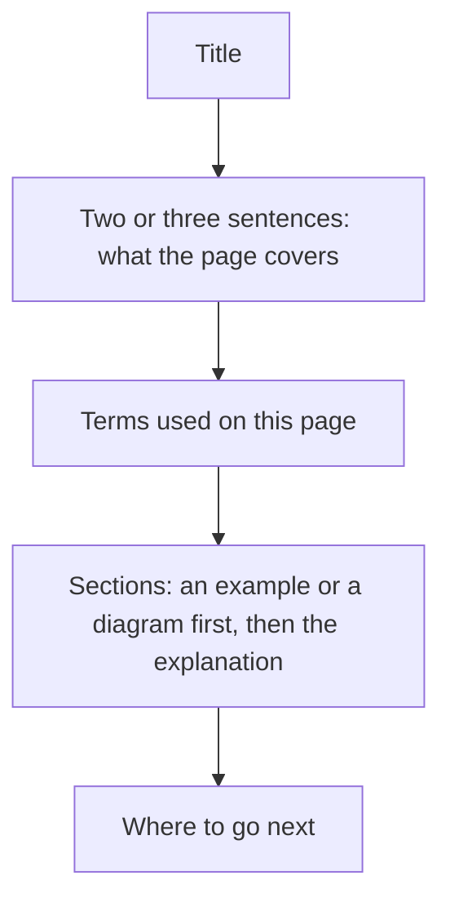
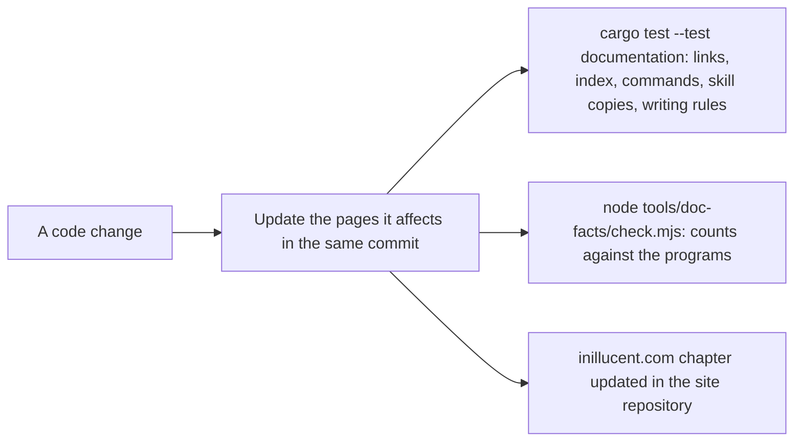

# task-2123: rewriting the inillucent documentation

## 1. The problem

The Markdown documentation in this repository and the documentation chapters on inillucent.com were
written over many tickets by a language model. Three problems came out of that:

1. **The pages are hard to read.** Sentences stack clauses with em dashes and spaced hyphens. Terms
   such as "leaf", "LSN", "frame" and "pin" are used before they are explained. Many paragraphs
   explain the history of a decision before they say what the engine does.
2. **The pages use the same writing habits over and over.** A style scan of 53 files found 1,857
   problems before this change: 574 hyphenated compounds, 464 uses of "rather than" as a contrast,
   446 spaced hyphens used as dashes, 299 em dashes, and smaller counts of "surface", "vocabulary",
   "worth knowing", "the shape of", "battle tested" and similar.
3. **Some facts are out of date.** The inillucent.com chapters say there is no macOS archive (there
   is a signed `.pkg` and a universal archive), show `inillucent 0.1.2` as the installed version
   (the release is 1.0.29), say the capability table has 24 rows (the engine reports 49), say 403
   probe cases match SQLite (the current build matches 402) and give two different speed figures
   against SQLite on two pages.

The reader this documentation is for is a programmer who has used a database and has never written
one.

## 2. Goals

- Every page in scope is rewritten in short, plain sentences, following
  [`docs/writing-style.md`](../docs/writing-style.md), which this ticket adds.
- Every page that uses specialist terms has a table explaining them, or links to
  [`docs/glossary.md`](../docs/glossary.md) for each.
- Concepts that involve flow or structure have a mermaid diagram: how a query runs, what a commit
  writes, how recovery works, how hybrid search combines two rankings, how a migration is checked.
- Every number and every claim about behavior is checked against the current code and the programs
  built from it.
- A test fails when a banned writing pattern comes back, and the repository's instructions tell
  every future change to update the pages it affects.

## 3. What is in scope

| Group | Files | Treatment |
|---|---|---|
| Entry pages | `README.md`, `docs/README.md`, `docs/product-overview.md`, `docs/getting-started.md`, `docs/glossary.md`, `docs/architecture-overview.md` | Full rewrite |
| Engine pages | `docs/architecture.md`, `docs/relational-architecture.md`, `docs/vector-residency.md` | Full rewrite with diagrams |
| Usage pages | `docs/sql.md`, `docs/pragmas.md`, `docs/vector-search.md`, `docs/embeddings.md`, `docs/migrating.md` | Full rewrite |
| Measurement pages | `docs/performance.md`, `docs/retrieval-quality.md`, `docs/feature-comparison.md`, `tests/synthetic-corpus.md` | Rewrite the prose; keep every measured number and its source |
| Project pages | `docs/roadmap.md`, `docs/closed-items.md`, `docs/repository.md`, `docs/dependency-policy.md`, `CONTRIBUTING.md`, `SECURITY.md`, `CODE_OF_CONDUCT.md` | Full rewrite |
| Libraries | `drivers/README.md`, the four package readmes under `packages/`, `examples/rag-agent/README.md`, `examples/rag-agent/AGENTS.md` | Full rewrite |
| Agent pages | `AGENTS.md`, `agent-skills/README.md`, the eight `agent-skills/*/SKILL.md` and their copies | Full rewrite; the copies are regenerated with `node tools/sync-skills.mjs` |
| Build and release pages | `packaging/README.md`, `packaging/PUBLISHING.md`, `packaging/macos/README.md`, `packaging/windows/README.md`, `tests/README.md`, `tests/crash/README.md`, `tests/interop/README.md`, `fuzz/README.md`, `tools/feature-probe/README.md`, the two `.github` templates | Full rewrite |
| inillucent.com | `src/data/documentation.ts` in the `inillucent-site` repository, 24 chapters | Rewrite every title, summary, paragraph, point and example explanation; fix the facts; rerun the examples |

Out of scope, and why:

| File | Reason |
|---|---|
| `CHANGELOG.md` | A record of what each release said at the time. New entries follow the style guide. |
| `tasks/*.md`, `tests/*-tdd.md` | Design documents. They record the reasoning at the time they were written. |
| `compat/**/*.md`, `inillucent-scorecard.md` | Written by programs (the gates, the grader, the migration reports). |
| `.claude/repo-plan.md` | Notes between agents working in this repository. |

## 4. The writing rules

The full guide is [`docs/writing-style.md`](../docs/writing-style.md). In short:

- Short declarative sentences, one idea each.
- No em dashes, no en dashes, no spaced hyphen used as a dash.
- No hyphenated compounds in prose ("read only", "built in", "nearest neighbor"). Names somebody
  else chose keep their hyphen: B-tree, R-Tree, Mach-O, p-value. Anything in backticks is exempt.
- No contrast clauses added for effect ("rather than", "not X but Y", "it is not A, it is B").
- No announcements ("worth noting", "to be clear"), no idioms, no metaphors, no invented technical
  words ("load bearing", "first class", "battle tested").
- Name the thing every time instead of "it", "this" or "the setting".
- Explain a term the first time it is used, or link it to the glossary. A page with more than three
  specialist terms starts with a table of them.
- Every number has a source the reader can find.

## 5. How each page is laid out

The file names stay the same. inillucent.com, the package registries and other repositories link to
them, and `crates/inillucent-compat/tests/documentation.rs` checks the links between them.

### Diagrams each page gets

| Page | Diagram |
|---|---|
| `docs/architecture-overview.md` | the two engines in one file; one query that uses both |
| `docs/relational-architecture.md` | the path of a statement through the crates; a commit (log first, then pages); recovery on open; a checkpoint |
| `docs/architecture.md` | how a vector search walks the HNSW graph; how `inillucent_search` combines keyword and vector results and decides to return nothing |
| `docs/vector-search.md` | choosing between exact search, an HNSW index and hybrid search |
| `docs/embeddings.md` | where the model runs: `embed()` in SQL, the model files, the runtime |
| `docs/migrating.md` | read the source, stage, check each table, publish or stop |
| `docs/getting-started.md` | the four programs and what each is for |
| `docs/repository.md` | the crate layers |
| `drivers/README.md` | every language binding calling one C library |
| `agent-skills/inillucent-mcp/SKILL.md` | an agent talking to `inillucent-mcp` over standard input and output |
| `packaging/README.md` | the five release phases |

## 6. Checking the facts

Every page is checked against four sources, in this order:

1. **The programs.** `inillucent help`, `inillucent help <command>`, `inillucent capabilities`,
   `inillucent functions`, `.help` in `inillucent-shell`, and the MCP `tools/list`, all from a
   release build of the current code (1.0.29).
2. **The feature probe.** `node tools/feature-probe/run.js` and `registers.js` against the pinned
   SQLite 3.53.4. On the build this ticket checked: 416 cases, 402 the same, 6 answers that differ,
   6 cases only inillucent answers, 2 accepted differences.
3. **The source code.** Defaults (page size, pool size, busy timeout), limits, error names and exit
   codes are read from the code that sets them, not from another page.
4. **The recorded measurements.** Speed and quality numbers come from the latest recorded runs
   quoted in `docs/performance.md` and `docs/retrieval-quality.md`, with their dates. This ticket
   does not rerun the benchmarks. Where two pages quote different runs, both are changed to the
   latest one.

A claim that none of the four can confirm is removed.

`node tools/doc-facts/check.mjs --site <site>` already compares the counts in the pages with the
programs. It looked for the programs only in `target/`, which is empty in a ticket's git worktree
because each worktree builds into its own directory. This ticket changes it, and
`tools/feature-probe/paths.js`, to ask cargo where the build directory is.

## 7. Keeping the documentation correct after this ticket

1. **A test for the writing rules.** `documentation.rs` gets
   `no_page_breaks_the_writing_rules`, which reads `tools/doc-style/rules.txt` and applies the same
   checks as `tools/doc-style/check.mjs` to every page in scope. A banned phrase, an em dash or a
   hyphenated compound in prose fails the build.
   `every_link_in_the_release_archive_resolves` applies `Repair-StagedLink`'s three steps to the
   repository's copies of the staged pages, reading the rewrite table and the list of directories
   out of `packaging/stage-layout.ps1`, so a link that would stop a release fails a test first.
   `every_anchor_a_page_links_to_exists` checks every `page.md#anchor` link against the headings
   and `<a id>` tags of the target page, using GitHub's anchor rule.
2. **A script for writers.** `node tools/doc-style/check.mjs <files>` checks a page in a second.
   `--site <path>` checks the inillucent.com chapters.
3. **Instructions.** `AGENTS.md` (the steps of a finished change), `CONTRIBUTING.md`, the pull
   request template and the `inillucent-develop` skill all say that a change which alters what a
   user sees updates the pages that describe it, including the inillucent.com chapter, in the same
   change.
4. **The site.** The doc-facts check already reads the site's chapter count. The style script reads
   the site's chapter prose.

## 8. What constrains the rewrite

These tests and tools read the pages. The rewrite keeps each of them passing.

### 8.1 Checks on every page

| Check | Where | What it needs |
|---|---|---|
| Links resolve | `documentation.rs`, `no_page_links_to_something_that_is_not_there` | every relative link in `docs/` points at a file that exists |
| Index lists every page | `every_page_is_listed_in_the_index`, `every_page_is_reachable_from_the_index` | `docs/README.md` names every file under `docs/`, including the new `writing-style.md` |
| Commands exist | `every_command_the_documentation_names_exists` | `inillucent <verb>` in a code span or block is one of the 30 verbs |
| No private references | `doc-facts`, `privateReferences` | no developer paths such as `C:\jason`, no private emails or hosts |
| No ticket numbers | `doc-facts`, `ticketNumbers` | no ticket keys in published pages |

### 8.2 Links in the release archive

`packaging/stage-layout.ps1` copies `README.md`, `AGENTS.md`, `LICENSE`, `docs/`, `agent-skills/`,
`tests/synthetic-corpus.md`, `tests/inillucent-testing-tdd.md` and `drivers/README.md` (as
`DRIVER.md`) into every release archive. A link into `tasks`, `crates`, `drivers`, `compat`,
`tools`, `fuzz`, `examples`, `packaging`, `scripts` becomes plain text there. **Any other link that
does not resolve inside the archive stops the release.** So a staged page may not link to
`CHANGELOG.md`, `CONTRIBUTING.md`, `SECURITY.md`, anything under `packages/`, `.github/`, or any
file under `tests/` except the two copied ones. This ticket adds a test that checks this, so the
failure shows up in the test suite instead of during a release.

### 8.3 Sentences a check reads

`tools/doc-facts/check.mjs` compares each of these with the programs. Each fact must stay written
in at least one page, in a form the pattern matches:

| Fact | Current value | A phrase that matches | Page that keeps it |
|---|---|---|---|
| command line verbs | 30 | "30 commands" | `docs/getting-started.md`, `AGENTS.md` |
| MCP tools | 28 | "28 of the same commands served", "28 of the CLI's commands as MCP tools", "28 of those commands over MCP" | `docs/getting-started.md`, skills |
| shell dot commands | 63 | "63 of its 65 dot commands" | `docs/getting-started.md`, `AGENTS.md` |
| shell options | 48 | "all 48 of `sqlite3`'s command line options" | `docs/getting-started.md` |
| pragmas | 68 | "68 pragmas this engine recognises" | `docs/sql.md` |
| function names | 190 | "190 built in function names" | `docs/sql.md` |
| JSON function names | 30 | "all 30 function names" | `docs/sql.md` |
| capabilities | 49 | "49 capabilities reported" | `drivers/README.md`, the site |
| probe cases | 416 | "416 case probe" | `docs/feature-comparison.md`, `docs/README.md` |
| probe cases the same | 402 | "402 of 416 probed cases produce" | `docs/feature-comparison.md`, `docs/sql.md` |
| workspace members | 29 | "29 crates deny" | `docs/repository.md` |
| crates that forbid `unsafe` | 21 | "and 21 forbid `unsafe`" | `docs/repository.md` |
| crates that deny the four lints | 29 | "29 of the 29 crates deny" | `docs/repository.md` |
| test targets and map rows | 234 | "tests across 234 test targets", "234 rows in `tests/selection.toml`" | `docs/repository.md` |
| site chapters | 24 | "in 24 chapters" | `docs/README.md`, `docs/getting-started.md` |

### 8.4 Checks on single pages

| Page | Check | What it needs |
|---|---|---|
| `docs/pragmas.md` | `harness.rs`, `the_pragma_page_matches_the_register` | the page is generated by `cargo run -p inillucent-compat --bin inillucent-obligations` from `obligations.rs`. The rewrite changes the generator's text and regenerates the page |
| `docs/dependency-policy.md` | `policy.rs`, `the_dependency_policy_covers_what_the_contract_allows` | the words `libc`, `windows-sys` and "other database engine installed". The test also asked for "allow-list" and "first-party"; this ticket changes it to "allowed list" and "first party" |
| `docs/roadmap.md` | `every_measured_number_the_roadmap_carries_is_in_the_performance_page` | every ratio such as `0.70x` in the roadmap also appears in `docs/performance.md` |
| `docs/repository.md` | three tests in `documentation.rs`, and `tools/coverage.mjs` | "29 of the 29 crates deny" and "and 21 forbid `unsafe`"; the table between `<!-- requires:begin -->` and `<!-- requires:end -->`; the table between `<!-- coverage:begin -->` and `<!-- coverage:end -->`, which `tools/coverage.mjs` writes |
| `docs/feature-comparison.md` | `escapes.rs` | exactly six table rows containing `**differs` apart from the legend row |
| `AGENTS.md` | `drivers/inillucent-driver/tests/capability.rs` | the sentence "every row but two is checked against the running engine", and `cancel` and `readonly_open` in backticks |
| `CLAUDE.md`, `GEMINI.md`, `.cursor/rules/inillucent.mdc` | `every_agent_pointer_file_points_at_agents_md` | under 20 lines, and names `AGENTS.md` |
| `agent-skills/*/SKILL.md` | `every_result_field_the_skills_show_is_one_the_shell_writes` | every key in a JSON result example is a field the shell writes (`elapsed_ms`, `row_count` and so on) |
| `agent-skills/*/SKILL.md` | `the_skills_state_the_number_of_commands_and_tools_there_are` | at least three of "serves 28 of the CLI's commands as MCP tools", "serves 28 of those commands over MCP", "all 30 commands" |
| `.claude/skills`, `.agents/skills` | `every_skill_copy_matches_its_source` | byte copies of `agent-skills/`, written by `node tools/sync-skills.mjs` |
| the four package readmes | `every_method_a_package_table_names_exists_in_its_binding` | a `## The API` heading followed by a table whose first column names methods that exist in the binding |
| `packaging/PUBLISHING.md` | `doc-facts`, `privateRepositorySentencesAgree` | while the repository is private, `PUBLISHING.md` says so |
| `docs/feature-comparison.md`, `docs/glossary.md`, `README.md`, `AGENTS.md` | `Repair-StagedLink` | a few exact link strings are rewritten in the archive; if a rewrite removes one of those links the rewrite rule does nothing and the generic rule applies |

## 9. How the work is split

The pages are split into lanes with no shared files, so the rewrites can run at the same time in
this worktree. Each lane:

1. reads `docs/writing-style.md` and section 8 of this document;
2. checks every claim on its pages against the programs and the code;
3. rewrites the pages;
4. runs `node tools/doc-style/check.mjs <its files>` until it reports no problems;
5. writes a list of every fact it changed to `_agent_output/task-2123/facts/<lane>.md`.

Then, once, for the whole change: `node tools/sync-skills.mjs`,
`cargo test -p inillucent-compat --test documentation`, `node tools/doc-facts/check.mjs --site`,
`node tools/doc-style/check.mjs --site <site> --all`, and the site's example verifier and build.

## 10. Risks

| Risk | What is done about it |
|---|---|
| A rewrite drops a fact a test or tool looks for | Section 8 lists every one; the documentation test and doc-facts run before the merge |
| A rewrite changes a true fact into a wrong one | Each lane records what it changed and why; the source for each change is the program output or the code |
| The style rules are too strict for a page that must quote a phrase | `<!-- doc-style: off -->` and `<!-- doc-style: on -->` exempt a quoted block |
| Another ticket edits the same page at the same time | One other ticket (task-2117, test failures) is working in this repository; it does not edit documentation |

## 11. What happened

The rewrite ran as 21 units of one to eight pages each, after two restarts of the agent terminal
stopped ten larger lanes part way through. Each unit wrote a fact log under
`_agent_output/task-2123/facts/` (gitignored), with the old text, the new text and the source of
every change.

Facts the rewrite corrected, beyond the ones in section 1:

| Page | Was | Is, and the source |
|---|---|---|
| `drivers/README.md`, `README.md` | every language binding calls the C library | only C and the Python `Database` class do. Node, Go, PHP and Python's `run` and `query` start `inillucent --output json` (`index.mjs:15`, `inillucent.go:281`, `Process.php:35`) |
| `docs/sql.md`, the site | nothing is refused | 19 constructs are refused, and 12 of them run in SQLite 3.53.4 (`inillucent capabilities`) |
| `docs/retrieval-quality.md`, `docs/feature-comparison.md` | 11 ranking and latency values | the values in `inillucent-scorecard.md`, the 2026-09-20 run at `cd53317` |
| `docs/architecture-overview.md` | a search index is four files in its own folder | `inillucent_search` keeps its data in five shadow tables in the `.rdb`. The folder format belongs to the old library and has five files (`persist.rs`) |
| `docs/embeddings.md` | `embed()` can run on a GPU | `embed()` in SQL always runs on the processor. `--gpu` installs the CUDA build of ONNX Runtime |
| `docs/relational-architecture.md`, `docs/feature-comparison.md` | page sizes 512 bytes to 64 KiB can be chosen | SQL always gets 32 KiB. `PRAGMA page_size = N` and `VACUUM` do not change it. `Database::open_at` accepts 8, 16, 32 and 64 KiB (`PageSize::new`) |
| `docs/getting-started.md`, `README.md` | `cargo install inillucent-cli` installs four programs | it installs three. `inillucent-migrate` is its own crate |
| `SECURITY.md` | the shell has `.unsafe on`; there are no workflows; the project is before 1.0 | the shell has `-safe`; `.github/workflows/tests.yml` runs on every push; the version is 1.0.29 |
| package readmes | 27 MCP tools; `npx -y inillucent-mcp` | 28 tools; `npx -y -p inillucent inillucent-mcp` |
| `docs/repository.md` | eight fuzz targets | 16 |

Bugs the fact checking found are outside this ticket. They are written up in the descriptions of the
two bug list tickets: `confidence()` depending on the query vector's length, a read only open
replaying recovery until a write, `backup` onto its own path destroying the database, a table that
stopped accepting inserts, `inillucent functions 'json%'` matching nothing, a wrong capability note,
`vector-search` printing the key twice, and a contradiction in `inillucent help setup-embeddings`.
