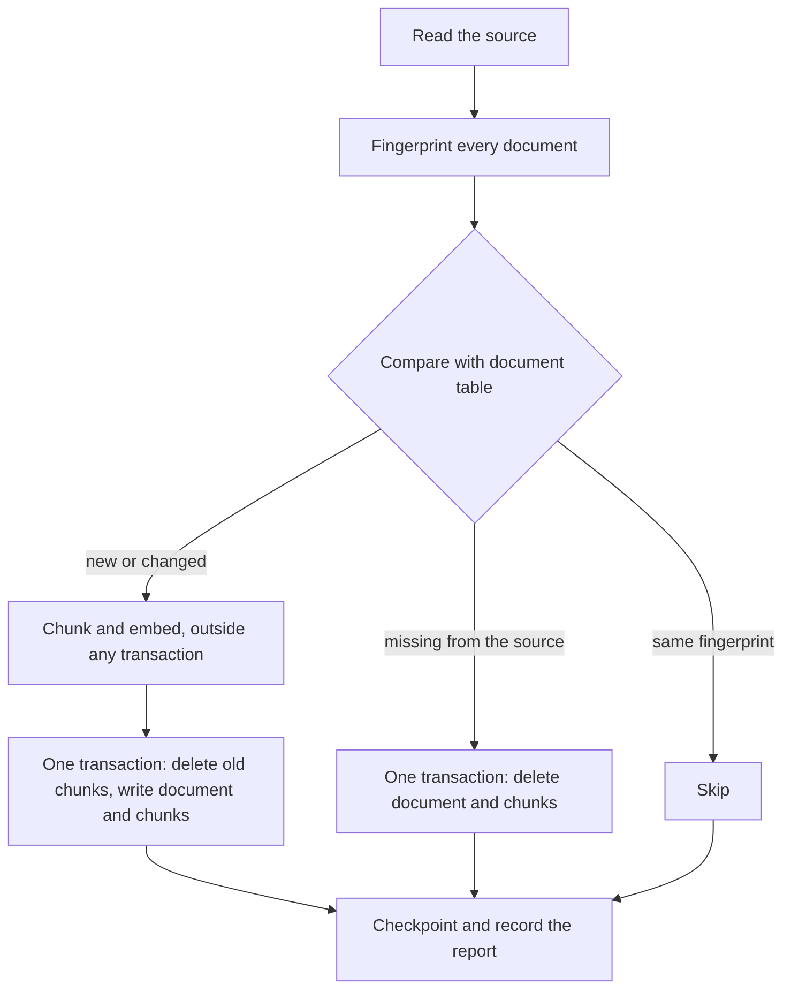

# task-2129: the RAG agent examples, as a command line example and a Rust MCP server

## What the ticket asks for

`examples/rag-agent/` holds one example today. An agent answers questions about Greek and Roman
philosophy by running the `inillucent` command line against a committed database. The ticket asks
for five things:

1. Move that example into `examples/rag-agent/cli-example/` and rewrite its README so it is clear and
   follows `docs/writing-style.md`.
2. Add `examples/rag-agent/rust-example/`: the same corpus, served to the agent through an MCP server
   written in Rust. It chunks documents with overlap, keeps the database in step with the source
   through periodic syncs, and uses what current RAG practice has measured to work.
3. A README for the Rust example that shows real MCP requests and responses as JSON, compares a
   `VECTOR(768)` column with an `inillucent_search` table, and explains the cost of loading the
   embedding model on demand.
4. End to end tests that start the real server and use the real database and the real embedding
   model.
5. `examples/README.md`, a short page that says what each folder is for.

Both examples stand outside the Cargo workspace. They install inillucent the way a user does: the
command line from Homebrew, npm, pip or the install scripts, and the Rust crates from crates.io. The
repository's own build and test runner never compile them, so changing an example needs no full test
cycle.

## Terms

| Term | Meaning |
|---|---|
| chunk | a piece of a document small enough to embed and to hand to a model as context |
| overlap | the text two neighbouring chunks share, so an answer that crosses a chunk boundary is whole in one of them |
| contextual header | text added to every chunk before it is embedded, naming the document the chunk came from |
| RRF | reciprocal rank fusion. Two ranked lists are merged by adding `1 / (60 + rank)` for every list a result appears in |
| residency | when the embedding model is held in memory. `docs/embeddings.md` defines the three profiles |
| sync | reading the source documents, comparing them with the database, and writing only what changed |

## What the research found

These are the results the design uses. Each one names where it came from.

| Finding | Source | What the example does |
|---|---|---|
| Keyword search and vector search fail on different questions. Running both and fusing the lists beats either alone | Anthropic, "Introducing Contextual Retrieval" (2024): embeddings plus BM25 cut the top 20 retrieval failure rate from 5.7% to 2.9% when combined with contextual chunks | two hybrid modes: the engine's own fusion in `inillucent_search`, and RRF done in the application |
| RRF with a constant of 60 is the standard way to fuse lists whose scores are not comparable | Cormack, Clarke and Buettcher, SIGIR 2009; restated by G. Laforge, "Understanding Reciprocal Rank Fusion in Hybrid Search" (February 2026) | `rrf` mode, `k = 60` |
| A chunk that names its document retrieves better. A short context string prepended before embedding reduced failures by 35% on its own | Anthropic, "Introducing Contextual Retrieval" | every chunk is embedded as `search_document: <title>: <text>`. The measured variant also adds the article's first sentence |
| Chunks of a few hundred tokens split on sentence boundaries are the usual default. Very large chunks lose precision | "RAG Chunking Strategies: A 2026 Retrieval Playbook" (digitalapplied.com); LlamaIndex chunk size study | about 1,000 characters, about 250 tokens, packed from whole sentences |
| Overlap of 10% to 20% is the common default. A January 2026 study measured no benefit from overlap on its benchmark, so overlap is a setting to measure | same playbook | about 15% overlap, carried as whole sentences, and a flag to turn it off |
| Returning neighbouring chunks around a hit gives the model context the hit alone lacks | the "small to big" pattern in the same playbook | `get_passage` returns a chunk with its neighbours, cut from the stored document text so the overlap is not repeated |
| A cross encoder reranker gives the largest single gain | Anthropic reports 67% fewer failures with reranking | not built. inillucent ships one embedding model and no reranker. The README says so and says where a reranker would go |
| The index has to be rebuilt when the chunker or the model changes | common practice; a vector made by other settings sits next to the wrong text and nothing fails | every document's fingerprint includes the chunker settings and the model name, so changing either re-embeds everything on the next sync |

## Layout

```
examples/
  README.md                     what each folder is for
  rag-agent/
    README.md                   the two examples side by side, and the shared corpus
    corpus/                     greek-philosophy.jsonl and ATTRIBUTION.md, used by both
    cli-example/                the existing example, moved
      README.md  AGENTS.md  CLAUDE.md  greek-philosophy.rdb  images/  scripts/
    rust-example/
      README.md  AGENTS.md  CLAUDE.md  .mcp.json  opencode.json
      Cargo.toml                its own [workspace], so the repository's workspace ignores it
      questions.json            the evaluation questions and the article each must find
      src/
        main.rs                 the command line: serve, sync, search, evaluate
        config.rs               settings shared by every command
        corpus.rs               reads the source documents: a JSONL file or a folder of .md and .txt
        chunker.rs              sentence splitting, packing, overlap, contextual header
        store.rs                the schema, and every SQL statement the server runs
        embed.rs                the model: embed(TEXT) through SQL, with the prefixes
        sync.rs                 compares source and database, writes only what changed
        scheduler.rs            the periodic sync thread and the manual trigger
        search.rs               the four search modes and RRF
        mcp.rs                  JSON-RPC 2.0 over stdio, the MCP handshake and tool dispatch
        tools.rs                the five tools: their schemas and their handlers
        evaluate.rs             hit rate and MRR over questions.json, per mode
      tests/
        support/mod.rs          starts the server and speaks MCP to it
        e2e.rs                  the end to end cases
```

The corpus moves up one level to `examples/rag-agent/corpus/` because both examples read it. The
command line example's scripts read `../corpus/`.

## The Rust example

### Dependencies

```toml
inillucent = "1.0.29"
inillucent-engine = { version = "1.0.29", features = ["embed"] }
```

The `inillucent` crate has no `embed` feature of its own. `inillucent-engine` has one, and Cargo
turns a feature on for every user of a crate in the build. Naming `inillucent-engine` with `embed`
therefore compiles `embed(TEXT)` into the engine the `inillucent` crate uses. This was checked with a
probe program against the published 1.0.29 crates: the first `SELECT embed(?1)` took 760 ms and the
second 34 ms, reading the model that `inillucent setup-embeddings all` installed.

Other dependencies: `serde` and `serde_json` for the protocol, `sha2` for document fingerprints,
`clap` for the command line. Nothing else.

### Schema

```sql
CREATE TABLE document (
  id          INTEGER PRIMARY KEY,
  source_key  TEXT NOT NULL UNIQUE,   -- the URL, or the file path
  title       TEXT NOT NULL,
  url         TEXT NOT NULL,
  body        TEXT NOT NULL,          -- the whole document, for get_passage
  fingerprint TEXT NOT NULL,          -- sha256 of the text and the chunker settings
  synced_at   TEXT NOT NULL
);
CREATE TABLE chunk (
  id          INTEGER PRIMARY KEY,
  document_id INTEGER NOT NULL,
  ordinal     INTEGER NOT NULL,       -- position in the document, from 0
  start_byte  INTEGER NOT NULL,       -- where the chunk starts in document.body
  end_byte    INTEGER NOT NULL,
  text        TEXT NOT NULL,
  v           VECTOR(768)
);
CREATE INDEX chunk_document ON chunk (document_id, ordinal);
CREATE VIRTUAL TABLE chunk_search USING inillucent_search(title, text, document FACET, dims = 768);
CREATE TABLE sync_log (id INTEGER PRIMARY KEY, started_at TEXT, report TEXT);
```

`chunk.id` and `chunk_search.rowid` are the same number, so a hit from either search reaches the
same chunk row.

The vector is stored twice, once in `chunk.v` and once in `chunk_search`. That is about 8 MB each
for this corpus. The example keeps both so the two approaches can be compared on the same data. The
README says an application picks one.

### Two statements the published engine refuses, and what the example does instead

Checked against the 1.0.29 command line and the 1.0.29 crates:

| Statement | Result on 1.0.29 | What the example does |
|---|---|---|
| `INSERT INTO chunk_search (...) SELECT ..., embed(...)` | `unsupported`: an `INSERT ... SELECT` into a virtual table | runs `SELECT embed(?1)` once, keeps the vector as a blob, and binds it to both inserts |
| `WHERE vector = embed('search_query: ' \|\| ?1)` on `chunk_search` | `unsupported`: a registered function in that position | embeds the question first with `SELECT embed(?1)`, then binds the blob |

Embedding in its own statement also means each text is embedded once, however many tables it goes
into, and it keeps the slow part out of the write transaction.

### Chunking

1. Normalise whitespace. The corpus has no newlines. A Markdown source is read with its paragraphs,
   and a paragraph break is also a sentence break.
2. Split into sentences with the rule `chunk-corpus.py` already uses: a `.`, `?` or `!`, then space,
   then a capital, a digit or an opening quote, and not after a known abbreviation or an initial.
3. Pack whole sentences until the next one would pass `target_chars` (default 1,000).
4. Start the next chunk with the trailing sentences of the last one, up to `overlap_chars` (default
   150, 15%). A sentence longer than `max_chars` (default 2,000) is split at word boundaries.
5. Fold a last chunk shorter than `min_chars` (default 250) into the one before it.
6. Record each chunk's `start_byte` and `end_byte` in the normalised document text.
7. Build the embedding input: `search_document: <title>: <chunk text>`, and with
   `--context lead`, `search_document: <title>. <first sentence of the document>: <chunk text>`.

The keyword index gets `title` in its own column and the chunk text in `text`, so a search for
"Seneca" matches a chunk whose sentences only say "he".

### Sync



- The fingerprint is sha256 over the title, the URL, the text, the chunker settings, the context
  mode and the model name. A change to any of them re embeds that document.
- A document's chunks are embedded before its transaction opens. `SharedDatabase` runs one
  statement at a time, so searches run between the embeddings instead of waiting for the whole
  document.
- Each document is its own transaction. A sync that stops half way leaves every document either in
  its old state or its new state. The next sync finishes the rest.
- `serve` runs a sync at start and then every `--sync-every` (default 15 minutes). The `sync_now`
  tool starts one at once. An atomic flag stops two syncs running together. A request for a sync
  while one runs is answered with the running sync's progress.
- `sync` on the command line runs one sync and prints its report as JSON.

### Search modes

| Mode | How it works | What it returns for each hit |
|---|---|---|
| `hybrid` | one query on `chunk_search` with `MATCH` and `vector =`. The engine fuses BM25 and cosine | `score`, `confidence`, `origin` |
| `vector` | `ORDER BY vector_distance_cos(chunk.v, ?1)` over the plain column | `distance` |
| `keyword` | `chunk_search MATCH ?1` with no vector | `score` |
| `rrf` | the `vector` list and the `keyword` list, each 3 × k long, fused in Rust with RRF | `rrf_score`, and each list's rank |

The keyword query is built from the question's words. Each word is quoted and the words are joined
with `OR`, because FTS5 syntax treats a bare `?`, `-` or `"` in a question as an operator and a
question like "what is Plato's cave?" would fail.

The default mode is chosen by the evaluation below, and the README states the numbers.

### MCP

JSON-RPC 2.0 over stdio, one message per line, as the MCP stdio transport specifies. Written by hand
in `mcp.rs` so a reader sees the whole protocol, and because it is under 300 lines. Methods:
`initialize`, `notifications/initialized`, `ping`, `tools/list`, `tools/call`. Logs go to stderr,
because stdout carries the protocol.

| Tool | Parameters | Returns |
|---|---|---|
| `search` | `query`, `mode`, `k` (1 to 20, default 5), `title` | the hits, the mode, the time taken, and the index state (documents indexed, whether a sync is running) |
| `get_passage` | `chunk_id`, `neighbors` (0 to 3, default 1) | the chunk with its neighbours, as one span cut from the document text, with the title and URL |
| `list_documents` | `filter` (optional text) | every document's title, URL, chunk count and sync time |
| `sync_status` | none | the running sync's progress, or the last report, and when the next one is due |
| `sync_now` | none | starts a sync and returns at once |

Each result is sent twice, as `structuredContent` and as JSON text in `content`, so a client that
reads either works. A failure is a result with `isError: true` and a message that says what to do.

### Model residency

`serve` takes `--residency` and sets `INILLUCENT_EMBED_RESIDENCY` before the first embedding.
`--warm` embeds one word at start so the first question does not pay the load. The README measures
the first and the second question under `on-demand`, `idle:5m` and `resident`, and the cost of a sync
under `on-demand`, where every chunk pays the load.

## Tests

`cargo test` in `rust-example/` runs `tests/e2e.rs`. Every case starts the built `rag-server` as a
child process and speaks MCP to it over its stdin and stdout. The corpus is four real articles copied
out of `greek-philosophy.jsonl` into a temporary file, so a run takes seconds.

| Case | What it proves |
|---|---|
| the handshake | `initialize` answers with a protocol version, the server name and the tools capability. `tools/list` lists the five tools with schemas |
| the first sync | `sync_status` reaches four documents and a chunk count above zero. Every chunk has a 768 dimension vector in both tables |
| each mode finds the article | "you cannot step into the same river twice" returns Heraclitus first in all four modes. "Metrodorus" returns Epicurus in keyword mode |
| an edit, a removal and an addition | the test changes one article, deletes one and adds one, then waits for the periodic sync. The report says 1 updated, 1 removed, 1 added, 1 unchanged. A word only the edit contains is found. The removed article's chunks are gone from both tables. The unchanged article was not embedded again |
| overlap | neighbouring chunks share text. `get_passage` with neighbours returns one continuous span of the document with no repeated text |
| a question the corpus does not cover | hybrid confidence for "how do I configure a Kubernetes ingress" is lower than for "who was Seneca" |
| errors | an unknown tool, an empty query and a mode that does not exist each come back as `isError` with a message. A malformed line gets JSON-RPC error `-32700` |
| a question with punctuation | "what is Plato's cave?" does not fail in keyword mode |

`tests/e2e.rs` also has one `#[ignore]` case that runs the full evaluation over the whole corpus.
It needs a full sync first and takes minutes, so it runs only when asked for:
`cargo test -- --ignored`.

The unit tests in `chunker.rs` check the packing rules: no chunk passes `max_chars`, neighbouring
chunks overlap, and the chunks cover every character of the document.

The command line example keeps `scripts/verify.sh` and `scripts/verify-indexed.sh`.
`crates/inillucent-compat/tests/retrieval/rag_verify.rs` runs them and moves to the new path.

## Evaluation

`rag-server evaluate` reads `questions.json`. Each entry is a question and the article whose chunks
must appear in the top five. The set is the ten questions from `verify.sh`, and ten more that test
rare names, paraphrase and a question the corpus cannot answer. For every mode it reports how many
questions found their article in the top five, the mean reciprocal rank, and the median search time.
It runs once with `--context title` and once with `--context lead`, and the README prints both.

## Changes outside the examples

| File | Change |
|---|---|
| `.gitignore` | the committed database moves to `examples/rag-agent/cli-example/greek-philosophy.rdb`; the chunk CSVs move with it; the Rust example's `target/` and `data/` are ignored |
| `tools/doc-style/scope.txt` | the new README and AGENTS pages |
| `crates/inillucent-compat/tests/retrieval/rag_verify.rs`, `tests/selection.toml` | the new path |
| `README.md`, `docs/repository.md`, `docs/embeddings.md`, `docs/closed-items.md`, `agent-skills/inillucent-search/SKILL.md` | the new path; `node tools/sync-skills.mjs` copies the skill |
| `packaging/stage-layout.ps1` | the rewrite row for the README link |
| comments in `crates/` that cite `examples/rag-agent` | left alone. They record where a measurement was taken, and the directory still exists |

## What is not built

- A reranker. inillucent ships one embedding model and no cross encoder.
- An HNSW index. 3,000 chunks is an exact scan in milliseconds. The README says when to add one and
  how, and `cli-example/scripts/verify-indexed.sh` already shows it.
- A contextual header written by a language model. The example uses the title and, as an option,
  the article's first sentence, which cost nothing to compute.

## What the implementation found, and what changed

Measured on 25 September 2026 over the full corpus, on the processor.

| Finding | Number | Change to the design |
|---|---|---|
| The full corpus is 3,696 chunks, and a first sync takes 8 minutes 44 seconds | 141 ms a chunk | none |
| A sync with nothing changed takes 0.01 seconds | 80 fingerprints compared | none |
| `rrf` ranks best: 19 of 20 found, MRR 0.821. `hybrid` 19 of 20, MRR 0.681. `vector` 18, 0.798. `keyword` 18, 0.617 | 24 questions, run twice, identical | **`rrf` is the default mode**, in place of `hybrid` |
| `confidence` from `inillucent_search` does not separate answerable questions from others on this corpus. 9 of 20 answerable questions scored at or below the Kant question's 0.230 | lowest answerable 0.007 | the abstention guidance uses the cosine distance |
| The best cosine distance does separate questions on other subjects: every answerable question 0.341 or less, the three unrelated ones 0.417 to 0.530 | | **every hit in every mode but `keyword` carries `distance`**; `AGENTS.md` says above about 0.4 means another subject |
| `--context lead` makes the search by meaning worse: 15 of 20 against 18 | MRR 0.643 against 0.798 | `title` stays the default |
| The first search in a process takes 1.7 to 1.9 s: about 750 ms loading the model and about 950 ms reading the vectors and the keyword index for the first time | | **`--warm` runs one search in every mode**, in place of one embedding. The first question then takes about 30 ms |
| `on-demand` makes a sync 510% slower | 872 ms a chunk against 143 ms | the README says never to combine them |
| A loaded model costs about 1 GB of working set | 49 MB before, 1,123 MB after | none |
| The Kant question is not unanswerable. No article is about Kant, and the Metaphysics and Epistemology articles each have a passage on his categories | Claude Code answered from them | the README says so; `questions.json` still counts it as a question no article is about |

Chunk offsets are stored in bytes (`start_byte`, `end_byte`), because Rust slices strings by byte.

The end to end tests were checked by breaking the code three ways: treating every document as
changed, leaving `chunk_search` rows behind on delete, and turning overlap off. Each made
`the_server_searches_the_corpus_and_keeps_it_in_sync` fail.

Claude Code (Sonnet), started in `rust-example/` with its `.mcp.json`, answered three questions
through the server: Epictetus (vector and keyword), Metrodorus (it chose `keyword` mode itself) and
Kant (it answered from the two passages and said Kant is outside the corpus's subject).
