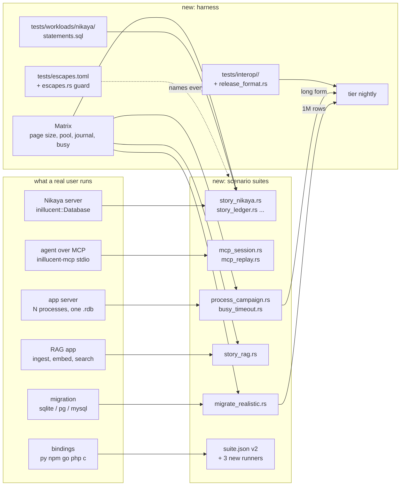

# Inillucent end to end testing: scenarios, edge cases, and the harness that keeps them true

**task-2035. Written 2026-09-20 from a read only review of `C:/jason/dev/inillucent`.** No test or build
was run in that checkout, because task-2025 was taking timed measurements in it. Every count below
was taken from the files named beside it.

---

## 1. Introduction

Inillucent's suite is large and unusually disciplined: 168 test targets in nine tiers, 3,169 Rust
test functions, a selective parallel runner, a testing standard with seven rules, a differential
oracle pinned to SQLite 3.53.4, and a guard that fails the build when a CLI command, a dot command
or an MCP tool has no subprocess test. Per construct and per command, coverage is close to
complete.

The defects that reached users anyway came from a different direction. Every serious escape in the
history was found by a real use the suite did not model: a production schema migration that
corrupted a neighbouring table, a document view that returned HTTP 500 because a compound query was
used as a derived table, `ANALYZE` on a migrated 6.9 GB database that made it permanently
unopenable, the first time the CLI was ever spawned as a process (`--db` was ignored), the first
Linux run with a working oracle (every delete of a bare filename failed), and, this week, an FTS5
index that refuses with `SQLITE_CORRUPT` on row 42 at SQLite's default 4 KiB page size because every
test and every published number ran at 32 KiB (task-2033).

This document designs the layer that is missing: **end to end scenarios that run the programs a
real application runs, over the configurations a real application picks, through the surfaces a
real application binds to**, and a small amount of harness so that the next escape becomes a test
that the suite can prove it holds.

## 2. Goals and non goals

**Goals**

1. Every application shaped story runs across a configuration matrix that includes the 4 KiB page
   size and a small buffer pool, so a defect that depends on page geometry cannot pass unnoticed.
2. The real consumers are modelled: Nikaya's startup migration and query corpus, an agent session
   over MCP, an application server with several processes on one file, a RAG ingest and search
   lifecycle, a migration from a realistic SQLite database.
3. The shared driver conformance suite grows from 18 cases to cover full text search, hybrid
   search, transactions that fail part way, large values, unicode and NULL edges, and two
   connections, and all four language bindings run it and are counted by the runner.
4. A database written by each published release opens and reads back correctly in the current
   build, and a database written by the current build opens in the previous release.
5. A ledger maps every escaped defect to the test that now holds it, checked by a tooling test, so
   "we added a test for that" is a fact the build verifies.
6. Everything new obeys the existing standard: a value asserted rather than a crash, a reopen
   before any durability claim, a count rather than a clock, a `; skipping` line for a missing
   prerequisite, a row in `tests/selection.toml`.

**Non goals**

- Fixing the engine. task-2033 and the other open defects stay their own tickets. Where a new
  scenario hits an open defect, the test asserts the correct answer and is allow listed with the
  ticket key, exactly as `differential_part8.rs` does with `allow.list`.
- Replacing the differential, durability or retrieval tiers. They are the reason the escapes are
  scenario shaped and not construct shaped.
- Performance gates. `fullgate` and `perfhistory` stay as they are.
- A new tier for its own sake. New targets go into `e2e`, `durability` and `tooling`; one new tier,
  `nightly`, is added only for campaigns that take minutes.

## 3. Problem statement

### 3.1 What the suite is today

| tier | targets | what it does |
|---|---:|---|
| smoke | 1 | open, write, reopen, read |
| unit | 31 | 1,910 `#[cfg(test)]` functions |
| engine | 62 | SQL and storage over real files, in process |
| differential | 33 | graded against pinned SQLite |
| durability | 27 | simulated faults; two suites use real killed processes |
| e2e | 26 | CLI, dot commands, MCP wire, driver conformance, public facade |
| perf | 1 | six cost guards, run alone |
| retrieval | 7 | HNSW, BM25, the graded harness |
| tooling | 9 | the repository's own rules |

Sources: `tests/selection.toml`, `tests/inillucent-testing-tdd.md` §2, and the inventory taken for
this ticket.

### 3.2 Where the escapes came from

| escape | found by | what the suite lacked |
|---|---|---|
| `CREATE TABLE` corrupted an existing table (Nikaya, `93c7261`) | production startup | a story that migrates a schema beside populated tables and reads every column back |
| compound query as derived table refused (Nikaya, `2f820f3`) | an HTTP request | the consumer's real statement corpus |
| `ANALYZE` made a migrated database unopenable (`bd16a3e`) | a real 6.9 GB corpus | reopen after maintenance commands on a database with an abandoned log stream |
| `--db` ignored, `restore` of a missing file exits 0 (0.1.4) | first process spawn | subprocess tests, now present and guarded |
| bare filename deletes fail on Linux (`066b484`) | first Linux oracle run | a Linux run that fails loudly on a skipped oracle |
| 43% of acknowledged commits lost across two processes (`dc9988b`) | a reviewer's script | a two process load test, now `process_concurrency.rs` |
| FTS5 refuses at 4 KiB page on row 42 (task-2033, open) | writing another test | any test at a page size other than 32 KiB |
| 64 frame pool evicted dirty uncommitted pages (`2fa10c4`) | a missing fixture made two tests skip | a small pool in the matrix, and a strict run |
| safe mode did not refuse `.output` over MCP (`ad14898`) | a real MCP client script | dot commands given paths inside the root |
| release scripts sent a handshake the server refused (0.1.2) | running the release | an MCP client transcript replayed against the server |

Three patterns cover all of them: a **configuration nobody varied**, a **consumer nobody modelled**,
and a **prerequisite that skipped silently**. The standard already closes the third with `--strict`;
this design closes the first two and adds the ledger that keeps them closed.

### 3.3 The specific gaps, with evidence

- `crates/inillucent/tests/application.rs` has four stories, all at `Options::default()` (32 KiB
  pages). No story runs at 4,096 bytes, the size `new_engine_vtab_stream.rs` uses and the size
  task-2033 fails at.
- `tests/interop/` and `tests/workloads/` are empty directories. The README says "an empty one is
  a phase that has not arrived yet". No database written by a published release is checked in, and
  no test opens one.
- `drivers/conformance/suite.json` has 18 cases. None covers FTS5, `inillucent_search`, a value
  over 32 KB, or two connections. Python runs it through the C ABI; npm, Go and PHP each have their
  own five to eight case round trip and do not read the suite.
- `packages/python/tests/test_wheel.py` is referenced by nothing. `packages/php/tests/roundtrip.php`
  calls `exit(0)` when it cannot find a binary, so it reports green having run nothing. None of the
  package tests has a row in `tests/selection.toml`, so `--strict` cannot count them.
- `busy_timeout`'s wait then succeed behaviour has no test. The in process version was deleted
  (`concurrency.rs` near line 471, the connection is not `Send`) and no cross process replacement
  was written. Only the immediate refusal half is covered.
- `mcp_wire.rs` calls all 28 tools once each with well formed requests. Nothing sends malformed
  JSON, a 1 MiB + 1 byte request, a `tools/call` before `initialize`, two requests in flight, or
  closes stdin during a statement. `mcp_cancel.rs` covers cancellation only.
- `semantics.rs` declares `Expect::Differs` for a known SQLite difference and constructs it zero
  times (the compiler warning is in `_agent_output/task-1884-gate-under-load/real-failure.txt`),
  while `compat/compat-report.md` lists seven constructs that answer differently. Rule 1.3 of the
  standard is therefore not being applied to the differences the report knows about.
- `process_crash.rs` kills a writer at one chosen point. There is no campaign that kills at many
  points and reopens each time, the shape that found the task-1987 loss of one insert in 600.
- `crates/inillucent-migrate/src/sqlite.rs` has no unit tests; its coverage is four subprocess
  assertions in `tests/cli.rs`. The SQLite fixtures migrated in `migrate_sqlite.rs` are small and
  synthetic. No fixture has NOCASE or DESC indexes, generated columns, `WITHOUT ROWID`, triggers,
  views, a blob larger than a page, and 200 columns together, which is the combination that broke on
  Nikaya's corpus.

## 4. Architecture



Every box in the middle column is a normal cargo test target with a row in `tests/selection.toml`.
The harness column is data files plus three small tooling tests. Nothing here changes the engine.

## 5. Detailed design

### 5.1 The configuration matrix

**Where:** `crates/inillucent-compat/src/matrix.rs` (the compat crate already holds `cliproc` and the
oracle helpers that every suite imports), re exported for `crates/inillucent/tests/` through a
`dev-dependency` that already exists.

```rust
/// One configuration a scenario runs under. `name` appears in every failure message.
pub struct Arm { pub name: &'static str, pub page_size: u32, pub frames: u32, pub journal: Journal, pub busy_timeout_ms: u32 }

/// The arms every scenario runs. Order is cheapest first so a failure reports early.
/// @param kind - `Quick` for the e2e tier (three arms), `Full` for nightly (all six)
pub fn arms(kind: Kind) -> Vec<Arm>
```

| arm | page size | frames | journal | busy timeout | why it is in the list |
|---|---:|---:|---|---:|---|
| `default` | 32,768 | default | default | 0 | what every published number runs at |
| `sqlite-page` | 4,096 | default | default | 0 | SQLite's default; task-2033 |
| `small-pool` | 4,096 | 64 | default | 0 | task-1944's eviction of dirty pages |
| `truncate-journal` | 32,768 | default | TRUNCATE | 0 | task-1911, first exercised inside a checkpoint |
| `persist-journal` | 4,096 | default | PERSIST | 0 | same |
| `waiting` | 4,096 | default | default | 2,000 | `busy_timeout` actually waits |

`Quick` is the first three. A scenario is written once as `fn story(arm: &Arm, area: &Path)` and a
macro `scenario!(name, story)` expands one `#[test]` per arm, so `cargo test` and the runner see
`nikaya_startup_migration::sqlite_page` as its own test with its own verdict. The scratch directory
carries the arm name so two arms never share a file.

**Guard:** `tooling::scenarios_run_every_quick_arm` reads every `crates/inillucent/tests/story_*.rs`
and every `crates/inillucent-compat/tests/story_*.rs` and fails if a file has a `#[test]` that is not
produced by `scenario!`. This is the same shape as `every_registry_command_has_a_subprocess_test`.

### 5.2 Stories against the public facade (tier `e2e`, `crates/inillucent/tests/`)

All through `inillucent::Database`, which is what Nikaya links. Each story ends with a reopen,
`PRAGMA integrity_check`, and a full read back of every column of every table it touched, compared
to an expected table the test built itself. `count(*)` alone is never the assertion, because the
Nikaya corruption answered `count(*)` correctly.

**`story_nikaya.rs`, the startup migration.** Populated `message`, `chunk`, `chunk_embedding` tables
(a few thousand rows, one column of 1 to 40 KB text so values cross the extent threshold), then the
exact sequence Nikaya's `db.rs` runs at startup: `CREATE TABLE IF NOT EXISTS schema_migration`,
`SELECT name FROM schema_migration WHERE name = ?1`, `CREATE TABLE` for a new table, `ALTER TABLE
ADD COLUMN`, `CREATE INDEX` on the added column, `INSERT INTO schema_migration`. Then the read back.
Then `ANALYZE`, close, reopen, read back again. Then the same with the process killed between the
`ALTER` and the `CREATE INDEX` (through the shell, as `process_crash.rs` does) and a reopen. The
index built after `ALTER TABLE ADD COLUMN` is checked by asking the same question two ways, rule 1.6.

**`story_workload_replay.rs`, the consumer's statements.** `tests/workloads/nikaya/statements.sql`
holds every statement string in `C:/jason/dev/nikaya/server/src/db.rs` and `services/*.rs`
(27 lines match a statement literal today), with a generator that builds a schema and data those
statements can run against. The test prepares and runs every statement with representative
parameters at every arm, and where the oracle can answer the same statement, diffs the result. A
statement the engine refuses is a failure unless it is in the file's `allow.list` with a ticket key.
When Nikaya adds a statement the file goes stale; a tooling test greps the Nikaya checkout when it
is present and prints `; skipping` when it is not, so the staleness is loud on this machine and
silent on a clone.

**`story_ledger_day.rs`, a model checked soak.** A seeded generator issues transactions against a
small schema (an order book with foreign keys, an index the planner uses, a trigger, a view) and
against a `BTreeMap` model in the test. Every 200 transactions it checkpoints; every 500 it closes
and reopens; every 1,000 it runs `VACUUM` or `REINDEX` or `ANALYZE`, chosen by the seed. After each
phase the model and the file are compared through the table and through each index (rule 1.6). The
`e2e` form runs 3,000 transactions; the `nightly` form runs 100,000 and also replays the script
through the pinned SQLite shell and diffs the final dump. A divergence prints the seed and the
transaction number.

**`story_rag.rs`, the retrieval lifecycle.** 2,500 documents (enough for FTS5 leaves to split at
4 KiB) into an FTS5 table and an `inillucent_search` hybrid table with deterministic 64 wide
vectors. Phases: ingest, query top 20 by BM25 and by vector and by fusion; update a third of the
documents; delete a third; roll back a batch of inserts; checkpoint; reopen; query again. After
every phase the results are compared to a brute force computation in the test over the model's
view of the documents. This is where task-2033 first fails at the `sqlite-page` arm; the row is
allow listed against `task-2033` until that ticket lands, and the allow list entry is what makes
the fix visible when it does.

**`story_edges.rs`, the edge catalogue.** One test per row of §6, each at every quick arm.

### 5.3 The agent session over MCP (tier `e2e`, `crates/inillucent-compat/tests/`)

**`mcp_session.rs`.** One real `inillucent-mcp` child, one session, the sequence an agent produces:
`tools/list`, `inillucent_tables` on an empty file, `inillucent_create`, `inillucent_batch` with a
schema, `inillucent_describe`, `inillucent_query` with a syntax error (asserts the error status),
`inillucent_query` with an unsupported construct (asserts status `unsupported`, not an error), the
corrected query, a query that returns 10,001 rows (asserts 10,000 rows and an exact `total`), a
query whose response exceeds 8 MiB (asserts the size refusal), `inillucent_export` and
`inillucent_import` inside the root, `inillucent_backup`, and `inillucent_integrity_check`. A second
child on the same file runs a write while the first is mid query, and the first's next call sees it.

**Protocol edges, same file:** a `tools/call` before `initialize`; a request of 1,048,577 bytes; a
line that is not JSON; a JSON object with no `id`; two requests written before either answer is
read (asserts both answers arrive, matched by `id`); stdin closed while a `WITH RECURSIVE` series
is streaming (asserts the child exits within the wait, exit status recorded, and that a fresh
process can open the file with no stale lock, by writing to it).

**`mcp_replay.rs` and `tools/record-mcp-transcript.py`.** A stdio proxy that records what a real
client sends and what the server answers, in the same style as `tools/record-wire-transcript.py`
does for PostgreSQL. Fixtures under `crates/inillucent-compat/tests/fixtures/mcp/*.transcript`, one
recorded from Claude Code and one from the release smoke test's client. The test replays the client
half and compares the server half field by field, with `id` and timing fields masked. This is the
test that would have stopped 0.1.2's handshake break before the release script did.

### 5.4 Several processes on one file (tier `durability`, `requires = ["programs"]`)

**`process_campaign.rs`.** The `process_crash.rs` shape as a campaign: a writer process inserts
acknowledged rows through the shell with a marker per commit; the test kills it at cut point k for
k in a seeded sample of 40 points spread across commit, checkpoint and fold; after each kill a reader
process reopens and asserts every acknowledged marker is present and no unacknowledged one is. Runs
at the `sqlite-page` and `default` arms. The nightly form uses 400 points. The lost count is asserted
to be exactly zero, as `process_concurrency.rs` does now.

**`busy_timeout.rs`.** Process A holds a write transaction open for 500 ms through the shell. Process
B opens with `busy_timeout = 2000` and issues a write. Asserts B's write succeeds, and asserts the
slot's `waited` counter moved and `timed_out` did not, read through `inillucent stats`. A second
case gives B `busy_timeout = 0` and asserts the refusal names the holder, which is the counting
version of the deleted in process test. No wall clock assertion, per rule 1.7.

**`process_readers.rs`.** One writer, four readers, all real processes, 2,000 commits. Each reader
reads a consistent snapshot in a loop and asserts every row set it sees is a prefix of the
acknowledged sequence. A checkpoint runs every 100 commits under the readers. This is the shape
that produced task-1987's second cause.

### 5.5 Migration from realistic databases (tier `e2e`, `requires = ["shell", "tracked-fixtures"]`)

**Fixtures.** `compat/fixtures/realistic/` gains three databases built by the pinned `sqlite3` shell
from checked in SQL (so the fixture is reproducible and the SQL is reviewable), each under 2 MB:

| fixture | modelled on | what it carries |
|---|---|---|
| `browser-history.db` | Firefox `places.sqlite` | NOCASE and DESC indexes, triggers keeping counts, a view, unicode URLs, `WITHOUT ROWID` |
| `chat-archive.db` | a messaging app | 200 column attachments table, blobs of 1 B to 3 MB, generated columns, foreign keys with cascade |
| `warehouse.db` | Nikaya's schema | FTS5 with external content, an `INTEGER PRIMARY KEY` table of 200,000 short rows, a wide key table |

**`migrate_realistic.rs`.** Runs `inillucent-migrate` as a process on each, then for every table
diffs a digest of every column of every row against the oracle's digest of the source (the sum
digest `inillucent-remote/src/migrate.rs` already defines), reopens the destination, and runs the
fixture's own query list against both. The `warehouse` fixture also asserts the migration did not
materialise a table: the shell's `.stats` page count read before and after, compared as a count.
`sqlite.rs` gains unit tests for type mapping, index direction and collation carry over, because
those are the three things that went wrong on the real corpus.

### 5.6 Bindings: one suite, four runners (tier `e2e`)

**`drivers/conformance/suite.json` version 2.** New case groups, each with the value encoding the
file already uses:

| group | cases |
|---|---|
| `fts` | create FTS5 table, insert, `MATCH`, `bm25()` order, phrase, prefix, delete then `MATCH` |
| `hybrid` | `inillucent_search` create, insert with vector, lexical top 5, vector top 5, fused top 5 |
| `transaction_failure` | four row insert colliding on row three inside and outside `BEGIN`, asserting zero rows kept |
| `values` | 40 KB text, 1 MB blob, empty string beside NULL, `i64::MIN`, `2^53 + 1`, `-0.0`, NaN refusal, NUL byte in text, NFD and NFC text stored and read back byte identical |
| `two_connections` | connection one writes and commits, connection two on the same file reads it; connection one holds a transaction, connection two's write answers busy |
| `status` | syntax error, `unsupported`, constraint, busy, readonly open refusing a write, each asserting the status name |
| `identifiers` | unicode table name, quoted names with spaces, 200 columns |

**Runners.** `packages/npm/inillucent/conformance.test.mjs`, `packages/go/conformance_test.go` and
`packages/php/tests/conformance.php` each read `suite.json` and run every case, the forty lines
`drivers/README.md` promises. `drivers/bindings/python/run_conformance.py` already does. Rows in
`tests/selection.toml` for all four with `requires = ["node"]`, `["go"]`, `["php"]`, `["python",
"capi"]`, each printing `; skipping` when its interpreter is absent, so `--strict` counts them.
`packages/php/tests/roundtrip.php`'s `exit(0)` becomes that skip line and a non zero exit under
`INILLUCENT_STRICT=1`. `packages/python/tests/test_wheel.py` gets a row.

**Guard:** `tooling::every_binding_runs_the_whole_suite` reads `suite.json` and each runner's recorded
case list (each runner writes `_agent_output/conformance/<lang>.json` naming the cases it ran) and
fails when a runner ran fewer cases than the suite holds. A runner that filters a group must name
the group and the reason in the suite file's `skipped_by` map.

### 5.7 Databases across releases (tier `nightly`, and one quick case in `e2e`)

**`tests/interop/<version>/`.** For each published release from 0.1.1 on: `app.rdb` and its log
segment written by that release's binary from `tests/interop/build.sql` (ordinary tables, an index,
an FTS5 table, an `inillucent_search` table, a blob over a page, at both 4 KiB and 32 KiB page
sizes), plus `expected.tsv`, the digest per table. Each file is under 300 KB. A script,
`tools/build-interop-fixture.ps1 <version>`, downloads that release's archive to
`tools/cross/bin/releases/<version>/` (gitignored, verified against its `SHA256SUMS`) and writes the
fixture. `packaging/ship.ps1`'s `publish` phase calls it for the version being shipped so the
directory never lags a release.

**`release_format.rs`.** Forward: the current build opens every fixture, runs `integrity_check`,
reads every table, compares digests, then writes a row and reopens. Backward, `requires =
["previous-release"]`: the current build writes `build.sql` into a scratch file and the previous
release's binary opens it and reads the digests. The backward case skips with `; skipping` when the
binary is not on disk, and `--strict` counts it. The quick `e2e` case is the forward read of the
newest fixture only.

### 5.8 The escape ledger (tier `tooling`)

**`tests/escapes.toml`.** One row per escaped defect: the commit or ticket, one sentence, the
surface, and the test path and function that holds it now.

```toml
[[escape]]
ref = "task-2033"
surface = "fts5, page geometry"
what = "200 FTS5 documents at a 4 KiB page refuse with SQLITE_CORRUPT on row 42"
held_by = ["inillucent::story_rag::ingest_and_search::sqlite_page"]
```

**`escapes.rs`.** Every `held_by` entry names a test function that exists (the same attribution
walk `selection.rs` does), and every row in the table in §3.2 of this document has a row in the
ledger. The seed rows are the twenty in §3.2 and the defect history taken for this ticket; where no
test holds one today, the row says `held_by = []` and `open = "<reason>"`, and the guard fails if
an `open` row has no reason. A ticket that fixes a defect adds the row in the same commit; that is
the documentation rule, and the guard is what makes it more than a rule.

**`Expect::Differs` gets its first entries.** The seven constructs `compat/compat-report.md` lists as
answering differently become `Differs` cases in `semantics.rs`, each with the ticket or roadmap item
that owns the difference. A tooling assertion counts the variant's uses and fails at zero, so the
variant cannot go back to being decorative.

### 5.9 The `nightly` tier and the runner

One `[[tier]]` row, `nightly`, not `exclusive`. Targets: `story_ledger_day` long form (selected by
`INILLUCENT_SCENARIO=full`), `process_campaign` long form, `release_format` backward, and
`migrate_realistic` at one million rows. A scheduled task on this machine runs
`inillucent-testrun --tier nightly --strict` and appends to `tests/performance-history.tsv`'s
neighbour, `tests/nightly-history.tsv`, the date, the git hash and the verdict per target. The
runner needs no new flag: `--tier nightly` already selects it, and `--strict` already fails a skip.

### 5.10 Security and data handling

- Fixtures are built from checked in SQL by the pinned shell. No real Nikaya data, no real mail,
  enters the repository. The workload file holds statements, not values.
- The interop script verifies each downloaded release archive against the published `SHA256SUMS`
  and its minisign signature before running it, the same check `packaging/verify-installs.sh` does.
- The MCP transcripts are recorded against scratch databases and reviewed before commit; the
  recorder refuses to write a transcript whose database path is outside the scratch directory.
- Nothing new runs with elevated rights, and no new test writes outside its scratch directory, which
  the existing `confinement.rs` machinery can assert for the subprocess suites.

## 6. The edge case catalogue

Each row is one test in `story_edges.rs` or the named suite, at every quick arm, asserting a value
or a named status. Rows marked ◆ reproduce an escape from the history.

| area | case | asserts |
|---|---|---|
| values ◆ | 40 KB text in an undeclared affinity column | stored and read back byte identical; the refusal, if any, is the documented one and not an internal extent message |
| values | 1 MB blob, then `UPDATE` it to 1 byte, then back | reads, file size read as a count of pages does not grow past 3x |
| values | empty string, empty blob, NULL in one row | `typeof` answers `text`, `blob`, `null`; `= ''` and `IS NULL` select the right rows |
| values ◆ | `abs(-9223372036854775808)`, `SUM` past `i64::MAX`, `9007199254740993 = 9007199254740992.0` | overflow error, overflow error, `0` |
| text | NFC and NFD forms of the same word, emoji with modifiers, RTL text, a NUL byte mid string | byte identical read back; `length()` counts characters; `LIKE` and FTS5 `MATCH` behave as SQLite does (oracle) |
| identifiers | table named `"ordér 1"`, column named `select`, 200 columns, 1,000 tables | schema reads back; `describe` lists all |
| statements | `IN` list of 10,000 literals, 999 bound parameters, 5 MB single `INSERT ... VALUES` of 5,000 rows, parentheses 200 deep | each answers or refuses with `unsupported`, never a stack overflow ◆ |
| statements ◆ | compound `SELECT` as a derived table, `IN (subquery)`, `LEFT JOIN` with aggregate, keyset pagination with `ORDER BY ... DESC`, upsert with `RETURNING` | oracle answers |
| schema ◆ | `ALTER TABLE ADD COLUMN` then `CREATE INDEX` on it, then a covering query | same answer through the table and through the index |
| schema | `DROP` and recreate a table with the same name inside one transaction, then roll back | original rows present after reopen |
| maintenance ◆ | `ANALYZE`, `VACUUM`, `REINDEX`, `checkpoint` each followed by close and reopen | opens; `integrity_check` is `ok`; every table reads back |
| time | `CURRENT_TIMESTAMP` during a transaction that spans a second boundary; `datetime('now','localtime')` under `TZ` set to a zone with DST | oracle answers under the same `TZ`; skips with `; skipping` when the zone cannot be set |
| paths ◆ | database named with no directory, a path with a space and a unicode character, a path of 270 characters on Windows, a read only directory, a file deleted under an open handle | open and write succeed where they should; the refusal names the operation where they should not |
| files | a `.rdb` whose log segment is missing; whose log segment is truncated to an odd length; whose first page is zeroed | opens and reports the loss, or refuses with the documented corruption status; never a panic |
| concurrency ◆ | reader holds a snapshot while a checkpoint runs; writer killed holding the exclusive lock; a stale index left by a dead process | reader's rows unchanged; next opener recovers; next opener discards the stale index |
| MCP ◆ | see §5.3 | as listed |
| CLI | `--output json` for every command against a golden file with volatile fields masked; exit code 3 for an unsupported construct; `Ctrl-C` equivalent signal during a long query | golden matches; code is 3; file reopens and `integrity_check` is `ok` |
| bindings ◆ | `CREATE TEMP TABLE` then `SELECT` from it on the next call, from each binding | rows present, because the C ABI once opened a session per call |
| retrieval ◆ | FTS5 with 2,500 documents at 4 KiB; vector with a NaN component; unknown FTS5 tokenizer name | rows insert (allow listed against task-2033 until fixed); NaN refused by name; unknown tokenizer refused, not substituted |

## 7. Alternatives considered

| alternative | why not |
|---|---|
| Widen `application.rs` in place, no matrix | the four stories would still run at one page size; the matrix is the point |
| A property based fuzzer over the public API instead of stories | `tlp_differential.rs` and `btree_model.rs` already do this for predicates and the tree; the escapes were sequences of ordinary operations, which stories express and a fuzzer finds slowly |
| Run the whole existing suite at both page sizes | doubles a 300 s run for suites whose behaviour does not depend on geometry; the matrix goes on the suites that write real files through the public surfaces |
| Record production traffic from Nikaya | Nikaya's data is private mail; statements are enough and are checked in as text |
| Test bindings only through the C ABI conformance run | the npm, Go and PHP wrappers spawn the CLI rather than link the C ABI, so their code paths are different and each needs its own runner |
| Keep the escape list in the standard's §7 as prose | prose cannot fail a build; the ledger can |
| Docker for PostgreSQL and MySQL in the runner | out of scope; the transcript replay covers the client and the live suites stay conditional |

## 8. Testing strategy for this change

This ticket is tests, so the strategy is the standard applied to itself.

- Every new target has a row in `tests/selection.toml` with its tier and `requires`;
  `selection.rs` fails otherwise.
- Every scenario is a `scenario!` expansion; `scenarios_run_every_quick_arm` fails otherwise.
- Every new test asserts a value or a status name. No `is_ok()`. No wall clock, except the one
  ceiling rule 1.7 allows and none is expected.
- Every durability claim reopens. Every story reads every column back.
- A new test that hits an open defect is allow listed with a ticket key and the allow list is
  read by the test, so the fix turns it red and the ticket removes the entry.
- Before hand back, the implementer runs `inillucent-testrun --tier e2e --tier durability --tier
  tooling --strict` and `--tier nightly --strict` once, on a machine that has the oracle, the shell,
  node, go, php and python, and posts the skip count, which must be zero, and the per target
  verdicts.
- The three guards (`scenarios_run_every_quick_arm`, `every_binding_runs_the_whole_suite`,
  `escapes.rs`) are each checked by rule 1.5: remove the thing they guard, run, watch them fail,
  then restore.

## 9. Order of work for the implementation ticket

One ticket, one branch, in this order, because each step makes the next one checkable:

1. `matrix.rs`, the `scenario!` macro, and `scenarios_run_every_quick_arm`. Convert the four
   existing `application.rs` stories to it; this alone should reproduce task-2033 at the
   `sqlite-page` arm through the catalogue story.
2. `tests/escapes.toml` seeded from §3.2 and the defect history, and `escapes.rs`.
   `Expect::Differs` populated from the compat report.
3. `story_nikaya.rs`, `tests/workloads/nikaya/statements.sql` and `story_workload_replay.rs`.
4. `story_rag.rs` and `story_edges.rs`.
5. `mcp_session.rs`, the transcript recorder, two transcripts, `mcp_replay.rs`.
6. `busy_timeout.rs`, `process_campaign.rs`, `process_readers.rs`.
7. `suite.json` v2, the three new runners, the PHP and Python fixes, the selection rows, and
   `every_binding_runs_the_whole_suite`.
8. The realistic SQLite fixtures, `migrate_realistic.rs`, `sqlite.rs` unit tests.
9. `tests/interop/` for 0.1.1 through the current release, `release_format.rs`, the ship hook.
10. `story_ledger_day.rs`, the `nightly` tier, the scheduled run, the strict run and the write up in
    `tests/inillucent-testing-tdd.md` §2.1 (where a story goes) and §9 (the ledger rule).

## 10. Open questions the implementer decides, and records

- Whether `Arm` carries the journal mode through `Options` or through a pragma after open. Read
  how `wal_crash.rs` selects TRUNCATE and PERSIST and do the same.
- Whether the interop fixtures for 0.1.1 and 0.1.2 can be built at all; those releases predate the
  segmented log. If a release cannot write the fixture, its row in `tests/interop/README.md` says
  so and `release_format.rs` asserts the documented refusal on open.
- How many transactions the `e2e` form of `story_ledger_day` can afford. The bound is the `e2e`
  tier staying under fifteen seconds on this machine, measured with `--record`.
