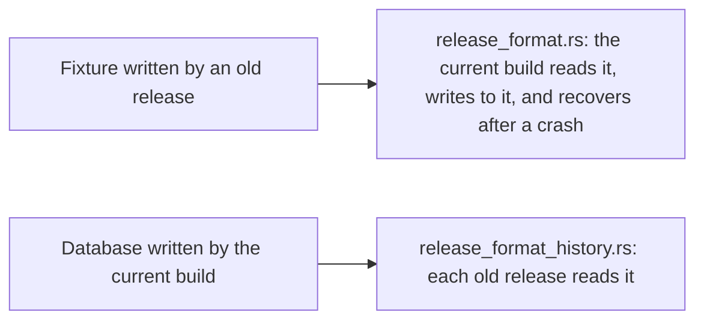

# `tests/interop/`: a database from every published release

Each folder here holds a database written by one published release of `inillucent`, using that
release's own binary. The folder also holds the write ahead log segment the release left, and the
answers the release gave. `crates/inillucent-compat/tests/e2e/release_format.rs` opens each database
with the current build and asks the same questions again.

These fixtures answer one question: can the current build still read a file that an older release
wrote? Only a file written by the older release itself can answer that question.

## Terms used on this page

| Term | Meaning |
|---|---|
| fixture | a checked in file a test reads. Here, one release's database, log segment and answers |
| log segment | a file of the write ahead log, named `app.rdb-wal.<number>`. It holds committed changes that are not yet in `app.rdb` |
| checkpoint | copying committed changes from the log into the database file |
| file format | the version number in bytes 8 to 11 of the file header. It says which layout of pages the file uses |
| FTS5 | the full text search index. See [the glossary](../../docs/glossary.md) |

## The releases

| Version | Tagged | File format | Log segment | Note |
|---|---|---|---|---|
| 0.1.1 | 2026-09-11 | 1 | 456 B | the oldest fixture. Releases were not signed before 0.1.3, so only the `SHA256SUMS` digest is checked. 0.1.1 cannot search an FTS5 index a later build wrote. See below |
| 0.1.2 | 2026-09-13 | 1 | 33,792 B | not signed |
| 0.1.3 | 2026-09-15 | 1 | 33,792 B | the first release signed with minisign |
| 0.1.5 | 2026-09-19 | 1 | 512 B | |
| 0.1.6 | 2026-09-19 | 1 | 512 B | |
| 0.1.7 | 2026-09-19 | 1 | 512 B | the last release that writes format 1 |
| 0.1.8 | 2026-09-24 | 2 | 112 B | the first release that writes format 2 |
| 0.1.9 | 2026-09-24 | 2 | 112 B | |
| 1.0.29 | 2026-09-24 | 2 | 112 B | |

The dates are the dates of the git tags. The file format is byte 8 of each `app.rdb`.

There is no 0.1.4 fixture. The npm packages `inillucent@0.1.3` and `inillucent@0.1.4` shipped
broken, and npm never reuses a version number, so the release after 0.1.3 was 0.1.5.

Every `app.rdb` is **622,592 bytes**, which is 19 pages of 32,768 bytes. Every `expected.tsv` is
3,812 bytes with LF line endings, and all nine are identical byte for byte. Each release keeps its
own `expected.tsv` so that a release that answered differently would show up as its own file.

## Building a fixture

```powershell
pwsh tools/build-interop-fixture.ps1 -Version 0.1.6
```

`tools/build-interop-fixture.ps1` does these steps:

1. Downloads the release's Windows archive and `SHA256SUMS` into `tools/cross/bin/releases/`. That
   folder is gitignored and shared with the main checkout.
2. Checks the archive against `SHA256SUMS`. When the release published a signature, checks
   `SHA256SUMS` against `packaging/inillucent.pub` with minisign.
3. Runs `build.sql` with that release's `inillucent.exe`.
4. Checkpoints, then writes one more row.
5. Records the answers to `verify.sql` in `expected.tsv`.

`packaging/ship.ps1` calls `tools/build-interop-fixture.ps1` in the publish phase, for the version
it is releasing, and commits the fixture after the tag. The fixture is built from the published
archive, so it cannot exist before the release does.
`release_format.rs::the_release_script_builds_the_shipped_versions_fixture` fails if that call is
removed from `packaging/ship.ps1`.

## The row that only the log holds

Each fixture was written, checkpointed, and then written to once more. That last row is `note` 9001,
`the row that only the log holds`. The row is in `app.rdb-wal.*` and nowhere else. A build that
opened the database and ignored the log would count 120 rows, where `expected.tsv` says 121.

Opening a database replays its log and writes that row into `app.rdb`. That would change the
checked in fixture. So no test opens a fixture in place. Every test copies the fixture first with
`inillucent_compat::interop::stage`.

## What the tests check



| Test file | Tier | What it checks |
|---|---|---|
| `release_format.rs` | `e2e` | the current build reads every fixture, writes to it, stops the writer, and recovers. Every release recorded the same answers |
| `release_format_history.rs` | `nightly` | each released binary reads, or refuses, a file the current build wrote |

`release_format_history.rs` runs each released binary once per question per release, so it takes
minutes. That is why its tier is `nightly`.

## What 0.1.1 cannot read

`release_format_history.rs` asks each older binary to read a file the current build wrote. Among the
releases that read the current format, every release gives the same answer to every question except
one:

```
0.1.1  SELECT rowid FROM note_fts WHERE note_fts MATCH 'segment'   ->  (no rows)
0.1.2 and later                                                    ->  1;4
```

The FTS5 index layout changed in 0.1.2. 0.1.1 reads everything else in the same file: the tables,
the `WITHOUT ROWID` entries, the blob larger than a page, the `inillucent_search` rows and the row
that only the log holds. It also reads `count(*)` and `SELECT rowid, title` from `note_fts`. Only
the `MATCH` returns no rows. 0.1.1 does not refuse the query, because the 0.1.1 index format did not
record which layout wrote it.

A published binary cannot be changed. So `KNOWN_GAPS` in `release_format_history.rs` records this
difference and asserts that it still happens. If a change made 0.1.1 read the new index, the test
would fail and the `KNOWN_GAPS` row would be deleted.

Since 0.1.8, each FTS5 index carries a layout record: one `%_data` row that names the layout and the
release that wrote it. An `inillucent_search` table's `%_config` names its release beside its format
number. A reader that finds a layout or a format it does not know refuses with the status
`unsupported` and names both. [Relational architecture](../../docs/relational-architecture.md)
describes what each format version promises. `crates/inillucent-compat/tests/engine/format_refusal.rs`
checks each refusal, including the exit code from the command line.

## Searching a file a newer build wrote

`verify.sql` reads an `inillucent_search` table's rows and content. `verify.sql` never runs a
search. `retrieval-build.sql` and `retrieval.sql` add the searches: a term query, a ranked query and
a nearest neighbor query over an HNSW graph.

`retrieval-build.sql` and `retrieval.sql` are not part of a checked in fixture and have no
`expected.tsv`. Adding rows to the fixture tables would change every answer in the recorded
`expected.tsv` files. Instead, `release_format_history.rs` writes one database with the current
build. The database has a `mode = 'approximate'` table over twelve vectors beside the tables from
`build.sql`, compacted into a stored generation. The test then asks the current build and each
release the same questions of the same file. The current build's answer is the reference.

Every release that reads the current format answers every retrieval question the same way, so
`KNOWN_RETRIEVAL_GAPS` is empty.

## Format 2: older releases refuse a file the current build writes

0.1.8 moved the file format from 1 to 2. In format 2, a leaf page's delta area has a directory kept
in key order, and a page's checksum covers its LSN (log sequence number). The current build reads
every format 1 fixture here. No release up to 0.1.7 can read a format 2 file. Each of those releases
refuses the file and returns no answer from it:

```
0.1.1, 0.1.2, 0.1.3   ->  database disk image is malformed: neither meta page is readable
0.1.5, 0.1.6, 0.1.7   ->  Error [unsupported]: this database is format version 2 and this build
                          reads version 1; upgrade inillucent to open it
```

0.1.5 was the first release with the refusal by name. `release_format_history.rs` checks both
answers against the released binaries. The test reads each release's format from byte 8 of that
release's own fixture. A release that writes format 2 is graded on its answers, with nothing to
edit.
