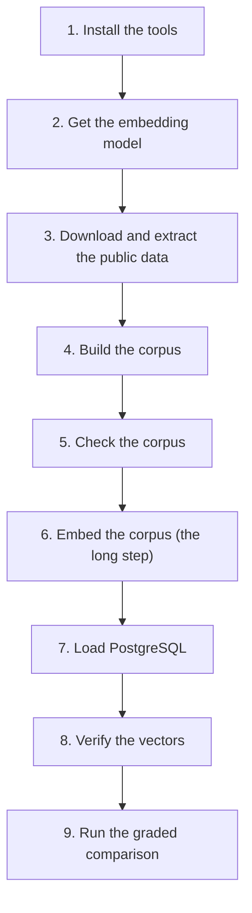

# The synthetic corpus

This page explains how to build the corpus that inillucent's retrieval numbers are measured on, and
how to run the comparison with PostgreSQL and pgvector on a machine that has never done it before.
Every input is public. Anyone with this repository, an internet connection and some hours can
reproduce the score card.

For the results, read [Retrieval quality](../docs/retrieval-quality.md).

## The steps



| Step | Command |
|---|---|
| 3 | `./scripts/fetch-public-corpus.sh` |
| 4 | `inillucent-bench synth-build` |
| 5 | `inillucent-bench synth-check` |
| 6 | `inillucent-bench synth-embed` |
| 7 | `createdb`, then `inillucent-bench synth-load` |
| 8 | `inillucent-bench embed-check`, and one SQL query |
| 9 | `inillucent-bench grade` |

`inillucent-bench` is built from `crates/inillucent-bench` in this repository. The examples below
run it as `./target/release/inillucent-bench` after `cargo build --release`.

## Terms used on this page

| Term | Meaning |
|---|---|
| chunk | One searchable piece of a document, about a paragraph or a section. A search returns chunks. |
| document | One page, message, issue or file as its source system sees it. A long document becomes many chunks. |
| corpus | All the text being searched. |
| embedding, or vector | A list of 768 numbers that stands for the meaning of a chunk, produced by a trained model. Chunks on similar topics get similar lists even when they share no words. |
| pgvector | A PostgreSQL extension that stores vectors and searches them. It is the baseline inillucent is measured against. |
| HNSW | The graph index both engines use to find the nearest vectors without comparing against every one. See [the glossary](../docs/glossary.md). |
| BM25 | The keyword scoring formula inillucent uses. See [the glossary](../docs/glossary.md). |
| exhaustive search | Comparing the query with every chunk. The answer is always exact. Every accuracy number is measured against it. |
| recall | The share of the correct answers a search returned. If exhaustive search says the best ten chunks are A to J and a search returns eight of them, recall at 10 is 0.8. |
| ground truth | A set of queries whose correct answers are known from the corpus itself, so no person judges a result. |
| CirrusSearch dump | A Wikimedia export of its search index. It holds plain text and a list of section headings, so no wiki markup has to be parsed. |
| ONNX | A file format for trained models. The embedding model runs from an ONNX file inside the calling process. |

## Why the corpus is built from public data

inillucent was first graded on a private database of one organisation's wiki pages, chat messages,
issues, source code, design files and whiteboards. That data cannot be published. This corpus
replaces it so that anyone can reproduce the numbers.

`crates/inillucent-bench/src/synth.rs` builds the six sources, the documents, titles, authors,
spaces, labels and identifiers. The sentences inside the chunks are real public text. Keyword
scoring depends on term frequencies, sentence length and how rare words cluster. Generated filler
text has none of those properties, so it would measure nothing.

The text is not committed to this repository. It is downloaded and rebuilt on demand. That keeps the
repository small. It also meets the attribution terms of the Wikipedia licence without
redistributing the text.

## What the corpus contains

| Source | Stands for | Built from | Licence |
|---|---|---|---|
| `confluence` | wiki pages | English and Simple English Wikipedia articles | CC BY-SA 4.0 |
| `github` | source files | eight repositories in six languages | MIT, BSD 3 Clause, Apache 2.0 |
| `slack` | chat threads | Wikipedia Talk and User talk pages | CC BY-SA 4.0 |
| `jira` | issue threads | real GitHub issues from the same eight repositories | factual metadata |
| `figma` | design files | long articles rewritten as frames and text layers | CC BY-SA 4.0 |
| `miro` | boards | articles rewritten as clustered notes | CC BY-SA 4.0 |

The eight repositories:

| Repository | Language | Licence |
|---|---|---|
| `tokio-rs/tokio` | Rust | MIT |
| `pandas-dev/pandas` | Python | BSD 3 Clause |
| `vuejs/core` | TypeScript | MIT |
| `gohugoio/hugo` | Go | Apache 2.0 |
| `apache/airflow` | Python | Apache 2.0 |
| `facebook/react` | JavaScript | MIT |
| `moby/moby` | Go | Apache 2.0 |
| `symfony/symfony` | PHP | MIT |

The three sources built from Wikipedia articles draw from one shared pool, and each article goes to
exactly one source. If one article supplied a chunk to two sources, a query matching one chunk
would also match its copy in the other source, and every filtered measurement would be distorted.

The builder's targets, from `plans` in `synth.rs`:

| Source | Documents | Chunks | Mean characters per chunk |
|---|---|---|---|
| `confluence` | 12,291 | 93,915 | 825 |
| `github` | 5,664 | 47,543 | 650 |
| `slack` | 16,067 | 17,675 | 1,284 |
| `jira` | 1,967 | 11,160 | 509 |
| `figma` | 1,014 | 9,149 | 2,222 |
| `miro` | 2,363 | 7,397 | 1,186 |
| **total** | **39,366** | **186,839** | |

A source falls short of its target when the downloaded material runs out. The corpus behind the
score card of 20 September 2026 has 185,078 chunks across 38,847 documents.

### Four properties the grading depends on

**The size of each source decides which search path a filtered query takes.** inillucent chooses
between walking the HNSW graph and comparing against every chunk that passes the filter. On this
corpus `confluence` and `github` take the graph and the other four sources take the exact scan. If
the sizes change, the filtered search results stop measuring what they were written to measure.

**Chunk order follows the source.** Chunks are numbered in the order they would have been added.
The first tenth of the corpus is `confluence` alone, and only the last part mixes all six sources.
So a prefix of the corpus is not a sample of it. The harness samples with a stride, and `--limit N`
gives nearly one source.

**Every title is unique and describes its own content.** One ground truth uses a document's title
as the query. A title that two documents share is skipped. Repeated titles would empty that ground
truth without any error.

**Every chunk starts with its document title and its heading path.** The title, then the headings
joined by ` > `, then the body. For example: `Amphetamine > Uses`, then the article text. Two of the
graded families query with a title or a heading. If the title and heading were held only as data
beside the text, neither engine could match them and both would score near zero. A real ingestion
pipeline produces the same layout, because it splits a page at its headings. `synth-check` checks
that every chunk carries its title and its last heading. The mean chunk lengths above include those
words.

## What you need

| Tool | Version | Why |
|---|---|---|
| Rust | 1.95.0, pinned in `rust-toolchain.toml` | builds `inillucent-bench` |
| PostgreSQL | 18 | holds the baseline corpus |
| pgvector | 0.8.0 or later | the baseline vector index. `hnsw.scan_mem_multiplier` does not exist before 0.8.0 |
| ONNX Runtime | a current release | runs the embedding model |
| Python | 3 | the two extraction scripts |
| `gh` | any, logged in | fetches the issue threads with a higher request limit |
| `git` | any | shallow clones of the eight repositories |
| `curl` | any | downloads the Wikipedia dumps |

You also need about 20 GB of free disk and 16 GB of memory.

## Step 1: install the tools

On macOS with Homebrew:

```sh
brew install rust postgresql@18 pgvector onnxruntime gh
gh auth login
```

The commands below assume PostgreSQL listens on port 5433. If yours listens elsewhere, pass
`--database-url` to every `inillucent-bench` command that uses the database.

ONNX Runtime is loaded by path at run time. Set `ORT_DYLIB_PATH` to the library before any command
that embeds text:

```sh
export ORT_DYLIB_PATH=/opt/homebrew/lib/libonnxruntime.dylib
```

Three commands need `ORT_DYLIB_PATH`: `synth-embed`, `embed-check` and `grade`. `grade` needs it
because it embeds its queries. When `ORT_DYLIB_PATH` is missing, the error message names it.

## Step 2: get the embedding model

The model is `nomic-embed-text-v1.5` in its ONNX export, from the `nomic-ai/nomic-embed-text-v1.5`
repository on Hugging Face. Put these five files in
`~/.cache/inillucent-models/nomic-embed-text-v1.5/`:

```
config.json  model.onnx  tokenizer.json  tokenizer_config.json  special_tokens_map.json
```

If the download fails with HTTP 403, a network proxy may be blocking `huggingface.co`. Download the
files on another network and copy them across.

Use `model.onnx`, the full precision model. The same Hugging Face repository has
`model_quantized.onnx`, which runs faster. Its vectors differ from the full precision ones and would
lower the scores of both engines, so it does not produce a valid score card. It is fine for a quick
smoke test.

## Step 3: download and extract the public data

From the repository root:

```sh
./scripts/fetch-public-corpus.sh
```

`fetch-public-corpus.sh` does five things:

1. Downloads two Simple English Wikipedia CirrusSearch dumps: the content dump for articles and the
   general dump for Talk pages.
2. Shallow clones the eight repositories.
3. Fetches issue threads, six pages of 100 per repository. It uses `gh` when `gh` is logged in and
   plain `curl` otherwise.
4. Runs `scripts/extract-wikipedia.py` and `scripts/extract-github.py`.
5. Streams the English Wikipedia CirrusSearch dump through `extract-wikipedia.py`, which stops after
   60,000 articles of at least 3,000 characters. The English dump is 43 GB. Only its first part is
   ever transferred.

The English articles are longer than the Simple English ones and use many more words. Without them
the three article sources cannot reach their chunk targets.

| Variable | Default | What it sets |
|---|---|---|
| `RAW` | `~/.cache/inillucent-corpus/raw` | where the downloads go |
| `DERIVED` | `~/.cache/inillucent-corpus/derived` | where the extracted files go |
| `DUMP_DATE` | `20251222` | which Wikimedia dump to download |
| `ENWIKI_ARTICLES` | `60000` | how many English articles to keep |
| `PYTHON` | `python3`, or `python` if there is no `python3` | the interpreter for the extraction scripts |

If something fails part way, run the extraction scripts on their own. They skip work already done:

```sh
python3 scripts/extract-wikipedia.py ~/.cache/inillucent-corpus/raw ~/.cache/inillucent-corpus/derived
python3 scripts/extract-github.py    ~/.cache/inillucent-corpus/raw ~/.cache/inillucent-corpus/derived
```

`~/.cache/inillucent-corpus/derived/` then holds:

| File | What it holds |
|---|---|
| `enwiki-articles.jsonl` | 60,000 English Wikipedia articles, plain text with section headings |
| `articles.jsonl` | Simple English Wikipedia articles |
| `talk.jsonl` | Wikipedia discussion pages |
| `code.jsonl` | source files from the eight repositories |
| `issues.jsonl` | GitHub issue threads with a body of at least 300 characters |

**A corpus built on another day has different text.** Wikimedia keeps CirrusSearch dumps for only a
few weeks. If `20251222` is gone, set `DUMP_DATE` to a date the server still offers. The
repositories and their issues also change. The builder aims at the same document and chunk counts,
so a later corpus has the same size, the same split between sources, the same chunk lengths and the
same ordering. Absolute scores may move a little. The comparison between the two engines holds,
because both engines read the same corpus.

## Step 4: build the corpus

```sh
cargo build --release
./target/release/inillucent-bench synth-build --out ~/.cache/inillucent-corpus/corpus.jsonl
```

`synth-build` reads from `~/.cache/inillucent-corpus/derived` unless `--derived` names another
directory. It prints a line per source with the documents and chunks it produced against the
targets, and it warns when a source runs short of material.

`--scale` multiplies every source's document and chunk counts and keeps the proportions. `--scale
0.25` builds a quarter size corpus for a faster cycle. Embedding time grows with the scale.

The build uses a fixed seed. Building twice from the same downloaded material produces the same
corpus byte for byte.

## Step 5: check the corpus before embedding it

Embedding takes hours. A corpus that cannot supply a ground truth produces a score card with empty
families, and nothing fails. So check first:

```sh
./target/release/inillucent-bench synth-check --corpus ~/.cache/inillucent-corpus/corpus.jsonl --per-source 40
```

`synth-check` runs the same query generators the graded run uses and refuses the corpus unless
every one works. It checks that:

- every chunk key is unique;
- all six sources supply enough title queries;
- heading queries and rare identifier queries exist;
- some documents are marked deleted, so a filter that forgets to exclude them is caught;
- the first tenth of the corpus covers fewer sources than the whole, and the last tenth covers all
  six;
- every generated query has at least one correct chunk that contains the query text;
- every chunk carries its own title and its own last heading.

The answerable check matters most. A corpus can pass every other check and still have questions
with no findable answer. The result is not an error. Both engines score near zero, which looks like
a harder corpus.

The end of a healthy run looks like this, with `--per-source 40`:

```
are the ground truths answerable
  document identity          240/240 have a correct chunk containing the query text (100.0%)
  natural language headings  120/120 have a correct chunk containing the query text (100.0%)
  rare identifiers           120/120 have a correct chunk containing the query text (100.0%)
  chunks carrying their own title: <chunks>/<chunks> (100.0%)
  chunks carrying their own leaf heading: <chunks with a heading>/<chunks with a heading> (100.0%)

the corpus supports every graded scenario
```

Any other ending names the source and the ground truth that failed.

An identifier query is not always a substring of its chunk. The generator keeps only letters,
digits, `-` and `_` from a word, so `exists_method(return_value)` becomes the token
`exists_methodreturn_value`. `synth-check` applies the same filtering to the chunk's words before it
compares. Such a query cannot be matched by either engine, so it lowers both engines' scores
equally.

## Step 6: embed the corpus

This is the long step. On a CPU with six performance cores it ran at 5 to 7 chunks a second and
took about ten hours. A GPU is much faster.

```sh
export ORT_DYLIB_PATH=/opt/homebrew/lib/libonnxruntime.dylib
./target/release/inillucent-bench synth-embed \
  --corpus ~/.cache/inillucent-corpus/corpus.jsonl \
  --cache  ~/.cache/inillucent-corpus/corpus.cache
```

| Flag | Default | What it does |
|---|---|---|
| `--model-dir` | `~/.cache/inillucent-models/nomic-embed-text-v1.5` | where the model files are |
| `--devices` | `cpu` | where the model runs: `cpu`, `cuda`, `cuda:1`, or several separated by commas |
| `--batch` | 16 | chunks embedded together |
| `--report-every` | 2000 | chunks between progress lines |

`synth-embed` writes each vector to `corpus.vectors` beside the cache, in corpus order, and writes
`corpus.cache` at the end. Each progress line shows the rate and the time left.

**`synth-embed` can resume.** Run the same command after an interruption. It counts the vectors
already written, drops a partial vector at the end of the file, and continues.

**Do not rebuild the corpus without embedding it again.** Position N in `corpus.vectors` is chunk
N. A new `corpus.jsonl` with an old `corpus.vectors` pairs every vector with the wrong chunk. The
index still builds and queries still return rows, but every retrieval number is wrong. Step 8
detects this.

## Step 7: load PostgreSQL

```sh
createdb -h 127.0.0.1 -p 5433 inillucent_synth
./target/release/inillucent-bench synth-load \
  --corpus ~/.cache/inillucent-corpus/corpus.jsonl \
  --cache  ~/.cache/inillucent-corpus/corpus.cache
```

`synth-load` creates the `vector` extension and the `documents` and `chunks` tables, inserts every
document and chunk with its vector, and builds nine indexes. Two of the nine matter to the
comparison:

| Index | Definition |
|---|---|
| `chunks_content_fts` | GIN over `to_tsvector('english', content)`, for keyword search |
| `chunks_embedding_hnsw` | HNSW over `embedding vector_cosine_ops`, with `m = 16, ef_construction = 64` |

The schema is the one the original private system used, so the baseline SQL runs against it
unchanged.

`synth-load` writes the same vector bytes the cache holds. Nothing is computed again. So a score
difference comes from the index and the ranking, and never from the embedding model.

`--no-indexes` skips the index builds, which are the slow part. Use it only to inspect the rows. The
baseline needs the indexes before grading.

## Step 8: verify the vectors

Run both checks every time.

**Were the cache's vectors made from the cache's text?**

```sh
./target/release/inillucent-bench embed-check --cache ~/.cache/inillucent-corpus/corpus.cache --samples 200
```

`embed-check` embeds 200 chunks from across the corpus again and compares each with the stored
vector. It is the same model on the same text, so agreement should be 1.000000. It fails and names
the chunks when any agreement is below 0.9995. It also reports every vector that is not unit length.
Cosine distance is computed as a dot product, so a vector that is not unit length would score too
high.

**Does PostgreSQL hold the same vectors as the cache?** Compare inside the database with pgvector's
own operators:

```sql
SELECT embedding = '[...]'::vector AS same,
       embedding <=> '[...]'::vector AS distance
FROM chunks WHERE id = 1;
```

`same` should be `t` and `distance` exactly `0`.

Do not read the vector back as text and compare the numbers yourself. `SELECT embedding` prints the
vector as decimal text and loses precision. The result is differences of about 6e-9 that look like a
mismatch and are not. `synth-load` writes through the binary protocol, so nothing is converted on
the way in.

## Step 9: run the graded comparison

```sh
export ORT_DYLIB_PATH=/opt/homebrew/lib/libonnxruntime.dylib
./target/release/inillucent-bench grade --cache ~/.cache/inillucent-corpus/corpus.cache --per-source 40
```

Run `grade` from the repository root. `grade` writes `inillucent-scorecard.md` into the working
directory, and the same measurements as JSON beside it. `--out` names another path. Each run also
writes a folder under `runs/` with one line per engine per query.

| Flag | Default | What it does |
|---|---|---|
| `--per-source` | 40 | title queries each source contributes. More queries reduce the noise in each result and take longer |
| `--device` | `cpu` | where the queries are embedded: `cpu`, `cuda` or `cuda:N` |
| `--inillucent-only` | off | skips both pgvector configurations, for work on inillucent alone |
| `--database-url` | `postgres://127.0.0.1:5433/inillucent_synth` | the baseline database |

[Retrieval quality](../docs/retrieval-quality.md) gives the command the published score card was
made with, and explains each family and how a verdict is reached.

The unit tests of the two crates the harness uses run with:

```sh
cargo test --release -p inillucent-core -p inillucent-bench
```

## How the comparison is kept fair

**Both engines sit behind one interface.** `crates/inillucent-bench/src/engine.rs` defines one trait,
so no family can run against only one engine. The pgvector side issues the SQL the original system
issued, against the same schema, and combines its keyword and vector results with the same fusion
method inillucent uses.

**pgvector is graded in two configurations.**

| Configuration | What it is |
|---|---|
| `pgvector (extension defaults)` | nothing set. This is what an untuned installation does, and filtered search returns few rows |
| `pgvector (correctly configured)` | set for this workload, per query. [Retrieval quality](../docs/retrieval-quality.md#the-baseline) lists each setting and the reason for its value |

The configured settings depend on whether the query has a filter. A query with a filter sets
`hnsw.iterative_scan = relaxed_order`, `hnsw.ef_search = 400` or the rows requested if larger,
`hnsw.max_scan_tuples = 40000` and `hnsw.scan_mem_multiplier = 4`. A query with no filter sets the
iterative scan off and `hnsw.ef_search = 100`, and resets the other two settings, so a filtered
query cannot leave them on the connection. `pg_session_settings` in `engine.rs` returns these
statements, so a test can check them without a database.

**Three things are the same for both engines.**

1. Both read the same text and the same vector bytes.
2. Each query is embedded once and the same vector goes to both engines.
3. Both report a hit by the same key: the document identifier and the chunk index joined by `#`.
   Without a shared key every comparison would score zero.

## The three ground truths

Each ground truth takes its correct answers from the corpus itself.

| Ground truth | The query | What counts as correct | Which queries are used |
|---|---|---|---|
| document titles | a document's title | any chunk of that document | titles of 12 to 160 characters, with at least two words, used by only one document |
| section headings | a heading | the chunks under that heading | headings of 15 to 120 characters and at least three words, found in at most four chunks |
| rare identifiers | a token such as a function name, a ticket key or a versioned name | the chunks that hold the token | tokens of 6 to 40 characters that mix letters with digits, `-` or `_`, found in at most five chunks |

The title ground truth is the only one that grades the whole pipeline, including fusion. A title
shares words with its own body, which helps keyword search. It helps both engines equally.

Source code supplies most identifiers. Ticket keys also appear in the prose sources at a low rate.

[Retrieval quality](../docs/retrieval-quality.md#the-query-families) describes every family the
graded run measures, including the passage families built on top of these.

## What may differ on another machine

**Latency will differ.** Latency is the measurement most affected by other work on the machine. Do
not compare latency figures taken while something else was running. Two runs taken while an
embedding job used about 670 per cent of the processor had useless latency figures and unchanged
recall figures.

**Absolute scores may differ** between corpora built from different dump dates, because the text
differs.

**These must not differ:**

- pgvector at its extension defaults returns far fewer rows than requested under a filter, and
  inillucent returns every row;
- both correctness gates pass;
- inillucent's recall against exhaustive search, with no filter, stays high.

If a number moves, find the reason before changing any setting.

## Costs

These were recorded on a CPU with six performance cores and twelve efficiency cores.

| Step | Time | Disk |
|---|---|---|
| download and extract | 20 to 40 minutes, mostly the eight clones | 1.9 GB raw, 2.3 GB extracted |
| build the corpus | 2 minutes | 249 MB |
| check the corpus | under a minute | none |
| embed the corpus | about 10 hours at 5 to 7 chunks a second | 574 MB of vectors, 800 MB cache |
| load PostgreSQL and build the indexes | 15 to 25 minutes | about 2 GB in the database |

The embedding model needs 654 MB on disk.

## Common mistakes

| Mistake | What happens | Fix |
|---|---|---|
| `ORT_DYLIB_PATH` not set | `synth-embed`, `embed-check` or `grade` fails with an error that names `ORT_DYLIB_PATH` | set `ORT_DYLIB_PATH` to the ONNX Runtime library |
| pgvector older than 0.8.0 | `hnsw.scan_mem_multiplier` does not exist, so the configured baseline is not configured | upgrade pgvector |
| reading `hnsw.*` settings from `pg_settings` on a new connection | nothing is returned, because the extension registers its settings only after its library loads in that session | read them with `current_setting` after setting them |
| `--limit N` to get a smaller corpus | a prefix is nearly all one source | use `synth-build --scale` |
| comparing vectors as text | differences of about 6e-9 from decimal printing | compare with `=` and `<=>` inside PostgreSQL |
| treating every reported core as a fast core | embedding takes far longer than estimated | count performance cores only |

## Cleaning up

Everything under `~/.cache/inillucent-corpus/` can be rebuilt and is safe to remove: the downloads,
the corpus, the vectors and the cache. So is any saved index. `.gitignore` excludes `corpus.jsonl`,
`*.cache`, `*.vectors` and `/index.inillucent/`, so none of them can be committed by accident.

To recreate the database, repeat Step 7 alone, as long as `corpus.jsonl` and `corpus.cache` are the
pair that were made together.
